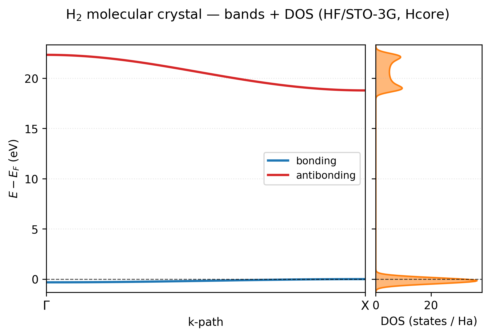

# Band structure and density of states

This tutorial uses a one-dimensional H2 chain to teach k paths, k meshes,
band arrays, Gaussian broadening, and DOS normalization. It deliberately uses
the non-self-consistent Hcore operator so the exercise is fast.

```{important}
Hcore contains kinetic and nuclear-attraction terms only. The plot produced
here is a teaching model, not an HF or DFT prediction for a hydrogen crystal.
For a scientific band, DOS, or PDOS claim, use a route-specific helper that
diagonalizes the converged SCF operator and verify that exact operator in the
calculation record.
```

For the equations, route-specific SCF helpers, and interpretation checklist,
see [Band structure and DOS](../user_guide/band_structure.md).

## Build and sample the chain

The unit cell contains one H2 molecule. The real periodic direction is x; the
other lattice columns are bookkeeping separation for this 1D example.

The band path and DOS mesh are intentionally different:

- the path follows $\Gamma\rightarrow X$ to show dispersion;
- the mesh samples the full 1D Brillouin zone to integrate the DOS.

```python
import numpy as np
import vibeqc as vq
from vibeqc.plot import bands_dos_figure

system = vq.PeriodicSystem(
    dim=1,
    lattice=[[6.0, 0.0, 0.0], [0.0, 30.0, 0.0], [0.0, 0.0, 30.0]],
    unit_cell=[
        vq.Atom(1, [0.0, 0.0, 0.0]),
        vq.Atom(1, [1.4, 0.0, 0.0]),
    ],
)
basis = vq.BasisSet(system.unit_cell_molecule(), "sto-3g")

kpath = vq.kpath_from_segments(
    system,
    [((0.0, 0.0, 0.0), "Γ", (0.5, 0.0, 0.0), "X")],
    points_per_segment=40,
)
bands = vq.band_structure_hcore(
    system,
    basis,
    kpath,
    n_electrons_per_cell=2,
)
dos = vq.density_of_states_hcore(
    system,
    basis,
    mesh=[80, 1, 1],
    sigma=0.02,
    n_electrons_per_cell=2,
)

print("band array:", bands.energies.shape)
print("Gamma energies:", bands.energies[0])
print("X energies:", bands.energies[-1])
print("occupied reference:", bands.e_fermi)

dos_area = np.trapezoid(dos.dos, dos.energies)
print(f"integrated DOS: {dos_area:.6f}; expected {basis.nbasis}")

fig = bands_dos_figure(bands, dos, title="H2 chain (STO-3G, Hcore)")
fig.savefig("h-chain-hcore-bands-dos.png", dpi=180)
```

STO-3G supplies one AO per hydrogen, so the two-atom unit cell produces two
bands. `points_per_segment=40` means 40 intervals including both endpoints, so
this one-segment path has 41 points and `bands.energies` has shape `(41, 2)`.
For a multi-segment path, the builder counts a shared endpoint only once.

The DOS integral should be close to two because each unit-area Gaussian
represents one band state after normalized k-point weighting. A value below
two usually means the energy grid cuts off Gaussian tails.

## Read the plot



The two Hcore bands are the bonding-like and antibonding-like combinations of
the two 1s basis functions. Their width measures how strongly the corresponding
Bloch combinations change with k in this model.

Use careful language:

- You may say that the Hcore model has two bands and a gap along the sampled
  path.
- You may compare how their dispersion changes when the lattice spacing is
  varied.
- You may not call the plotted separation an RHF or DFT band gap.
- You may not infer a global gap solely from one path unless that path includes
  the relevant extrema.

`bands.e_fermi` is the highest occupied sampled eigenvalue for this even,
closed-shell electron count. It is a convenient plot reference, not a
finite-temperature chemical potential.

## See the endpoint orbitals

The accompanying plot evaluates the bonding-like and antibonding-like Hcore
crystalline orbitals at $\Gamma$ and $X$:

```{figure} ../_static/plots/h-chain-crystalline-orbitals.png
:alt: Four H2-chain Hcore orbitals at Gamma and X, showing in-phase repetition at Gamma and alternating signs at X.
:width: 80%
:align: center

H2-chain Hcore crystalline orbitals at the two path endpoints. Gamma repeats
the same phase in every unit cell; X alternates the phase between cells.
```

The orbital satisfies the Bloch sum

$$
\psi_{n\mathbf{k}}(\mathbf{r})=
\sum_\mathbf{T}e^{i\mathbf{k}\cdot\mathbf{T}}
\sum_\mu C_{\mu n}(\mathbf{k})
\chi_\mu(\mathbf{r}-\mathbf{T}).
$$

At $\Gamma$, the phase factor is one. At the 1D zone boundary $X$, adjacent
translations acquire alternating signs. The difference explains why the same
local AO combination can have a different energy at the two endpoints.

The maintained generators are:

- [`examples/plots/h-chain-bands-dos.py`](https://github.com/vibe-qc/vibe-qc/blob/main/examples/plots/h-chain-bands-dos.py)
- [`examples/plots/h-chain-crystalline-orbitals.py`](https://github.com/vibe-qc/vibe-qc/blob/main/examples/plots/h-chain-crystalline-orbitals.py)

## Converge the mesh before broadening

Repeat the DOS calculation with `[40, 1, 1]`, `[80, 1, 1]`, and
`[160, 1, 1]`. Compare peak positions and the integrated area. Then hold the
converged mesh fixed and compare `sigma=0.005`, `0.01`, and `0.02` Ha.

The order matters:

1. Mesh convergence determines whether the sampled eigenvalue distribution is
   stable.
2. Broadening determines how that stable distribution is displayed.

Increasing `sigma` until spikes disappear can conceal an under-sampled mesh.
It does not improve the Brillouin-zone integration.

## Change the lattice spacing

Repeat the exercise with x lattice lengths of 5, 6, and 8 bohr while keeping
the H-H bond fixed at 1.4 bohr. As neighboring molecules separate, intermolecular
coupling weakens and the bands should generally narrow in the Hcore model.

When comparing the three calculations, keep the path resolution, DOS mesh,
basis, and `sigma` fixed. Record the bandwidth as

$$
W_n=\max_\mathbf{k}\varepsilon_n(\mathbf{k})
-\min_\mathbf{k}\varepsilon_n(\mathbf{k}).
$$

This is a controlled illustration of dispersion. It is not a prediction of
whether the interacting chain is metallic or insulating.

## Add the runner's QVF diagnostic spectrum

The high-level periodic runner adds total DOS and atom/angular-momentum PDOS to
the default QVF archive. `dos_kmesh` controls the independent post-SCF mesh:

```python
import vibeqc as vq


def run_bulk_scf_with_dos(system, basis):
    return vq.run_periodic_job(
        system,
        basis,
        method="RKS",
        functional="pbe",
        kpoints=[4, 4, 4],
        dos_kmesh=[12, 12, 12],
        output_qvf=True,
        output="output-bulk-pbe",
    )
```

Open the resulting QVF in vibe-view to inspect the total and projected DOS, but
identify the operator before interpreting it. The current RKS/UKS QVF path
reconstructs an operator from the converged density without the
exchange-correlation potential. The restricted path also applies full exact
exchange. It is therefore a diagnostic spectrum, not the converged
Kohn-Sham spectrum, and must not be used for a quantitative DFT band or DOS
claim.

For self-consistent bands along a path, use the helper belonging to the SCF
route, such as `band_path_eigenvalues` for GPW/GAPW,
`aiccm2026dev_b_band_structure` for AICCM2026DEV-B, or
`vibeqc.periodic.ccm.ccm_band_structure` for the CCM A stream. The generic
`band_structure` function is the advanced entry point when your workflow owns
real-space Fock and overlap lattice blocks.

Do not assume a generic SCF result has `fock_real` or `overlap_real`
attributes. See the [programmatic SCF route table](../user_guide/band_structure.md#programmatic-scf-routes).

## CPU time and memory

The Hcore exercise skips SCF and solves one generalized eigenproblem at every
sampled k point. Its leading timing trend is

$$
T\sim\mathcal{O}(N_\mathbf{k}N_\mathrm{bf}^3),
$$

with serial matrix workspace near $\mathcal{O}(N_\mathrm{bf}^2)$. A
self-consistent calculation adds the cost and memory of its SCF route before
this spectral post-processing.

Measure CPU time, wall time, and peak RSS together. Record the basis count,
path points, SCF mesh, DOS mesh, broadening, threads, host, and version so the
comparison can be reproduced.

## Next

- [Projected DOS](pdos.md) for Mulliken channel weights and QVF diagnostics.
- [k-point sampling](../user_guide/k_points.md) for mesh generation and
  convergence.
- [Smearing](../user_guide/smearing.md) for metals and fractional occupations.
- [Periodic orbital cubes](periodic_orbital_cubes.md) for a spatial view of
  selected crystalline orbitals.
