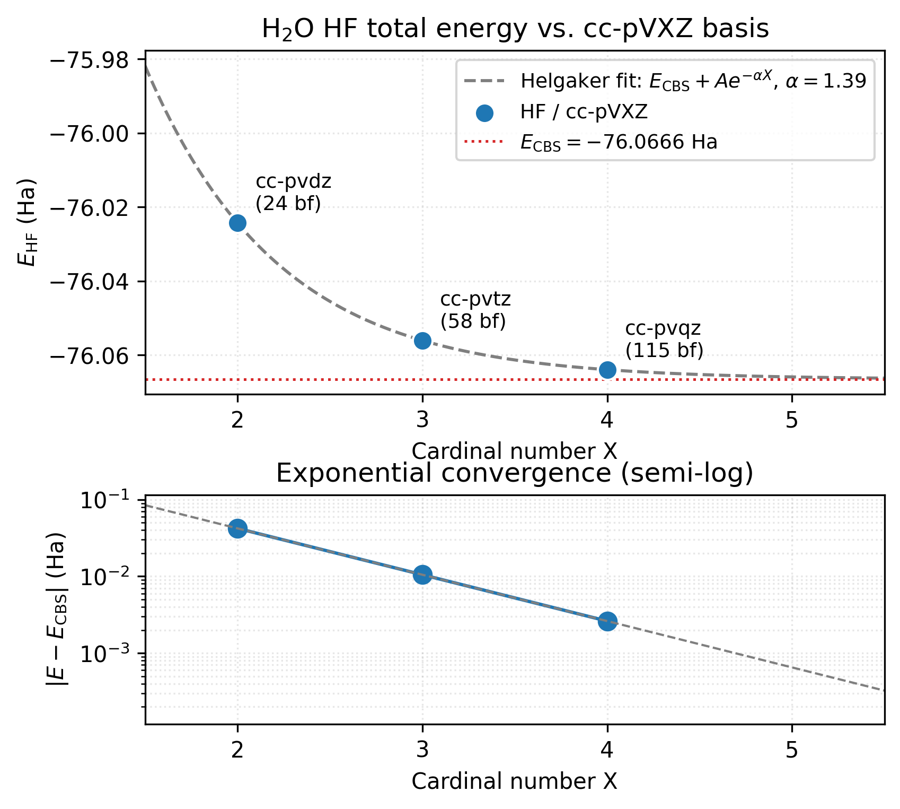

# Basis-set convergence

Total energies and most properties improve as you move from small
basis sets (minimal, split-valence) toward large ones (triple-zeta
with diffuse and polarization). This tutorial shows how to run a
family of calculations, tabulate the trend, and decide when you've
hit the point of diminishing returns.

## A Dunning-family sweep on water

The correlation-consistent series ``cc-pVXZ (X = D, T, Q)`` and its
augmented variants systematically approach the HF and correlation
complete-basis-set (CBS) limit. Run HF on water at each:

```python
from vibeqc import Atom, BasisSet, Molecule, run_rhf

mol = Molecule([
    Atom(8, [ 0.0,  0.00,  0.00]),
    Atom(1, [ 0.0,  1.43, -0.98]),
    Atom(1, [ 0.0, -1.43, -0.98]),
])

print(f"{'basis':12s}  {'nbasis':>6s}  {'E (Ha)':>16s}  {'ΔE (mHa)':>10s}  {'iters':>5s}")
print("-" * 60)

previous = None
for name in ("sto-3g", "cc-pvdz", "cc-pvtz", "cc-pvqz"):
    basis = BasisSet(mol, name)
    r = run_rhf(mol, basis)
    delta = ""
    if previous is not None:
        delta = f"{(r.energy - previous) * 1000:+10.3f}"
    print(f"{name:12s}  {basis.nbasis:6d}  {r.energy:16.8f}  {delta:>10s}  "
          f"{r.n_iter:5d}")
    previous = r.energy
```

Output:

```
basis         nbasis           E (Ha)   ΔE (mHa)  iters
------------------------------------------------------------
sto-3g             7       -74.94956615                  8
cc-pvdz           24       -76.02431388   -1074.748     10
cc-pvtz           58       -76.05605100     -31.737     12
cc-pvqz          115       -76.06394333      -7.892     15
```

Reading across:

- ``ΔE`` shrinks by roughly 1/3 with each level up, classic
  asymptotic behavior of the correlation-consistent series. Extrapo-
  lating to CBS by fitting an exponential in the cardinal number X
  gives around ``-76.0676 Ha`` at HF limit.
- ``cc-pVTZ`` captures 99.96% of the cc-pVQZ improvement for 1/2 the
  basis functions, a reasonable default for production HF.
- **Timing scales as ``O(N^4)``** in the basis-function count for HF,
  so doubling the basis multiplies the cost by ~16.

## A polarized Pople sweep

A quick "what does polarization do?" experiment:

```python
for name in ("6-31g", "6-31g*", "6-31g**", "6-311g**"):
    basis = BasisSet(mol, name)
    r = run_rhf(mol, basis)
    print(f"{name:14s}  nbasis={basis.nbasis:3d}  E = {r.energy:.6f}")
```

```
6-31g         nbasis= 13  E = -75.982973
6-31g*        nbasis= 18  E = -76.006678
6-31g**       nbasis= 24  E = -76.021164
6-311g**      nbasis= 30  E = -76.045115
```

- Adding polarization on heavy atoms (``*``) gains ~24 mHa.
- Adding polarization on hydrogens as well (``**``) another ~14 mHa.
- Going from 6-31 → 6-311 split-valence ~24 mHa.

Diffuse-augmented bases (``6-311++g**``, ``aug-cc-pvtz``) are
essential for anions, weak-interaction energies, and excited-state
calculations. vibe-qc's basis library ships them, but their small
exponents can trigger linear-dependency issues in certain tight
geometries; tighten ``conv_tol_grad`` and bump ``max_iter`` when you
need them.

## Properties that converge differently

Total energies are the *slowest*-converging quantity. Relative
energies (reaction energies, barriers) and properties (dipoles,
bond orders, frequencies) converge faster because error cancellation
helps, but not always monotonically.

```python
from vibeqc import mulliken_charges, dipole_moment

for name in ("cc-pvdz", "cc-pvtz", "cc-pvqz"):
    basis = BasisSet(mol, name)
    r = run_rhf(mol, basis)
    q = mulliken_charges(r, basis, mol)
    mu = dipole_moment(r, basis, mol)
    print(f"{name:14s}  E = {r.energy:.5f}   "
          f"q_O(Mull)= {q[0]:+.3f}   μ(D)= {mu.total_debye:.4f}")
```

Output:

```
cc-pvdz         E = -76.02431   q_O(Mull)= -0.269   μ(D)= 1.9131
cc-pvtz         E = -76.05605   q_O(Mull)= -0.471   μ(D)= 1.8847
cc-pvqz         E = -76.06394   q_O(Mull)= -0.497   μ(D)= 1.8648
```

Observe:

- **Dipole converges cleanly**, within 0.03 D by cc-pVTZ, within
  0.02 D at cc-pVQZ. The experimental gas-phase value is 1.855 D;
  cc-pVQZ HF is already on top of it, but this is partially a
  cancellation of errors (HF over-polarises, no correlation pulls it
  back) rather than true convergence.
- **Mulliken charges are a mess**, they wander even within a
  consistent family. Don't chase a particular value; use them only
  for within-set comparisons.

## Tabulating the trend in a figure

Re-running the cc-pVXZ sweep and plotting the total energy against the
basis-function count (log scale) makes the diminishing returns visible at
a glance:

```python
import numpy as np
import matplotlib.pyplot as plt

basis_names = ["sto-3g", "cc-pvdz", "cc-pvtz", "cc-pvqz"]
nbasis, energies = [], []
for name in basis_names:
    basis = BasisSet(mol, name)
    r = run_rhf(mol, basis)
    nbasis.append(basis.nbasis)
    energies.append(r.energy)

fig, ax = plt.subplots()
ax.plot(nbasis, energies, "o-")
ax.set_xlabel("Number of basis functions")
ax.set_ylabel("E(RHF) / Ha")
ax.set_xscale("log")
for n, e, name in zip(nbasis, energies, basis_names):
    ax.annotate(name, (n, e), xytext=(4, 4), textcoords="offset points")
fig.tight_layout()
fig.savefig("h2o_basis_convergence.png", dpi=150)
```

For a three-point ``cc-pVXZ`` extrapolation to the HF CBS limit, fit
``E(X) = E_CBS + A * exp(-α X)`` with ``α ≈ 1.63`` (Halkier et al.
1998).



The top panel shows the three cc-pVXZ data points (blue dots) and
the fitted Helgaker exponential (grey dashed). The fit's CBS
asymptote sits at $E_\mathrm{CBS} = -76.067$ Ha (red dotted line), 
about 2.6 mHa below cc-pVQZ's $-76.064$ Ha. Each level recovers
roughly $1/3$ of what its predecessor missed, so cc-pVQZ has already
captured ~99 % of the gap to CBS. The bottom panel makes the
**rate** of convergence explicit: $|E - E_\mathrm{CBS}|$ falls
along an essentially straight line on a semi-log axis, the
signature of true exponential convergence. That straightness is the
formal justification for trusting the three-point extrapolation:
the geometric ratio is constant, so a fit on three consecutive points
can read out the asymptote reliably. A correlation-energy plot would
look very different, the inverse-cubic $X^{-3}$ falloff curves
gently on semi-log instead of going straight, requiring a different
fit form. (See the references for the inverse-cubic correlation
extrapolation.)

The figure is regenerated by
`[`examples/plots/water-basis-convergence.py`](https://github.com/vibe-qc/vibe-qc/blob/main/examples/plots/water-basis-convergence.py)`.

## Notes

- **Basis-set superposition error** (BSSE) matters for
  interaction-energy calculations on weakly-bound complexes. No
  counterpoise correction is built in yet, but you can compute it
  manually by running the monomer calculations in the dimer basis and
  subtracting.
- **Basis linear dependencies.** At very large bases (``aug-cc-pVQZ``
  and bigger, or diffuse functions in close-packed geometries) the
  overlap matrix becomes nearly singular. vibe-qc will still converge,
  but the MO coefficients become noisy. For periodic calculations
  this is why the ``pob-*`` solid-state basis family exists, 
  small-exponent primitives trimmed deliberately.

## Theory

The sections below cover the machinery behind the sweeps above: what a
basis set is as an expansion in contracted Gaussians, the two common
basis hierarchies (Pople and correlation-consistent), Helgaker's CBS
extrapolation formula, what polarization functions buy you, and why
solids need their own bespoke basis families.

### What a basis set is

In a practical electronic-structure calculation, every molecular
orbital is expanded in a fixed, finite set of **atom-centered basis
functions** $\{\chi_\mu\}$:

$$
\phi_i(\mathbf{r}) = \sum_\mu C_{\mu i} \, \chi_\mu(\mathbf{r}).
$$

With an infinite, complete basis you get the exact answer of whatever
method you're using (HF, DFT, CCSD, …). With a finite basis you get
an approximation whose error **scales with basis size**; the study
of that scaling is basis-set convergence.

Each $\chi_\mu$ in vibe-qc is a **contracted Gaussian-type orbital**:

$$
\chi_\mu(\mathbf{r}) = \mathcal{N}_\mu \; (\mathbf{r} - \mathbf{R}_A)^{\ell_\mu} \;
  \sum_{p=1}^{K_\mu} d_{\mu p} \, e^{-\alpha_{\mu p} |\mathbf{r} - \mathbf{R}_A|^2},
$$

a fixed linear combination of $K_\mu$ primitive Gaussians with
pre-determined exponents $\alpha_{\mu p}$ and contraction coefficients
$d_{\mu p}$, multiplied by a solid harmonic $(\mathbf{r} - \mathbf{R}_A)^{\ell_\mu}$.
The contraction saves the SCF driver from having to optimize every
primitive separately, the basis-set designer has already done that
for atomic ground states and frozen the inner-shell mix.

### Two common hierarchies

**Pople split-valence (6-31G\*, 6-311G\*\*).** Inner-shell contracted
to one function, valence split into two (6-31G) or three (6-311G).
Polarization functions (the `*` = `d`-type on heavy atoms; `**` = d
+ p on hydrogen) give radial flexibility beyond the valence's
$\ell$-range. Diffuse functions (`+` on heavy atoms; `++` with H)
add small-exponent primitives for anions / Rydberg states / weak
bonds.

**Correlation-consistent (cc-pVXZ).** Designed by Dunning to
systematically recover correlation energy, with the X = D, T, Q, 5,
6 cardinal number controlling both valence-flexibility and polarization
depth *together*. The key property: the incremental basis-set-error
contribution falls off geometrically with X, so two successive
cardinal numbers extrapolate reliably to the complete-basis-set
(CBS) limit.

### Helgaker's CBS extrapolation

The canonical extrapolation of the HF total energy uses the exponential
Helgaker-Klopper-Koch form:

$$
E_\text{HF}(X) = E_\text{HF}^\text{CBS} + A \, e^{-\alpha X},
$$

with $\alpha \approx 1.63$ fixed across the Dunning cc-pVXZ series.
Correlation energies converge more slowly (electron-electron cusps),
and the standard fit is the inverse-cubic power law

$$
E_\text{corr}(X) = E_\text{corr}^\text{CBS} + B \, X^{-3}.
$$

Three consecutive cc-pVXZ points are enough to fit either form.

### Polarization functions: what they add

A minimal basis (STO-3G) has no angular-momentum flexibility beyond
what atomic ground states need. Adding a $d$-type shell to a heavy
atom, or a $p$-type to hydrogen, lets the orbital "polarize" in
response to the bonding environment. Without polarization, oxygen
can't respond to the electronic asymmetry of the O-H bond and
dipoles under-shoot by 15-25%. The `*` / `**` in Pople names and
the `P` in `pVXZ` both denote polarization. For anything past a
qualitative sketch, polarization is not optional.

### Why solids use different basis sets

In a crystal, diffuse basis functions on neighboring atoms overlap
*significantly*, because in a crystal, every atom has 6 or 12
near neighbors at bonding distance rather than the 1-4 of a
molecule. That pushes the overlap matrix toward singularity and
the SCF into linear-dependency territory. Solid-state basis
families like **pob-TZVP** (Peintinger-Vilela Oliveira-Bredow 2013)
are redesigned from molecular bases with the smallest-exponent
primitives either removed or replaced by less-diffuse alternatives.
See [Periodic HF on a 1D H chain](periodic_hf.md) for the pob-\* motivation.

## Resources

~250 MB peak RAM, ~5 s on one core (Apple M2 baseline) for the H₂O
scan up to cc-pVQZ; each individual SCF is sub-second. cc-pV5Z and
beyond on H₂O hit ~30 s and ~1 GB RAM each, the Fock build is
$\mathcal{O}(N_\text{bf}^4)$ and the basis count grows roughly
geometrically in the cardinality.

## References

- **Pople basis sets.** W. J. Hehre, R. Ditchfield, and J. A. Pople,
  "Self-consistent molecular orbital methods. XII. Further
  extensions of Gaussian-type basis sets for use in molecular
  orbital studies of organic molecules," *J. Chem. Phys.* **56**,
  2257 (1972). The 6-31G\* / 6-31G\*\* papers are in the same
  series.
- **Correlation-consistent basis sets, original.** T. H. Dunning
  Jr., "Gaussian basis sets for use in correlated molecular
  calculations. I. The atoms boron through neon and hydrogen,"
  *J. Chem. Phys.* **90**, 1007 (1989).
- **Augmented Dunning basis sets.** R. A. Kendall, T. H. Dunning
  Jr., and R. J. Harrison, "Electron affinities of the first-row
  atoms revisited. Systematic basis sets and wave functions,"
  *J. Chem. Phys.* **96**, 6796 (1992).
- **Helgaker CBS extrapolation.** T. Helgaker, W. Klopper, H. Koch,
  and J. Noga, "Basis-set convergence of correlated calculations
  on water," *J. Chem. Phys.* **106**, 9639 (1997).
- **Inverse-cubic correlation extrapolation.** A. Halkier, T.
  Helgaker, P. Jørgensen, W. Klopper, H. Koch, J. Olsen, and A. K.
  Wilson, "Basis-set convergence in correlated calculations on Ne,
  N₂, and H₂O," *Chem. Phys. Lett.* **286**, 243 (1998).
- **pob-\* solid-state basis sets.** M. F. Peintinger, D. V.
  Oliveira, and T. Bredow, "Consistent Gaussian basis sets of
  triple-zeta valence with polarization quality for solid-state
  calculations," *J. Comput. Chem.* **34**, 451 (2013).
- **Textbook.** T. Helgaker, P. Jørgensen, and J. Olsen, *Molecular
  Electronic-Structure Theory*, Wiley (2000). Chapter 8 is the
  comprehensive treatment of Gaussian basis sets.

## Next

- A DFT-functional-comparison tutorial using the same sweep pattern
  is next on the list (scan the XC library instead of basis sets).
- The [periodic HF tutorial](periodic_hf.md) uses ``pob-tzvp``
  directly because standard basis sets are usually too diffuse for
  crystals.
