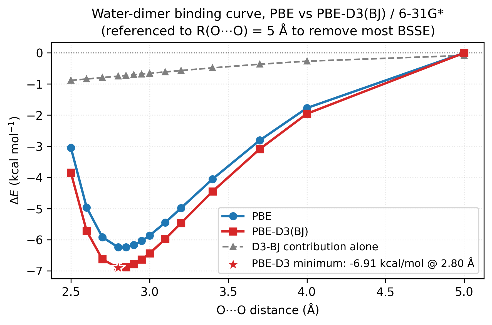

# Dispersion corrections (D3-BJ)

Standard density-functional approximations (LDA, PBE, even B3LYP) are
**local or semi-local**: the exchange-correlation kernel at a point
only sees the density around that point. That makes them blind to
*long-range dispersion* (London / van-der-Waals), the electron
correlation that attracts non-overlapping fragments. For molecular
crystals, layered materials, π-stacking, drug-receptor binding, and
host-guest chemistry, the missing dispersion energy is often 1-10
kcal/mol per contact, which is everything.

**Grimme's D3(BJ) correction** is a pairwise atomic-sum that bolts a
physically-motivated $-C_6/R^6$ tail onto any DFT functional, with
Becke-Johnson (BJ) damping to avoid double-counting short-range
correlation. It's additive to the SCF energy, no re-converging the
density, and vibe-qc wires it through ``run_job`` with a single
argument.

```{important}
The default native D3-BJ backend is self-contained and quantitative for atoms
H through Ar. It includes the full coordination-dependent C6 reference grid,
the complete analytic gradient, and 156 published damping-parameter sets.
Install the optional `dftd3` package for an independent reference backend or
for molecules containing heavier elements.
```

## Theory

The sections below explain the physics D3-BJ models and how it is built:
why local and semi-local functionals miss dispersion in the first place,
how Grimme's coordination-number-dependent $C_6$ construction works, what
Becke-Johnson damping fixes at short range, and where the pairwise
density-blind model breaks down.

### Where dispersion comes from

For two closed-shell fragments $A$ and $B$ with no density overlap,
second-order perturbation theory in the instantaneous Coulomb
interaction gives the leading long-range attraction

$$
E_{\text{disp}}^{AB}(R) = -\frac{C_6^{AB}}{R^6} - \frac{C_8^{AB}}{R^8} - \dots
$$

where the $C_n^{AB}$ coefficients are integrals over frequency-dependent
polarisabilities of the isolated fragments. This is the non-retarded
London / van-der-Waals expansion, every electronic-structure method
that captures electron-electron correlation correctly (CCSD(T), MP2,
RPA) reproduces it. Local and semi-local DFT functionals, by
contrast, build $E_{\text{xc}}$ from operators that only see the
density and its gradient *at a point*. That's fundamentally
short-ranged, no density overlap, no correlation energy, so the
$R^{-6}$ tail is missing.

### D3 construction

Grimme's D3 approach (2010) keeps the $1/R^6 + 1/R^8$ shape but
replaces the per-pair polarisability integral with a **coordination-
number-dependent $C_6$**: for each atom, the local coordination
number $\text{CN}_A$ is estimated from a smooth distance-based
counting function, then $C_6^{AB}(\text{CN}_A, \text{CN}_B)$ is
interpolated between pre-computed reference values for a small set of
chemically representative environments (sp / sp² / sp³ carbon, etc.).
This single trick makes the correction transferable across oxidation
states without refitting. $C_8^{AB}$ is derived from $C_6^{AB}$ via
atomic expectation values.

### BJ damping

The raw $-C_6/R^6$ tail diverges as $R \to 0$ and also double-counts
whatever short-range correlation the DFT functional already supplies.
D3-BJ uses **Becke-Johnson damping**, a rational function that
transitions from zero at short range to the full asymptotic form at
long range:

$$
E_{\text{disp}}^{\text{D3-BJ}}
  = -\sum_{A < B}
  \Bigl(
    \frac{s_6 \, C_6^{AB}}{R_{AB}^6 + [a_1 \sqrt{C_8^{AB}/C_6^{AB}} + a_2]^6}
    +
    \frac{s_8 \, C_8^{AB}}{R_{AB}^8 + [a_1 \sqrt{C_8^{AB}/C_6^{AB}} + a_2]^8}
  \Bigr).
$$

The four empirical parameters, scaling coefficients $s_6, s_8$ and
BJ-damping parameters $a_1, a_2$, are **fit per functional** against
reference interaction-energy benchmarks (S22, S66, etc.). Each
functional gets its own set; using PBE's numbers with B3LYP
double-counts short-range correlation. vibe-qc looks these up for you
via `d3bj_params_for(functional)`.

### Limits

- Pairwise, density-blind. D3 doesn't know about charge transfer,
  many-body screening, or long-range polarization. For layered
  metals and metallic fragments, many-body dispersion (MBD, D4) does
  better.
- Doesn't fix a wrong density. If PBE over-polarises an H-bond, D3
  won't correct that, it adds to the resulting energy, doesn't
  re-converge.
- Always attractive. D3 always lowers relative energies; it can't
  model repulsion gaps that local DFT already over-attracts.

## The one-liner

Adding dispersion to a DFT job is a single keyword. This runs PBE/6-31G\*
on water and tacks the D3-BJ correction on top via `dispersion="d3bj"`:

```python
from vibeqc import Atom, Molecule, run_job

mol = Molecule([
    Atom(8, [ 0.0,  0.00,  0.00]),
    Atom(1, [ 0.0,  1.43, -0.98]),
    Atom(1, [ 0.0, -1.43, -0.98]),
])

run_job(
    mol,
    basis="6-31g*",
    method="rks",
    functional="PBE",
    dispersion="d3bj",         # <-- adds PBE-D3(BJ)
    output="water_pbe_d3",
)
```

The output file gets a new "Dispersion correction" block:

```
  Dispersion correction (D3-BJ)
  ----------------------------------------------------
          s6       1.000000
          s8       0.787500
          a1       0.428900
          a2       4.440700
      E_disp    -0.00070434 Ha  (-0.4420 kcal/mol)
       E_SCF   -76.31993075 Ha
     E_total   -76.32063509 Ha
```

When post-SCF dispersion is active, the earlier SCF trace labels its component
sum as `SCF energy`; use this block's `E_total` or the result object's
`.energy_total` for the dispersion-inclusive total.

For both D3(BJ) and non-composite D4 calls, the returned result object carries
`.energy` (bare SCF), `.e_dispersion` (the correction), and `.energy_total`
(the corrected method total):

```python
r = run_job(mol, basis="6-31g*", method="rks", functional="PBE",
            dispersion="d3bj", output="water_pbe_d3",
            write_molden_file=False)
print(f"E_SCF    = {r.energy:.6f} Ha")   # also available as r.e_scf
print(f"E_disp   = {r.e_dispersion:+.6e} Ha")
print(f"E_total  = {r.energy_total:.6f} Ha")
```

If dispersion wraps an MP2 or CC result, `.energy` remains the SCF reference
while `.energy_total` adds the correction to the underlying post-HF method
total. It does not discard the correlation energy.

```{warning}
When collecting energies programmatically for a dispersion-corrected
method, take `.energy_total`, not `.energy`. `.energy` stays the bare
SCF energy by design, and for PBE0-D3(BJ)-class methods the difference
is chemically large (glycine/def2-TZVP: -0.0097 Ha, -6.1 kcal/mol).
The ASE calculator (`vibeqc.ase.VibeQC`) follows the opposite, ASE-
mandated convention: `atoms.get_potential_energy()` is the total.
```

For a mean-field calculation with `structured_log=True`, the machine-readable
`job_end` event in the `.scf.jsonl` sidecar carries the same split explicitly
whenever a post-SCF correction is active: `energy` (bare SCF, backward
compatible), `e_scf`, `e_dispersion` (D3-BJ + D4), `e_total`, and for 3c
composites `e_gcp` / `e_srb`. Batch harvesters should prefer the result
object's `energy_total`, or the event's `e_total` when present.

## A worked example: the water dimer

Where dispersion matters is in *relative* energies, it barely changes
the energy of a single water molecule, but it stabilises the dimer
by a real amount. Compute both:

```python
dimer = Molecule([
    Atom(8, [ 0.0,   0.00,   0.00]),
    Atom(1, [ 0.0,   0.00,   1.814]),    # 0.96 Å along z
    Atom(1, [ 0.0,   1.756, -0.454]),
    Atom(8, [ 0.0,   0.00,   5.575]),    # O-O 2.95 Å
    Atom(1, [ 0.0,   1.434,  6.686]),
    Atom(1, [ 0.0,  -1.434,  6.686]),
])
water = Molecule([
    Atom(8, [0.0, 0.0, 0.0]),
    Atom(1, [0.0, 0.0, 1.814]),
    Atom(1, [0.0, 1.756, -0.454]),
])

for mol, label in ((water, "monomer"), (dimer, "dimer")):
    r_bare = run_job(mol, basis="6-31g*", method="rks", functional="PBE",
                     output=f"{label}", write_molden_file=False)
    r_d3 = run_job(mol, basis="6-31g*", method="rks", functional="PBE",
                   dispersion="d3bj", output=f"{label}_d3",
                   write_molden_file=False)
    print(f"{label:10s}  PBE   {r_bare.energy:.6f}   "
          f"PBE-D3  {r_d3.energy_total:.6f}   "
          f"Δdisp = {r_d3.e_dispersion*627.509:+.2f} kcal/mol")
```

Results:

```
monomer     PBE   -76.319931   PBE-D3  -76.320636   Δdisp = -0.44 kcal/mol
dimer       PBE  -152.650077   PBE-D3 -152.652627   Δdisp = -1.60 kcal/mol
```

Intra-molecular dispersion contributes ~0.44 kcal/mol to each isolated
water; the dimer picks up 1.60 kcal/mol total. The extra
``1.60 - 2·0.44 = 0.72 kcal/mol`` is the genuine *inter-molecular*
dispersion, the part that shows up in binding energies:

| Quantity | Value |
| --- | ---: |
| Binding energy (PBE)    | −6.41 kcal/mol |
| Binding energy (PBE-D3) | −7.13 kcal/mol |
| D3 contribution         | −0.72 kcal/mol |

Both values over-bind the experimental (CCSD(T)/CBS) reference of
~5.0 kcal/mol, that's a known PBE issue unrelated to dispersion.
D3 is additive, not corrective.

## What the curve looks like

The single-point comparison above is one slice through a much richer
picture. Scan the dimer's $\mathrm{O}{\cdots}\mathrm{O}$ distance and
plot both PBE and PBE-D3, the two curves and their difference make
the role of dispersion in this dimer explicit:



The blue and red curves are PBE and PBE-D3 binding energies along
the H-bond axis (referenced to $R(\mathrm{O}{\cdots}\mathrm{O}) = 5$
Å to remove most of the 6-31G\* BSSE, a counterpoise-like fix
that lets you see the actual *bonding well* without the
basis-incompleteness pedestal). The grey dashed line is the D3-BJ
contribution alone (PBE-D3 − PBE). Three things to read off:

1. **Both curves have a well around 2.8 Å.** PBE alone already gets
   most of the H-bond binding from electrostatics and exchange, the
   well is real and not far from the experimental
   ~2.97 Å / ~5 kcal/mol reference.
2. **D3 deepens the well by ~0.7 kcal/mol** and pulls the minimum
   slightly inward. Small but systematic, at the well bottom the
   correction is a few percent of the H-bond.
3. **The long-range tail (3.5-5 Å) is where D3 visibly bites.** The
   PBE curve climbs back to zero with no asymptotic attraction; the
   D3 contribution provides the proper $-C_6/R^6$ tail. For systems
   without permanent electrostatic attraction (rare-gas dimers,
   π-stacks, methane dimer, layered solids) this tail is the *only*
   binding mechanism and PBE alone gives essentially nothing.

The figure is regenerated by `[`examples/plots/water-dimer-d3-curve.py`](https://github.com/vibe-qc/vibe-qc/blob/main/examples/plots/water-dimer-d3-curve.py)`.

## Picking damping parameters

``dispersion="d3bj"`` auto-looks up the damping parameters for the
`functional=` you passed. The native registry contains all 156 D3(BJ)
parameter sets from the pinned simple-dftd3 data. The optional reference
backend is available through the `[dispersion]` extra:

```sh
pip install -e '.[dispersion]'        # from the vibe-qc checkout
# or just the underlying package:
pip install dftd3
```

which pulls in the reference `dftd3` package for explicit
`backend="dftd3"` comparisons and heavier-element calculations.

You can also pass an explicit functional-name string to pick a
different parametrisation than the one the SCF ran on (useful for
HF + D3 or for cross-comparison):

```python
from vibeqc import D3BJParams, d3bj_params_for

params = d3bj_params_for("b3lyp")          # look up B3LYP's damping
print(params)                              # D3BJParams(s6=..., s8=..., a1=..., a2=..., s9=...)

# Pass an explicit D3BJParams instance instead of a string:
custom = D3BJParams(s6=1.0, s8=1.5, a1=0.4, a2=4.5)
run_job(mol, basis="6-31g*", method="rks", functional="pbe",
        dispersion=custom, output="custom_d3")
```

## The three-body (ATM) term

Everything above is *pairwise*: each atom pair contributes independently.
The leading correction to that picture is the Axilrod-Teller-Muto (ATM)
three-body term, a dipole-dipole-dipole interaction summed over atom
triples. `D3BJParams` exposes it as `s9`:

```python
# Two-body D3(BJ) -- the default, and what "D3(BJ)" means in the papers.
plain = D3BJParams(s6=1.0, s8=0.7875, a1=0.4289, a2=4.4407)

# The same damping plus the three-body term: "D3(BJ)-ATM".
with_atm = D3BJParams(s6=1.0, s8=0.7875, a1=0.4289, a2=4.4407, s9=1.0)
```

`s9` defaults to `0.0`, and that default is deliberate. The published
per-functional `(s8, a1, a2)` sets were *fit without* the three-body
term, so switching it on alongside them changes the method rather than
refining it. Turn it on when the method you are reproducing defines
itself that way.

Two things worth knowing about the term:

* **It is repulsive**, unlike the pairwise part, and it grows with
  density. On an isolated molecule it is small --- benzene sees about
  +0.0094 mHa --- but it reaches 4--7% of a molecular-crystal lattice
  energy.
* **Its damping is not the BJ damping.** The two-body terms are damped
  by the Becke-Johnson radius `a1 * sqrt(C8/C6) + a2`; the ATM term uses
  D3's *zero-damping* function built on the tabulated `r0ab` cut-off
  radii. Changing `a1` or `a2` therefore leaves the three-body energy
  untouched.

The PBEh-3c and HSE-3c composites set `s9 = 1.0` for you --- their
defining papers make the three-body term part of the method. See
{doc}`../user_guide/composites`.

## D3 with Hartree-Fock

HF has no correlation at all, so dispersion is a bigger miss there
than for DFT. HF + D3(BJ) uses Grimme's HF-specific damping set, which
is included in the native registry. Pass its lookup name directly:

```python
run_job(mol, basis="6-31g*", method="rhf",
        dispersion="hf",           # Grimme's HF damping parameters
        output="hf_d3")
```

Any basis-set-superposition-error concerns that apply to plain HF
still apply, counterpoise correction is a separate topic, not baked
into vibe-qc yet.

## D3 in geometry optimization

D3 has analytic gradients, so it rides through ``optimize=True``
without extra configuration:

```python
run_job(mol, basis="6-31g*", method="rks", functional="pbe",
        dispersion="d3bj",
        output="dimer_d3_opt",
        optimize=True, fmax=0.2)
```

Each BFGS step adds the dispersion gradient to the SCF gradient; the
final `.out` file reports `E_SCF`, `E_disp`, and `E_total` at the
optimized geometry.

## Caveats

- **D3 is pairwise by design.** It doesn't see the electron density
  at all, just atomic positions and element types. It's fast
  (adds microseconds to a DFT calculation) but it can't fix an
  already-wrong density (e.g. PBE's tendency to over-polarize H-bonds).
- **No replacement for a correlated wavefunction.** If you need
  chemical accuracy for weak-interaction energies, use CCSD(T)-F12
  or RPA, not DFT-D3. D3 gets you most of the way with small-basis
  DFT for a lot of work.
- **Parameters are functional-specific.** Using PBE's damping with
  B3LYP double-counts short-range correlation. Always match
  `functional=` and the `dispersion=` lookup (the default behavior
  does this automatically).
- **BSSE is a separate topic.** Pair binding energies still benefit
  from counterpoise correction when the basis is moderate. Run the
  monomer in the dimer basis for a CP-corrected number, vibe-qc
  doesn't automate this yet.

## Next

- Bigger systems where dispersion dominates: π-stacked aromatics
  (benzene dimer, DNA bases), layered materials, rare-gas crystals.
  Standalone examples will land as the relevant geometries make it
  into `examples/`.
- D3 periodic cutoff handling (`compute_d3bj_periodic`, `cutoff_bohr`)
  is wired into `run_periodic_job` and GAPW today; it is the low-level
  dispatch functions (`run_rhf_periodic_scf` for HF, `run_rks_periodic_scf`
  for KS) that don't carry it directly, use `run_periodic_job` for
  periodic D3(BJ). Track any remaining gaps in the [roadmap](../roadmap.md).

## Resources

~150 MB peak RAM, ~10 s on one core (Apple M2 baseline) for the
water-dimer binding curve at HF/6-31G\* (10 distance points × HF +
D3 correction). The D3 evaluation itself is essentially free
(~$\mathcal{O}(N_\text{atom}^2)$ pair sum); cost is dominated by
the underlying SCFs.

## References

Foundation papers for the D3-BJ machinery.

- **BJ damping, original proposal.** A. D. Becke and E. R. Johnson,
  "Exchange-hole dipole moment and the dispersion interaction revisited,"
  *J. Chem. Phys.* **127**, 154108 (2007).
- **D3 base method.** S. Grimme, J. Antony, S. Ehrlich, and H. Krieg,
  "A consistent and accurate ab initio parametrization of
  density functional dispersion correction (DFT-D) for the 94
  elements H-Pu," *J. Chem. Phys.* **132**, 154104 (2010).
- **D3 with BJ damping.** S. Grimme, S. Ehrlich, and L. Goerigk,
  "Effect of the damping function in dispersion corrected density
  functional theory," *J. Comput. Chem.* **32**, 1456 (2011).
- **Review of dispersion-corrected DFT.** S. Grimme, "Density
  functional theory with London dispersion corrections,"
  *WIREs Comput. Mol. Sci.* **1**, 211 (2011).
- **Physical origin, textbook.** A. J. Stone, *The Theory of
  Intermolecular Forces*, 2nd ed., Oxford University Press (2013),
  chapters 2 and 4 for the London expansion.

For beyond-D3: **D4** (Caldeweyher et al., 2019) generalises the
coordination-number model with charge-dependent $C_6$; **many-body
dispersion** (Tkatchenko-Scheffler, MBD) adds many-body screening at
the cost of a plasmon self-consistency. D4 ships in `vibeqc.dispersion_d4`;
its native backend was un-gated 2026-06-26 and is production-validated
for H-Ne (native $C_6$ agrees with `dftd4` to a few percent, CH4-dimer
energy to <0.05 kcal/mol), `D4NativeExperimentalWarning` is no longer
emitted for that element range. `dftd4` remains the default for full
periodic-table coverage beyond H-Ne. MBD is not implemented.
