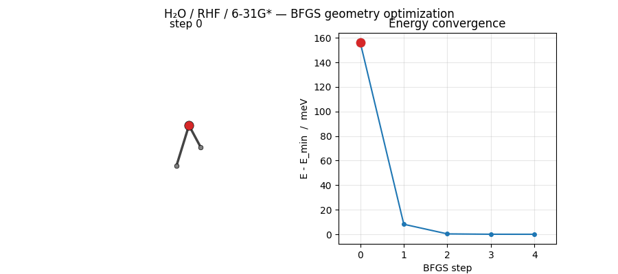

# Geometry optimization

See also the [user-guide reference](../user_guide/geometry_optimization.md)
for the native (ASE-free) optimizer's full API.

Relax a molecular structure to its energy minimum. vibe-qc uses ASE's
BFGS-line-search optimizer under the hood, driven by analytic HF/DFT
forces from the C++ core. ``run_job(..., optimize=True)`` is the
one-liner; the standard `.out` / `.molden` / `.traj` files all get
written as usual, plus the trajectory animation.

## Water at HF/6-31G\*

Starting from an approximate geometry:

```python
from pathlib import Path
from vibeqc import Atom, Molecule, run_job

mol = Molecule([
    Atom(8, [0.0,   0.0,   0.0  ]),
    Atom(1, [0.0,   1.60, -1.10]),   # slightly off-equilibrium
    Atom(1, [0.0,  -1.60, -1.10]),
])

run_job(
    mol,
    basis="6-31g*",
    method="rhf",
    output="water_opt",
    optimize=True,
    fmax=0.05,            # eV/Å — converged when |F|_max drops below this
    max_opt_steps=50,
)
```

Files produced:

- ``water_opt.out``, initial geometry, optimizer parameters, final
  optimized geometry, then the full SCF trace at the minimum
- ``water_opt.molden``, MOs at the minimum, for Avogadro / Jmol
- ``water_opt.traj``, one frame per BFGS step (ASE binary); view with
  ``ase gui water_opt.traj``

## Reading the output

After the banner and atom table, ``water_opt.out`` contains:

```
  Geometry optimisation (ASE/BFGS) -> water_opt.traj
  fmax = 0.05 eV/A, max_steps = 50

  Optimised geometry
  Atoms (bohr)
  ------------------------------------------------------
     1  Z=  8       0.00000000      0.00000000      0.07390216
     2  Z=  1       0.00000000      1.44014211     -1.00364326
     3  Z=  1       0.00000000     -1.44014211     -1.00364326
  charge=0  multiplicity=1  n_electrons=10

  iter     energy (Ha)  ...
  (SCF trace at the optimised geometry)
  ...
  converged in 7 iterations; E = -76.0108432849 Ha
```

The OH bond length and HOH angle at this HF/6-31G\* minimum:
**r(OH) = 0.947 Å, HOH = 105.5°** (experimental: 0.957 Å, 104.5°).
HF slightly under-shoots the bond and opens the angle.

## Parameters

The optimization-specific knobs on ``run_job`` control the
force-convergence target, the optimizer step limit, and how the
intermediate SCFs are run:

| Argument | Default | Meaning |
|---|---|---|
| ``fmax`` | 0.05 | Force-convergence tolerance (eV/Å) |
| ``max_opt_steps`` | 200 | Hard iteration limit for the optimizer |
| ``optimizer_backend`` | ``"auto"`` | ``"auto"`` / ``"ase"`` / ``"native"`` / ``"brent"``; see user guide |
| ``rhf_options`` | ``RHFOptions()`` | Applied to *every* intermediate SCF; bump ``max_iter`` here if BFGS visits hard-to-converge geometries |

``rhf_options`` / ``rks_options`` forward through to every frame of the
optimization, not just the final single point. This matters for
H-bonded systems and floppy molecules where one BFGS step sometimes
lands on a particularly stubborn geometry, bump ``max_iter = 200`` or
add ``damping = 0.3`` to the options struct and the whole trajectory
stays stable.

## A harder case: the water dimer

H-bonded clusters sit on a very flat potential-energy surface, plain
BFGS Hessian extrapolation can push the waters apart before the
quadratic model is trustworthy. ``run_job`` uses ``BFGSLineSearch``
which rejects uphill steps by construction, and pair this with a
realistic ``fmax``:

```python
from vibeqc import Atom, InitialGuess, Molecule, RHFOptions, run_job

mol = Molecule.from_xyz("h2o_dimer.xyz")  # see examples/h2o_dimer.xyz

rhf_opts = RHFOptions()
rhf_opts.max_iter = 200                   # H-bonded intermediates need it
rhf_opts.initial_guess = InitialGuess.SAD

run_job(
    mol, basis="6-31g*", method="rhf",
    output="water_dimer_opt",
    optimize=True,
    fmax=0.2,                             # force precision floor is ~0.1 eV/Å
    max_opt_steps=25,
    rhf_options=rhf_opts,
)
```

You'll get ``R(OO) ≈ 2.98 Å`` (experimental: 2.976 Å), the well-known
HF/6-31G\* result. For a real binding-energy number add a correlation
method and dispersion; for a chemistry demonstration this is enough.

## Visualizing the trajectory

ASE's BFGS converges H₂O at HF/6-31G\* in just 5 steps from a
mildly distorted starting geometry. The trajectory below shows
the molecule sliding into its equilibrium geometry while the
energy drops by ~156 meV:



Regenerated by
[`examples/plots/h2o-opt-trajectory-animation.py`](https://github.com/vibe-qc/vibe-qc/blob/main/examples/plots/h2o-opt-trajectory-animation.py)
from the per-step `.traj` file. Pattern is the same as the
[Vibrational frequencies](vibrational_frequencies.md#animating-a-mode):
matplotlib FuncAnimation + PillowWriter, the only difference is
that the input here is a series of saved-during-optimization
positions rather than displaced-along-mode positions.

The ``.traj`` file holds positions, energies, and forces for every
frame. ASE's built-in GUI animates it interactively:

```sh
ase gui water_opt.traj
```

Or inspect programmatically:

```python
import numpy as np
from ase.io import read

frames = read("water_opt.traj", index=":")
energies = np.array([f.get_potential_energy() for f in frames])
print(f"Energy dropped {energies[0] - energies[-1]:.4f} eV over "
      f"{len(frames) - 1} steps")
```

## DFT geometries

Same call, different method:

```python
run_job(
    mol, basis="def2-tzvp", method="rks", functional="PBE",
    output="water_pbe_opt",
    optimize=True,
)
```

PBE lengthens O-H bonds by ~0.02 Å relative to HF and pulls the HOH
angle back toward 104°, generally matching experiment more closely
(with the well-known caveat that GGA over-binds H-bonds somewhat).

## Brent steepest-descent optimizer

For systems where the Hessian approximation misbehaves (flat potential
energy surfaces, dispersion-bound complexes, near-degenerate states),
the Brent steepest-descent backend is a conservative alternative.  It
never takes an uphill step because every line search is a rigorous 1-D
minimisation using Brent's method.

```python
from vibeqc import run_job, Atom, Molecule

mol = Molecule([
    Atom(8, [0.0, 0.00, 0.00]),
    Atom(1, [0.0, 1.43, -0.98]),
    Atom(1, [0.0, -1.43, -0.98]),
])

run_job(
    mol,
    basis="6-31g*",
    method="rks",
    functional="PBE",
    dispersion="d3bj",
    optimize=True,
    optimizer_backend="brent",   # steepest-descent + Brent line search
    output="h2o_pbe_brent",
    output_qvf=True,             # write .qvf archive for vibe-view
    fmax=0.05,
)
```

Open the animation with vibe-view:

```sh
vibe-view open h2o_pbe_brent.qvf
```

The QVF archive carries the full trajectory (per-step geometries and
energies), the final density, MO metadata, and the system manifest.

The gradient per step is printed in ``.out``:

```
  Geometry optimization (Brent steepest-descent)
  gtol = 2.25e-03 Ha/bohr, max_steps = 50

  step   0  E =   -76.01443975  max|g| = 5.4370e-02
    line search: alpha=2.0824e-01, E=-76.01603409 Ha, n_eval=15
  step   1  E =   -76.01603409  max|g| = 5.1362e-02
    line search: alpha=1.6666e-01, E=-76.01726210 Ha, n_eval=14
  ...
  Geometry optimization (Brent): 4 steps, 63 energy evals,
  E = -76.01830427 Ha, max|grad| = 2.1819e-03 Ha/bohr, converged=True
```

### When to use each backend

| Situation | Recommended backend |
|---|---|
| Routine organic molecule, tight convergence | ASE BFGS |
| No ASE installed, frozen-atom constraints | Native L-BFGS-B |
| Flat PES (H-bonded clusters, vdW complexes) | Brent or ASE BFGS |
| Near-degenerate states, Hessian misbehaves | Brent |
| Semi-empirical / MLIP methods | ASE BFGS only (auto-fallback) |

## Theory

The sections below build up the machinery behind the one-liner: what a
stationary point on the potential-energy surface is, where the analytic
forces come from, and how the BFGS line-search optimizer uses them to
step toward the minimum.

### What "optimization" means on a Born-Oppenheimer PES

The Born-Oppenheimer approximation decouples nuclear and electronic
motion: fix the nuclei at positions $\mathbf{R} = \{\mathbf{R}_A\}$,
solve the electronic Schrödinger equation for those positions, and
treat the resulting electronic energy $E(\mathbf{R})$ as a potential
for the nuclei. **Geometry optimization** is the problem of finding
a stationary point on this potential-energy surface (PES):

$$
\mathbf{g}_A \;=\; \frac{\partial E}{\partial \mathbf{R}_A} \;=\; \mathbf{0}
\quad \text{for every atom } A.
$$

A local minimum has all positive eigenvalues of the Hessian
$\mathbf{H}_{AB} = \partial^2 E / \partial \mathbf{R}_A \partial \mathbf{R}_B$;
a transition state has exactly one negative eigenvalue.

### The Hellmann-Feynman theorem and analytic forces

For a variational electronic method at convergence, the forces
$\mathbf{F}_A = -\mathbf{g}_A$ reduce to expectation values of
explicit derivatives of the Hamiltonian:

$$
\mathbf{F}_A \;=\; -\Bigl\langle \Psi \Big| \frac{\partial \hat{H}}{\partial \mathbf{R}_A} \Big| \Psi \Bigr\rangle
  \;=\; -\frac{\partial E_\text{nuc}}{\partial \mathbf{R}_A}
  \;+\; \text{electronic terms}.
$$

This is the **Hellmann-Feynman theorem**. For an atom-centered
Gaussian basis the orbitals themselves move with the nuclei, so the
full analytic gradient also needs **Pulay forces**, corrections
from the basis-function derivatives. vibe-qc assembles all the
pieces (one-electron derivatives, two-electron ERI derivatives,
DFT-grid derivatives for KS, and dispersion-gradient contributions)
into an analytic $\mathbf{g}_A$ at every SCF step. Accuracy is
bounded by the SCF tolerance: default settings give forces better
than $10^{-8}$ Ha/bohr.

### BFGS: quasi-Newton in quasi-reality

A Newton step along the PES would be
$\Delta \mathbf{R} = -\mathbf{H}^{-1} \mathbf{g}$, but computing the
Hessian is expensive (the `vibrational_frequencies` tutorial will do it by finite differences).
Quasi-Newton methods build an approximate inverse Hessian $\mathbf{B}_k$
from the history of steps and gradients. **BFGS** (Broyden-Fletcher-
Goldfarb-Shanno) is the canonical update: given step $\mathbf{s}_k =
\mathbf{R}_{k+1} - \mathbf{R}_k$ and gradient change
$\mathbf{y}_k = \mathbf{g}_{k+1} - \mathbf{g}_k$,

$$
\mathbf{B}_{k+1} = \Bigl( \mathbf{I} - \frac{\mathbf{s}_k \mathbf{y}_k^T}{\mathbf{y}_k^T \mathbf{s}_k} \Bigr)
                   \mathbf{B}_k
                   \Bigl( \mathbf{I} - \frac{\mathbf{y}_k \mathbf{s}_k^T}{\mathbf{y}_k^T \mathbf{s}_k} \Bigr)
                 + \frac{\mathbf{s}_k \mathbf{s}_k^T}{\mathbf{y}_k^T \mathbf{s}_k}.
$$

Starting from $\mathbf{B}_0 = \alpha \mathbf{I}$ (a loose diagonal
model), BFGS accumulates curvature information so the quadratic
model becomes genuinely predictive near the minimum.

### The line-search variant used here

vibe-qc's ``run_job(..., optimize=True)`` actually runs ASE's
``BFGSLineSearch``, not bare BFGS. The line search enforces the
**Wolfe conditions**, sufficient-decrease plus curvature, on each
step, so every accepted move reduces the energy. This matters on
flat / weakly-bound surfaces (H-bonded clusters, van-der-Waals
complexes) where plain BFGS's quadratic model sometimes predicts
wild steps that blow the system apart; the line search catches
them. Cost: 1-3 extra SCFs per BFGS step when the first trial
step is uphill.

### Convergence criteria

vibe-qc stops when the **maximum-component** force is below
``fmax`` (units eV/Å, ASE convention). Default ``fmax = 0.05`` is
"medium-tight" (~1 × 10⁻³ Ha/bohr). Benchmark-quality geometries use
``fmax = 0.01``; H-bonded clusters often need ``fmax = 0.2`` because
force noise from the DFT grid dominates below that floor.

## Resources

~150 MB peak RAM, ~5 s on one core (Apple M2 baseline) for the
H₂O example: ~10 BFGSLineSearch steps, each one HF/6-31G\* +
analytic gradient. The water-trimer optimization in
[`examples/molecular/input-h2o-trimer-opt.py`](https://github.com/vibe-qc/vibe-qc/blob/main/examples/molecular/input-h2o-trimer-opt.py) is ~5 minutes, basis size
**and** step count both grow with system size.

## References

- **Born-Oppenheimer approximation.** M. Born and J. R. Oppenheimer,
  "Zur Quantentheorie der Molekeln," *Ann. Phys.* **389**, 457
  (1927).
- **Hellmann-Feynman theorem.** H. Hellmann, *Einführung in die
  Quantenchemie*, Deuticke (1937); R. P. Feynman, "Forces in
  molecules," *Phys. Rev.* **56**, 340 (1939).
- **Pulay forces.** P. Pulay, "Ab initio calculation of force
  constants and equilibrium geometries in polyatomic molecules. I.
  Theory," *Mol. Phys.* **17**, 197 (1969).
- **BFGS update.** C. G. Broyden, "The convergence of a class of
  double-rank minimization algorithms," *IMA J. Appl. Math.* **6**,
  76 (1970) and parallel papers by Fletcher, Goldfarb, Shanno
  (1970). Textbook treatment: J. Nocedal and S. J. Wright,
  *Numerical Optimization*, 2nd ed., Springer (2006), chapters 6-8.
- **Wolfe conditions / line search.** P. Wolfe, "Convergence
  conditions for ascent methods," *SIAM Review* **11**, 226 (1969).
- **ASE (the driver).** A. H. Larsen et al., "The atomic simulation
  environment, a Python library for working with atoms," *J. Phys.
  Condens. Matter* **29**, 273002 (2017).

## Next

- [Post-SCF analysis](post_scf_properties.md), charges, bond orders,
  and dipole moment at the optimized geometry.
- [Vibrational frequencies](vibrational_frequencies.md), once the
  geometry is at a stationary point, compute the Hessian to classify it.
