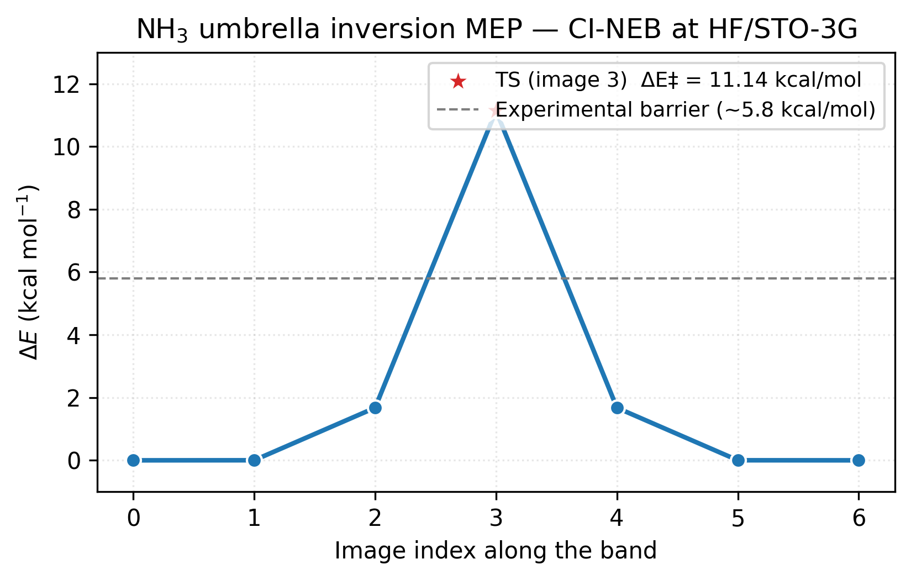
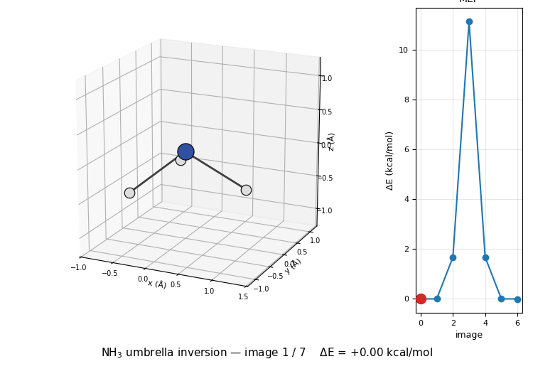

# Nudged elastic band: reaction paths and transition states

Geometry optimization (the `geometry_optimization` tutorial) finds minima. **Transition-state
search** finds first-order saddle points, the structures where a
reaction actually happens. The **Nudged Elastic Band (NEB)**
algorithm does this by threading a chain of intermediate geometries
("images") between two minima, connecting them with fictitious
springs, and relaxing the chain onto the minimum-energy path on the
PES. The highest-energy image approximates the transition state.

This tutorial walks through the canonical closed-shell example:
**NH₃ umbrella inversion**, the molecule flips through a planar
(D₃h) transition state to invert its chirality.

## The one-liner

vibe-qc finds reaction paths natively with `run_neb`, pass the two
endpoints, a basis, and `climbing_image=True`:

```python
import vibeqc as vq

result = vq.run_neb(reactant, product, basis="sto-3g", method="RHF",
                    n_images=5, climbing_image=True)
ts = result.path.images[result.transition_state_index].system
```

`run_neb` builds the interpolated band, runs the per-image SCFs (in
parallel if you ask), assembles the improved-tangent NEB force, and
relaxes the band with a quick-min outer loop, vibe-qc's own code end
to end. The full worked example lives in
[examples/workflows/input-nh3-umbrella-neb.py](https://github.com/vibe-qc/vibe-qc/blob/main/examples/workflows/input-nh3-umbrella-neb.py);
this page walks through its key pieces. Prefer to drive NEB from an
ASE workflow? See [Driving NEB through ASE](#driving-neb-through-ase)
at the end.

## Build the two endpoints

Two copies of pyramidal NH₃, one with H atoms below the nitrogen,
one above, each relaxed to its minimum with vibe-qc's optimiser.
vibe-qc coordinates are in **bohr**, so the experimental geometry
(quoted in Å) is converted on the way in:

```python
import numpy as np
import vibeqc as vq

ANG_TO_BOHR = 1.8897259886

def build_nh3(flip=False):
    theta = np.deg2rad(106.67)          # experimental HNH angle
    r_nh = 1.012 * ANG_TO_BOHR          # experimental N-H (1.012 Å → bohr)
    sin_a = np.sqrt(2 * (1 - np.cos(theta)) / 3)
    cos_a = np.sqrt(1 - sin_a**2)
    z_sign = +1 if flip else -1
    atoms = [vq.Atom(7, [0.0, 0.0, 0.0])]       # nitrogen at origin
    for k in range(3):
        phi = k * 2 * np.pi / 3
        atoms.append(vq.Atom(1, [
            r_nh * sin_a * np.cos(phi),
            r_nh * sin_a * np.sin(phi),
            z_sign * r_nh * cos_a,
        ]))
    return vq.Molecule(atoms, 0, 1)             # neutral singlet

reactant = vq.optimize_molecule(build_nh3(flip=False), "sto-3g", method="rhf").system
product  = vq.optimize_molecule(build_nh3(flip=True),  "sto-3g", method="rhf").system
```

Both relax to equivalent pyramidal minima related by mirror symmetry
- same energy, mirror-image geometry. `optimize_molecule` returns a
result object; its `.system` is the relaxed `Molecule`.

## Run the climbing-image band

With both minima in hand, a single `run_neb` call threads the band
between them and relaxes it. The three options that matter for this
inversion are spelled out right after the call:

```python
result = vq.run_neb(
    reactant, product,
    basis="sto-3g",
    n_images=5,                          # 5 interior images + 2 endpoints
    method="RHF",
    interpolation="linear",              # smooth flip, no bonds break → IDPP not needed
    climbing_image=True,
    climbing_image_start_fraction=0.1,   # promote the climber early (see note)
    conv_tol_force=1e-3,                 # ≈ 0.05 eV/Å, the Kolsbjerg 2016 default
)
```

**Three choices matter here:**

1. **`climbing_image=True`.** Without climbing, the image near the
   peak is pulled down by its neighbouring springs and never sits
   *at* the TS. With climbing on, the highest-energy image is freed
   from the spring force and pushed uphill along the tangent, it
   converges onto the exact saddle point.
2. **`climbing_image_start_fraction=0.1`.** The climber is promoted
   only after a plain-NEB warm-up (default `0.3 × max_iter`) so the
   band settles before one image starts climbing. This small,
   symmetric band converges in ~56 iterations, faster than the
   default warm-up would engage, so we shorten the warm-up to let
   the climber take over in time. On larger barriers the default is
   usually fine.
3. **`interpolation="linear"`.** The umbrella flip is a smooth
   geometric motion with no change in bonding, so a straight-line
   interpolation seeds the band well. For reactions that break or
   form bonds, use `"idpp"` (image-dependent pair potential), which
   avoids atom-atom clashes in the starting path.

There is no optimizer to choose: `run_neb` uses a quick-min
(damped-MD) outer loop internally, which is the right integrator for
the non-conservative NEB force (see [Theory](#theory)). On this
system the band converges in well under two seconds on a single
core; the default `n_jobs=0` uses bounded automatic parallelism, and
`n_jobs=-1` explicitly parallelises the per-image SCFs across all
cores for bigger problems.

## Read the MEP

The converged band carries one energy per image. Referencing each to the
first endpoint and converting to kcal/mol traces the minimum-energy path
and exposes the barrier height:

```python
e = result.energies                      # per-image energies (Hartree)
for i, de in enumerate((e - e[0]) * 627.509):
    print(f"image {i}: ΔE = {de:+.3f} kcal/mol")
```

Output:

```
image 0: ΔE = +0.000 kcal/mol
image 1: ΔE = +0.002 kcal/mol
image 2: ΔE = +1.675 kcal/mol
image 3: ΔE = +11.141 kcal/mol    ← TS
image 4: ΔE = +1.675 kcal/mol
image 5: ΔE = +0.002 kcal/mol
image 6: ΔE = -0.000 kcal/mol
```

Symmetric about image 3, as expected for the symmetric inversion.
`result.transition_state_index` is 3 (the highest-energy image, which
is also `result.path.climbing_image_index` once the climber is
promoted); image 3 is the transition state, at 11.1 kcal/mol above
the pyramidal minimum.



The figure makes the symmetry visible at a glance: the path is its
own mirror image around the climbing image (red star) at index 3.
Images 1 and 5 sit essentially flat against the endpoint minima, the
band only starts climbing at images 2 and 4 as the molecule flattens.
The dashed grey line marks the experimental barrier (~5.8 kcal/mol);
HF/STO-3G overshoots by nearly 2× because the sp³→sp² rehybridisation
at the TS is exactly the regime where electron correlation stabilises
the more delocalised state and a minimum basis cannot describe it.
The *shape* of the path is right at every level of theory; the
*height* needs MP2 or hybrid DFT in a TZ-quality basis to match
experiment.

The plot is regenerated by
[`examples/plots/nh3-umbrella-neb-mep.py`](https://github.com/vibe-qc/vibe-qc/blob/main/examples/plots/nh3-umbrella-neb-mep.py)
from the trajectory written by the example script.

## Inspect the TS

Pulling the highest-energy image out of the band and printing its atom
positions (converted back to Å) confirms the saddle point is the planar
D₃h structure the two pyramidal minima invert through:

```python
BOHR_TO_ANG = 0.52917721067
ts = result.path.images[result.transition_state_index].system
for a in ts.atoms:
    x, y, z = np.array(list(a.xyz)) * BOHR_TO_ANG
    print(f"  {('N' if a.Z == 7 else 'H')}   {x:+.3f}  {y:+.3f}  {z:+.3f}")
```

```
  N   +0.000  +0.000  +0.000
  H   +1.005  +0.000  +0.000    ← all H at z=0
  H   -0.503  +0.871  +0.000
  H   -0.503  -0.871  +0.000
```

All three H atoms sit at $z = 0$, the planar D₃h transition state
that connects the two pyramidal enantiomers. N-H bond length
(1.005 Å) is a touch shorter than the pyramidal equilibrium
(1.012 Å): the in-plane geometry is sp²-like and the overlap
tightens.

## Comparing to experiment

The computed barrier depends strongly on the level of theory. The table
below tracks the NH₃ inversion barrier from HF/STO-3G up to
MP2/aug-cc-pVTZ against the experimental value:

| Level | NH₃ barrier (kcal/mol) |
| --- | ---: |
| HF/STO-3G | 11.14 |
| HF/6-31G\*\* | ~6.0 |
| MP2/aug-cc-pVTZ | ~5.7 |
| Experimental | ~5.8 |

HF/STO-3G over-estimates by nearly 2×, a reminder that tutorial
numbers are qualitative until you climb the basis and correlation
hierarchies. The **shape** of the path (symmetric, planar TS, one
barrier) is qualitatively right at every level.

## Animate the path

The example script writes two renderable artefacts of the converged
band: a vibe-view archive via `result.write_qvf(...)`
(``output-nh3-umbrella-neb.qvf``, drop it into vibe-view for an
interactive reaction-path animation with the per-image energy plot),
and ``output-nh3-umbrella-neb.traj``, an ASE trajectory of all seven
images. The path animates as a ping-pong loop forward through the
inversion and back:

The refreshed reference bundle is downloadable from the docs site:
[`input`](../_static/examples/nh3-umbrella-neb/input-nh3-umbrella-neb.py),
[`out`](../_static/examples/nh3-umbrella-neb/output-nh3-umbrella-neb.out),
[`qvf`](../_static/examples/nh3-umbrella-neb/output-nh3-umbrella-neb.qvf),
[`traj`](../_static/examples/nh3-umbrella-neb/output-nh3-umbrella-neb.traj),
[`vibe-view screenshot`](../_static/examples/nh3-umbrella-neb/output-nh3-umbrella-neb-structure.png),
[`stdout`](../_static/examples/nh3-umbrella-neb/stdout.txt), and
[`stderr`](../_static/examples/nh3-umbrella-neb/stderr.txt).



The 3D molecule on the left flips through the seven NEB images while
the right inset highlights which image is currently shown on the MEP
curve. Reactant (image 1) and product (image 7) are mirror images of
each other through the planar TS at image 4, the classic D₃ₕ
transition state of the umbrella inversion.

For interactive inspection (rotation, atom labeling, distance
measurement), open the trajectory in ASE's GUI:

```sh
ase gui output-nh3-umbrella-neb.traj
```

Space advances one frame. Reproduce the GIF above with
``python3 examples/plots/nh3-umbrella-neb-animation.py``.

For a second worked example of the QVF `reaction.path` section
specifically, including a DFT+U variant, see
[`examples/vibe_view/showcase_neb_reaction.py`](https://github.com/vibe-qc/vibe-qc/blob/main/examples/vibe_view/showcase_neb_reaction.py):
it produces two archives whose headline section is `reaction.path`, the
one vibe-view's reaction renderer animates frame by frame with
reactant/TS/product waypoints and an energy profile.

## Driving NEB through ASE

`run_neb` is the native path and the one this tutorial recommends.
But vibe-qc also exposes an ASE `Calculator`, so you can drive NEB
(and the dimer method, IRC, …) through ASE's own optimizers when you
are already in an ASE workflow:

```python
from ase import Atoms
from ase.mep import NEB
from ase.optimize import FIRE
from vibeqc.ase import VibeQC

# initial / final: relaxed ASE Atoms, each with atoms.calc = VibeQC(basis="sto-3g")
images = [initial] + [initial.copy() for _ in range(5)] + [final]
for img in images:
    img.calc = VibeQC(basis="sto-3g")           # every image needs its own calc

neb = NEB(images, k=0.1, climb=True, method="improvedtangent")
neb.interpolate()
FIRE(neb, logfile=None).run(fmax=0.05, steps=200)   # FIRE, not BFGS - see Theory
```

This converges to the same TS barrier (11.14 kcal/mol). The ASE route
is also how you reach ASE's *own* dimer-method and IRC drivers, though
vibe-qc implements both natively as well (`run_dimer`, `run_irc`); see
[What NEB doesn't find](#what-neb-doesnt-find).

## Theory

The sections below unpack how NEB works: the spring-coupled band
construction and the forces on each image, why the per-step cost is far
smaller than the image count suggests, the climbing-image trick that
pins the top image onto the saddle, and the related searches NEB cannot
perform.

### The NEB construction

Given initial and final geometries $\mathbf{R}_0$ and $\mathbf{R}_N$,
NEB inserts $N-1$ intermediate **images** $\mathbf{R}_1, \dots,
\mathbf{R}_{N-1}$ and connects consecutive images with fictitious
springs. Each intermediate image feels two forces:

1. **Perpendicular PES force**, the true gradient of the electronic
   energy projected onto the direction perpendicular to the band
   tangent $\hat{\tau}_i$:

   $$
   \mathbf{F}_i^\perp = -\nabla E(\mathbf{R}_i) + (\nabla E(\mathbf{R}_i) \cdot \hat{\tau}_i)\, \hat{\tau}_i.
   $$

2. **Parallel spring force**, along the tangent, with spring
   constant $k$, keeps the images from collapsing into the endpoints:

   $$
   \mathbf{F}_i^\parallel = k \bigl( |\mathbf{R}_{i+1} - \mathbf{R}_i| - |\mathbf{R}_i - \mathbf{R}_{i-1}| \bigr) \hat{\tau}_i.
   $$

The total NEB force $\mathbf{F}_i^\text{NEB} = \mathbf{F}_i^\perp +
\mathbf{F}_i^\parallel$ is **not** the gradient of any scalar, the
spring term depends only on the parallel projection of the
displacement, so no scalar potential has it as a gradient. This is
why a standard BFGS line-search (which assumes an energy it can
decrease) fails on NEB, and why `run_neb` uses a quick-min
(damped-MD) outer loop instead. At convergence
($\mathbf{F}_i^\text{NEB} = \mathbf{0}$ for every interior $i$), the
band traces the minimum-energy path on the PES. The
*improved-tangent* variant (Henkelman-Jónsson 2000), `run_neb`'s
default, uses a smarter tangent definition that avoids kinking on
asymmetric paths.

### Why NEB is so much cheaper than it looks

Each NEB optimization step evaluates the gradient on *every*
intermediate image, seemingly $N$× the cost of a single gradient.
But in practice (a) the images at each step are close enough that
SCF converges in a handful of iterations each, and `run_neb` reuses
each image's converged density across outer iterations
(`warm_start=True`, the default) so the SCF starts warm rather than
from scratch; and (b) the per-image SCFs at each step are independent,
so `n_jobs=0` spreads them across a small bounded worker pool by
default and `n_jobs=-1` uses all cores when you explicitly request it.
For a 5-image band on a small molecule, you're looking at
$\mathcal{O}(100)$ single-point SCFs, comparable to a single geometry
optimization.

### The climbing-image trick

Plain NEB leaves the highest-energy image pulled slightly *below*
the true saddle point by the spring force from its neighbors. The
**climbing image** variant (Henkelman, Uberuaga, Jónsson 2000)
identifies the highest-energy image and replaces its force with

$$
\mathbf{F}_\text{ci}^\text{CI-NEB} = -\nabla E(\mathbf{R}_\text{ci}) + 2\,(\nabla E(\mathbf{R}_\text{ci}) \cdot \hat{\tau})\, \hat{\tau},
$$

- the true PES gradient with the tangent component inverted. This
drives the climbing image uphill along the tangent (toward the TS)
and downhill perpendicular (onto the ridge). The result is that the
climbing image converges to the exact saddle point, not just close
to it. Cost-wise: negligible extra work. (On a perfectly symmetric
path like this one, plain NEB already lands the centre image on the
saddle by symmetry; climbing matters most on asymmetric barriers.)

### What NEB doesn't find

NEB only walks a path between two *pre-specified* minima. If the
mechanism you're looking for goes via an intermediate you didn't
anticipate, NEB gives you a suboptimal path with multiple local
maxima. Complements:

- **Intrinsic Reaction Coordinate (IRC)**, starts from an
  already-known TS and traces the path downhill in both directions
  to identify the connected minima. **This ships natively** as
  `vq.run_irc`, the natural follow-up to a dimer/NEB saddle search:

  ```python
  irc = vq.run_irc(ts, basis="sto-3g", method="RHF")   # auto imaginary mode
  reactant, product = irc.reverse_minimum, irc.forward_minimum
  ```

  Molecular ROHF follows the same explicit-mode or auto-mode route. ROKS uses
  central differences of its energy and currently requires an explicit mode,
  for example `transition_mode=dimer_result.mode`; its auto-mode Hessian stays
  unavailable until the ROKS analytic gradient is implemented. Periodic
  restricted-open-shell IRC remains unsupported.

- **Dimer method / eigenvector-following**, finds saddle points
  from a single starting geometry plus a direction, no pre-specified
  endpoints needed. **This ships natively** as `vq.run_dimer` (same
  SCF / MACE method surface as `run_neb`):

  ```python
  result = vq.run_dimer(start, basis="sto-3g", method="ROHF",
                        initial_direction=mode)   # guessed reaction direction
  ts = result.system                              # result.is_saddle, result.curvature
  ```
- **Metadynamics / enhanced sampling**, explores the PES
  adaptively, good for systems where the mechanism is genuinely
  unknown.

Metadynamics doesn't ship natively yet; ASE has a module for it that
drives through the `VibeQC` calculator exactly like the
[ASE NEB route](#driving-neb-through-ase) above.

## Resources

~150 MB peak RAM, ~1.5 s on one core (Apple M2 baseline) for the
seven-image NH₃ NEB at HF/STO-3G: 5 interior images × ~56 quick-min
iterations × (HF + analytic gradient), run serially. Cost scales
linearly in (image count × NEB step count × per-image SCF cost), 
bigger barriers and slower-converging bands quickly push the wall
time into hours, at which point intentionally increasing `n_jobs`
(up to `n_jobs=-1` for all cores on a memory-sized host) becomes
worth it.

## References

- **Original NEB formulation.** H. Jónsson, G. Mills, and K. W.
  Jacobsen, "Nudged elastic band method for finding minimum energy
  paths of transitions," in *Classical and Quantum Dynamics in
  Condensed Phase Simulations*, B. J. Berne, G. Ciccotti, and D. F.
  Coker eds., World Scientific (1998), p. 385.
- **Improved tangent variant.** G. Henkelman and H. Jónsson,
  "Improved tangent estimate in the nudged elastic band method for
  finding minimum energy paths and saddle points," *J. Chem. Phys.*
  **113**, 9978 (2000).
- **Climbing-image NEB.** G. Henkelman, B. P. Uberuaga, and H.
  Jónsson, "A climbing image nudged elastic band method for finding
  saddle points and minimum energy paths," *J. Chem. Phys.* **113**,
  9901 (2000).
- **FIRE optimizer.** E. Bitzek, P. Koskinen, F. Gähler, M. Moseler,
  and P. Gumbsch, "Structural relaxation made simple," *Phys. Rev.
  Lett.* **97**, 170201 (2006).
- **ASE NEB implementation.** A. H. Larsen et al., "The atomic
  simulation environment, a Python library for working with atoms,"
  *J. Phys. Condens. Matter* **29**, 273002 (2017). Section 3.4.
- **Ammonia inversion barrier, experimental.** J. D. Swalen and
  J. A. Ibers, "Potential function for the inversion of ammonia,"
  *J. Chem. Phys.* **36**, 1914 (1962).

## Next

- Once you have a TS, vibrational frequencies on it should show
  exactly one imaginary mode aligned with the reaction coordinate
  - see [Vibrational frequencies](vibrational_frequencies.md). ASE's
  ``Vibrations`` on an NEB TS image makes this a two-line check.
- [Thermodynamics](thermodynamics.md) gives Δ*G*‡ = barrier +
  zero-point + entropy corrections, bringing you from an electronic
  barrier to an Eyring-equation rate constant.
- For bigger mechanisms (reactive systems with more than two
  minima), stitch NEB runs together via shared images.
