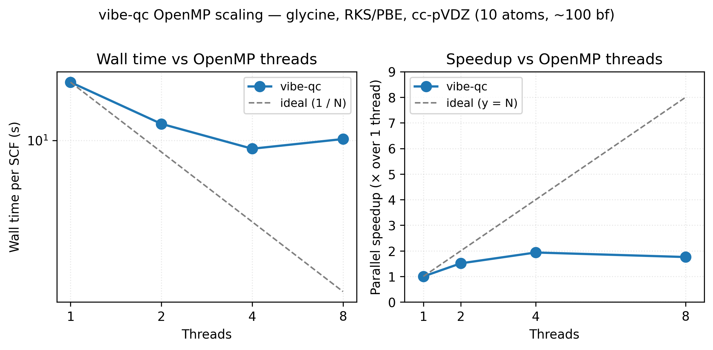

# Running in parallel

vibe-qc's C++ core is OpenMP-parallelised throughout: the four-index
ERI evaluation, the SCF commutator-error step, DFT-grid integration,
and gradients all distribute across threads on a shared-memory node.
For a medium-sized molecule on a modern laptop with 10 cores, expect
a 3-6× speed-up over serial.

## Two ways to set the thread count

The OpenMP thread count is controllable from two layers: pin it explicitly on the Python call, or set the standard environment variable in the shell. Both are shown below, along with which one wins when both are present.

### In Python via `run_job`

The `num_threads=` argument on `run_job` pins the OpenMP thread count for that calculation directly, here a water RKS/PBE single-point at 6-31g* on four threads:

```python
from vibeqc import Molecule, run_job

mol = Molecule.from_xyz("water.xyz")

run_job(
    mol,
    basis="6-31g*",
    method="rks",
    functional="PBE",
    num_threads=4,        # pin the OpenMP thread count
    output="water_pbe",
)
```

`num_threads=None` (the default) uses the process-wide default,
which follows `OMP_NUM_THREADS` if set, otherwise falls back to the
hardware core count.

### At the shell level via `OMP_NUM_THREADS`

Exporting the standard `OMP_NUM_THREADS` variable before launching Python sets the thread count for the whole process without touching the job script:

```sh
export OMP_NUM_THREADS=4
python3 my_job.py
```

Shell variables are respected by every vibe-qc entry point and
carry through to scripts that invoke `run_job`, `run_rhf`,
`run_rks`, `run_rhf_periodic_scf`, etc., just like in any
well-behaved OpenMP code.

If both are set, `num_threads=` on `run_job` wins (it calls
`set_num_threads` internally).

## What the output shows

The `.out` file from `run_job` logs both the active thread count
and wall-clock timings for each phase:

```
  Timings (wall clock, seconds)
  ----------------------------------------------------
  SCF total                               3.421
  SCF avg. per iteration                  0.380  (9 iters)
  Job total                               3.428
  Used 4 OpenMP threads.
```

Use this to sanity-check that your thread count took effect, and to
spot the cost breakdown when iterating on a calculation.

## When scaling flattens

OpenMP speed-up plateaus for three reasons:

1. **Memory bandwidth** dominates the integral loop on larger
   systems. Beyond ~16 cores the bus saturates and extra threads
   waste cycles.
2. **Fine-grained regions** have non-trivial OpenMP overhead. Very
   small molecules (< 50 basis functions) often run *faster* at
   1-2 threads than at 16 because of parallel-region setup costs.
3. **Amdahl's law.** The serial portion, basis-set construction,
   Fock diagonalisation at each SCF step, doesn't scale; above
   20-30 threads it becomes the bottleneck for moderate-sized
   systems.

The sweet spot for a 50-200-basis-function calculation on a modern
x86 laptop is usually 4-8 threads. For larger jobs (500+ bfs), try
the full core count and see if it helps.



OpenMP scaling for an RKS/PBE single-point on the glycine zwitterion
at cc-pVDZ (10 atoms, ~100 basis functions). Going from 1 → 4 threads
cuts wall time roughly in half (1.94× speedup); the 8-thread point
sits *above* 4 threads because OpenMP region overhead and Amdahl's
serial floor (basis-set construction, Fock diagonalisation) start to
dominate for a system this small. Larger molecules and basis sets keep
scaling further before flattening. Reproduce with
`python3 examples/plots/openmp-scaling.py`.

## How far each method scales

The 4-8-thread DFT sweet spot above does not transfer to every method.
Whether a method scales, and how far, depends on what its hot kernel is:
OpenMP work (scales with `OMP_NUM_THREADS`), a dense BLAS GEMM (scales only
if you also raise the BLAS thread count, which vibe-qc pins to 1 by
default to avoid oversubscribing the OpenMP regions), or single-threaded
Python. The table below is measured wall-clock scaling on a representative
system per class; the full data, the OpenMP-vs-BLAS axis decomposition,
and a cores-per-job table for batch scheduling live in the repo at
`benchmarks/openmp_scaling.md`.

| Method | Scales on | Saturates around | Note |
|---|---|---|---|
| RHF / RKS | OpenMP | ~8 (later for large basis) | memory-bandwidth bound, then the serial Eigen eigensolve at very large `n` |
| MP2 | OpenMP **and** BLAS | ~8 with both axes raised | the one common method that benefits from a threaded BLAS, raise the BLAS vars too |
| CCSD / CCSD(T) | OpenMP | scales past 16 | the threaded scalar intermediate loops dominate wall time, not the single-threaded BLAS ladders |
| UCCSD | OpenMP | system-size dependent | scalar OpenMP residual loops |
| CASSCF | OpenMP | active-space dependent | C++ CI sigma build |
| CASPT2 | single-threaded | ~1-4 | Python numpy contractions, only the SCF underneath threads |
| TD-DFT | OpenMP (small) | ~8 | tracks the DFT SCF for small systems, the response build is Python-bound and only dominates for large ones |
| periodic RKS / UKS | OpenMP inside each k-point | per-k work | the k-point loop is serial, so core count is sized by the per-k Fock/XC cost, not by the number of k-points |

Practical guidance for batch runs: give CCSD, CCSD(T) and MP2 the whole
node; cap small-molecule DFT, CASPT2 and TD-DFT at a few threads and run
several jobs side by side for throughput. For MP2, also set
`OPENBLAS_NUM_THREADS` / `VECLIB_MAXIMUM_THREADS` to the core count, its
dense density-fitting GEMM is the one place a threaded BLAS pays off.

## What's currently parallelised

- ERI evaluation (four-index integrals via libint).
- DFT grid integration (per-atom block split across threads).
- SCF commutator norm $\lVert \mathbf{F}\mathbf{D}\mathbf{S} -
  \mathbf{S}\mathbf{D}\mathbf{F} \rVert$.
- Gradient evaluation for HF / DFT / UHF / UKS.
- Periodic lattice sums for overlap / kinetic / nuclear-attraction
  and ERI contributions.
- Ewald reciprocal-space sums.

## What's not (yet)

- **Eigenvalue solves.** Single-threaded Eigen `SelfAdjointEigenSolver`
  runs. For small systems this doesn't matter; for very large
  systems it becomes a bottleneck. Parallel LAPACK integration is
  tracked on the roadmap.
- **Production MPI across nodes.** OpenMP is the broad production
  shared-memory path today. The optional `[mpi]` extra provides
  `mpi4py` helpers, an experimental GPW z-slab overlay, and two
  production seams on multi-k GDF, both via `vibeqc.mpi.KPointPartition`:
  the cderi (density-fitting 3-center integral) build farms
  momentum-transfer q-groups across ranks once per SCF *setup*
  (`run_krhf_periodic_gdf` / `run_kuhf_periodic_gdf` /
  `run_krohf_periodic_gdf`), and -- landed 2026-08-05 -- the
  per-*iteration* O(n_k²) exchange contraction is farmed too, over the
  bra k-index, with ranks exchanging whole `K(k_i)` matrices (exact,
  not approximate) and reassembling via `KPointPartition.allgather_ordered`.
  Restricted 3D χ-CCM four-center RHF additionally uses
  `LatticeOutputPartition` to farm complete direct short-range J/K output
  blocks. The full internal translation sum stays inside each task, while
  reciprocal long-range layers and the rest of SCF remain replicated. This
  is neither Γ-CCM WSC farming nor χ finite-group residue farming. Other HF /
  DFT / MP2 drivers are not distributed across MPI ranks yet. The production
  strategy is documented in
  [MPI Parallelization](../design_mpi_parallelization.md).
  Installing the extra alone does not initialize MPI: ordinary Python
  processes stay serial, while validated launcher ranks bind
  `MPI.COMM_WORLD` automatically and fail closed if the communicator does not
  match the launch contract.

## Performance-checking checklist

If scaling looks wrong, try:

1. Confirm threads are actually used, the `.out` file's `Used N
   OpenMP threads` line is definitive.
2. Check for Python-side bottlenecks (for-loops, I/O) with a
   profiler (`cProfile`). vibe-qc's C++ side is fast; most
   surprising slowness comes from the surrounding Python.
3. For periodic calculations, the lattice sum cutoffs grow the
   parallel work cubically. Too-conservative cutoffs (e.g.
   `cutoff_bohr = 30` for a cell that converges at 12) will cost
   more than the parallel saves.
4. For DFT, the grid quality affects both wall time and parallel
   efficiency. `n_radial = 75` (default) is usually more
   efficient than 99 or 120 in absolute wall-clock despite the
   lower parallelism overhead.

## Resources

See the embedded scaling figure: 17.8 s → 9.2 s on 1 → 4 cores
for the glycine cc-pVDZ benchmark (Apple M2 baseline). Memory peak
scales weakly with thread count, the per-thread engine pool is the
dominant overhead and adds <50 MB per additional thread on top of
the SCF's basis-quadratic memory footprint.

## References

- **OpenMP 5.2 specification.** <https://www.openmp.org/specifications/>.
  The formal standard for the shared-memory parallelism model used
  throughout vibe-qc.
- **Textbook.** T. Rauber and G. Rünger, *Parallel Programming*,
  3rd ed., Springer (2023). Solid general-purpose reference for
  the algorithmic side of shared-memory parallelism.
- **Amdahl's law.** G. M. Amdahl, "Validity of the single-processor
  approach to achieving large scale computing capabilities,"
  *AFIPS Conf. Proc.* **30**, 483 (1967). The original argument
  that bounds parallel speed-up by the serial fraction.

## Next

- [DFT functional comparison](functional_comparison.md) includes
  a thread-dependent timing snapshot.
- Memory budgeting is a separate concern, see the [memory user
  guide](../user_guide/memory.md) for the pre-flight estimator.
