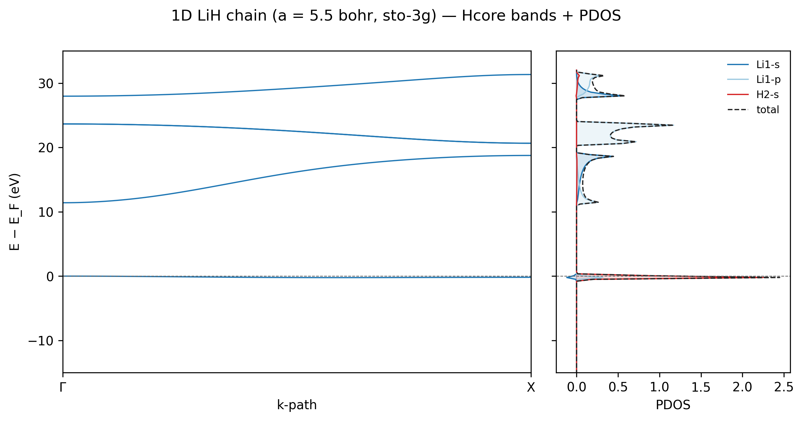

# Projected density of states (PDOS)

A total density of states tells you how many states occur near an energy. A
projected density of states estimates which atoms and angular-momentum
channels contribute to those states. In an LCAO code such as vibe-qc, the
default projection is a Mulliken partition of every Bloch orbital over the AO
basis.

This tutorial separates two workflows that should not be confused:

| Workflow | Operator | Use |
|---|---|---|
| `density_of_states_projected_hcore` | kinetic plus nuclear attraction | teaching, AO-label checks, fast qualitative survey |
| `run_periodic_job(..., output_qvf=True)` | route-dependent post-SCF reconstruction | diagnostic QVF output; verify the operator before scientific interpretation |

Hcore contains no Coulomb, exchange, or exchange-correlation potential. Its
orbital character can differ from a self-consistent result. Label every Hcore
plot explicitly and do not report its gap as a Hartree-Fock or DFT prediction.

## A complete Hcore example

The following example creates a 1D LiH chain, verifies the AO partition,
computes an atom and angular-momentum projected DOS, compares it with a
separately computed total DOS, and writes a plot:

```python
import numpy as np
import vibeqc as vq
from vibeqc.plot import pdos_figure

a = 5.5
system = vq.PeriodicSystem(
    dim=1,
    lattice=[[a, 0.0, 0.0], [0.0, 30.0, 0.0], [0.0, 0.0, 30.0]],
    unit_cell=[
        vq.Atom(3, [0.0, 0.0, 0.0]),
        vq.Atom(1, [0.5 * a, 0.0, 0.0]),
    ],
)
basis = vq.BasisSet(system.unit_cell_molecule(), "sto-3g")

groups = vq.ao_groups_per_atom_l(system, basis)
assigned = [ao for indices in groups.values() for ao in indices]
if len(assigned) != len(set(assigned)) or sorted(assigned) != list(range(basis.nbasis)):
    raise ValueError("PDOS groups must partition every AO exactly once")

pdos = vq.density_of_states_projected_hcore(
    system,
    basis,
    mesh=[200, 1, 1],
    projection=groups,
    sigma=0.005,
    n_electrons_per_cell=4,
)
dos = vq.density_of_states_hcore(
    system,
    basis,
    mesh=[200, 1, 1],
    sigma=0.005,
    n_electrons_per_cell=4,
)

print(pdos.group_labels)
print("maximum projected-total error:", np.max(np.abs(pdos.total - dos.dos)))

fig = pdos_figure(pdos, title="LiH chain (STO-3G, Hcore PDOS)")
fig.savefig("lih-chain-hcore-pdos.png", dpi=180)
```

`pdos.energies`, `pdos.total`, and each contribution array have the same
length. Energies and `sigma` are in Hartree. The plotting layer displays eV by
default and can shift the reference energy to `pdos.e_fermi`.



The figure is useful for learning how Li-s, Li-p, and H-s channels are shown.
The chemical interpretation remains qualitative because this example uses
Hcore. Reproduce the maintained plot with
`examples/plots/lih-chain-pdos.py`.

## The projection equation

At each k point, vibe-qc solves the generalized eigenproblem

$$
\mathbf{F}(\mathbf{k})\mathbf{C}_n(\mathbf{k})
=\varepsilon_n(\mathbf{k})
\mathbf{S}(\mathbf{k})\mathbf{C}_n(\mathbf{k}),
$$

with normalized eigenvectors,

$$
\mathbf{C}_n^\dagger(\mathbf{k})
\mathbf{S}(\mathbf{k})\mathbf{C}_m(\mathbf{k})=\delta_{nm}.
$$

The Mulliken weight of AO $\mu$ in band $n$ is

$$
p_{\mu n\mathbf{k}}=
\operatorname{Re}\left[
C^*_{\mu n}(\mathbf{k})
\left(\mathbf{S}(\mathbf{k})\mathbf{C}_n(\mathbf{k})\right)_\mu
\right].
$$

Normalization gives

$$
\sum_\mu p_{\mu n\mathbf{k}}=1.
$$

For a group $A$ containing selected AO indices, the broadened PDOS is

$$
g_A(E)=\sum_\mathbf{k}w_\mathbf{k}\sum_n
\left(\sum_{\mu\in A}p_{\mu n\mathbf{k}}\right)
\frac{\exp[-(E-\varepsilon_{n\mathbf{k}})^2/(2\sigma^2)]}
{\sqrt{2\pi}\sigma},
$$

where $\sum_\mathbf{k}w_\mathbf{k}=1$. If the groups form a complete,
non-overlapping AO partition, their curves sum to the independently computed
total DOS at every energy. `ProjectedDensityOfStates.total` itself is built by
adding the requested group curves, so comparing those curves with that member
is tautological. Validate the AO indices first, then compare against a separate
unprojected DOS evaluated with the same operator, mesh, grid, and broadening.

Individual Mulliken weights can be negative because overlap populations can
be negative. This is not by itself an error. Interpret robust group sums and
trends, not one isolated AO coefficient.

## Choose projection groups

The Hcore convenience function accepts:

| `projection` | Channels |
|---|---|
| `"atoms"` | one channel per atom |
| `"atoms_l"` | atom and angular momentum, such as `O1-p` |
| dictionary | explicit label to AO-index mapping |

For an explicit real-space Fock/overlap workflow, use
`vq.ao_groups_per_atom(system, basis)` or
`vq.ao_groups_per_atom_l(system, basis)` to build a complete partition. A
custom selection can be passed to the lower-level function:

```python
import vibeqc as vq


def project_selected_aos(fock_real, overlap_real, kmesh):
    groups = {
        "metal_d": [10, 11, 12, 13, 14],
        "ligand_p": [25, 26, 27],
    }
    return vq.density_of_states_projected(
        fock_real,
        overlap_real,
        kmesh,
        groups=groups,
        sigma=0.005,
    )
```

Hard-coded AO indices are fragile when the basis changes. Record the basis and
print the generated standard groups before creating a custom partition.

Changing the groups does not change the underlying Mulliken rule. A Bader,
IAO, or Wannier analysis is a different projection method and should not be
described as a custom Mulliken grouping.

## PDOS diagnostics in a QVF

For a converged Gaussian-basis periodic calculation, `run_periodic_job`
reconstructs a post-SCF operator, computes total DOS and atom/angular-momentum
PDOS, and embeds both in the default QVF archive. Control the post-SCF mesh with
`dos_kmesh`:

```python
import vibeqc as vq


def run_bulk_with_pdos(system, basis):
    return vq.run_periodic_job(
        system,
        basis,
        method="RKS",
        functional="pbe",
        kpoints=[4, 4, 4],
        dos_kmesh=[12, 12, 12],
        output_qvf=True,
        output="output-bulk-pbe",
    )
```

Open `output-bulk-pbe.qvf` in vibe-view and select the DOS or PDOS section.
The QVF spectrum uses a 0.05 eV Gaussian width. The DOS mesh is separate from
the SCF mesh and needs its own convergence study. Use shapes consistent with
dimensionality, such as `[64, 1, 1]` for a 1D chain or `[24, 24, 1]` for a 2D
sheet.

For RKS and UKS, this current QVF reconstruction omits the
exchange-correlation potential; the restricted path also applies full exact
exchange. It is not the converged Kohn-Sham operator. Use these curves as
diagnostics only, and use a route-specific converged-operator helper for a
quantitative DFT PDOS claim.

The lower-level `density_of_states_projected` entry point consumes explicit
real-space `LatticeMatrixSet` Fock and overlap objects. Generic periodic result
objects do not promise `fock_real` or `overlap_real` attributes. Do not copy
older examples that assume those fields exist. Route-specific spectrum
helpers are listed in
[Band structure and DOS](../user_guide/band_structure.md#programmatic-scf-routes).

## Converge a PDOS

Use this order so one numerical effect is not hidden by another:

1. Converge the physical SCF result with respect to basis, Coulomb route,
   SCF k mesh, and numerical thresholds.
2. Increase the DOS mesh until peak positions and integrated channel weights
   stop changing at the accuracy relevant to the claim.
3. Choose `sigma` small enough to retain resolved features but large enough to
   display the converged mesh smoothly.
4. Repeat the projection with a second reasonable basis when the chemical
   conclusion depends on a small difference between channels.
5. Verify that the groups partition every AO exactly once, then compare their
   sum with a separately computed unprojected DOS on the identical grid.
6. Retain the input, `.out`, `.system`, `.qvf`, basis identity, and citations.

A large `sigma` can make an under-sampled mesh look smooth. Smoothness is not
evidence of k-point convergence.

## CPU time and memory

For $N_\mathbf{k}$ k points and $N_\mathrm{bf}$ basis functions, the leading
diagonalization trend is

$$
T\sim\mathcal{O}(N_\mathbf{k}N_\mathrm{bf}^3).
$$

Each k-point diagonalization needs matrix workspace near
$\mathcal{O}(N_\mathrm{bf}^2)$. The current implementation retains Mulliken
weights of shape $(N_\mathbf{k},N_\mathrm{bf},N_\mathrm{bf})$, so PDOS working
memory scales as $\mathcal{O}(N_\mathbf{k}N_\mathrm{bf}^2)$. Stored curves add
$\mathcal{O}(GN_E)$ for $G$ groups and $N_E$ energy points. The preceding SCF
can still set the process peak, while a dense PDOS mesh can dominate
post-processing CPU time.

Record CPU time, wall time, peak RSS, basis count, SCF mesh, PDOS mesh,
energy-grid size, group count, spin treatment, and `sigma` together.

## Interpretation limits

- Mulliken projections are basis dependent, especially with diffuse or highly
  redundant basis functions. Use them primarily for trends and broad orbital
  character.
- Hcore PDOS is qualitative. Electron-electron interactions can alter band
  ordering and character even when the Hcore picture looks plausible.
- Negative channel values can arise from non-orthogonal overlap populations.
- Integer `n_electrons_per_cell` filling supplies a plotting reference, not a
  finite-temperature chemical potential. Metals require converged k-point
  sampling, occupations, smearing temperature, entropy, and energy convention.
- A PDOS identifies basis-function character, not oxidation state or uniquely
  assigned charge. Combine it with real-space density, bond analysis, and
  chemical context.

## References and next steps

The Mulliken population definition originates with R. S. Mulliken,
*J. Chem. Phys.* **23**, 1833 (1955). For the broader chemical interpretation
of bands and DOS in extended systems, see R. Hoffmann, *Solids and Surfaces:
A Chemist's View of Bonding in Extended Structures* (1988).

Continue with:

- [Band structure and DOS](../user_guide/band_structure.md) for path versus
  mesh sampling, Gaussian normalization, route-specific SCF helpers, and
  resource scaling.
- [Periodic orbital cubes](periodic_orbital_cubes.md) for the spatial view of
  a selected Bloch orbital.
- [Smearing](../user_guide/smearing.md) for metals and fractional occupations.
