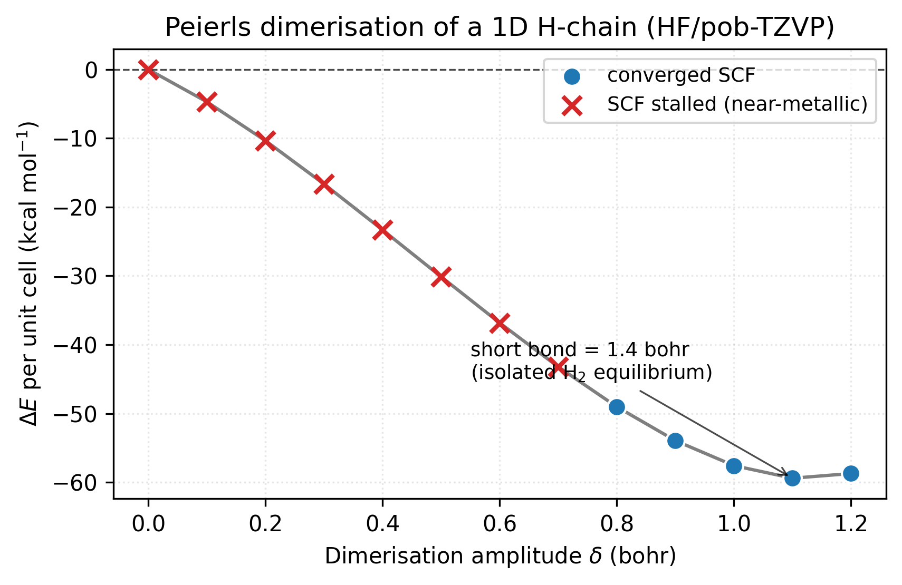
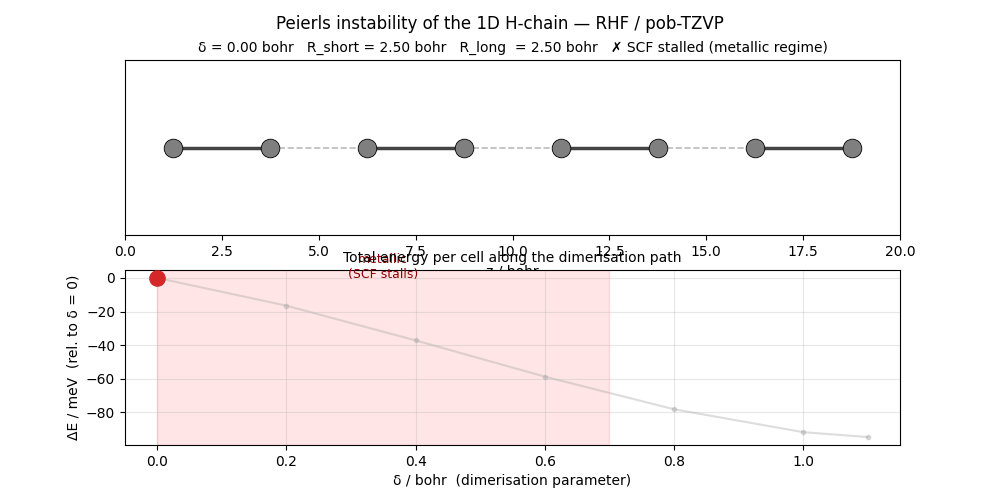
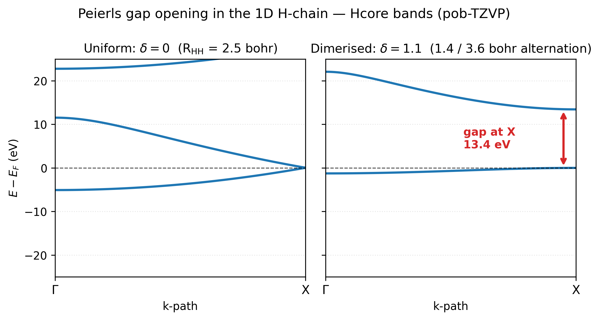

# Peierls dimerisation of a 1D H-chain

A uniform 1D chain of hydrogen atoms, equally spaced, has a
half-filled band that crosses the Fermi level at $k = \pi / 2a$, 
a 1D metal. Peierls (1955) showed that **any 1D metal is
thermodynamically unstable** against a periodic lattice distortion
that doubles the unit cell: pairs of atoms move together, opening a
gap at the folded-back band edge and lowering the total energy.
This tutorial traces that instability directly by scanning the
dimerisation amplitude and watching the total energy fall.

## The scan

Start from a two-atom unit cell with atoms at $0$ and $a/2$ (uniform
spacing) and shift the second atom by $-\delta$ along the chain:

- Uniform: $\delta = 0$. Both H-H distances equal $a/2$.
- Dimerised: $\delta > 0$. Short bond $a/2 - \delta$; long bond
  $a/2 + \delta$.

The complete scan is in
[examples/periodic/input-h-chain-peierls.py](https://github.com/vibe-qc/vibe-qc/blob/main/examples/periodic/input-h-chain-peierls.py);
the minimal excerpt:

```python
import numpy as np
from vibeqc import (
    Atom, BasisSet, KPoints, PeriodicSCFOptions, PeriodicSystem,
    format_scf_trace, run_rhf_periodic_scf,
)

A = 5.0                          # lattice parameter (bohr)
KMESH = [8, 1, 1]

def build_system(delta: float) -> PeriodicSystem:
    lattice = np.diag([A, 30.0, 30.0])
    unit_cell = [
        Atom(1, [0.0,              0.0, 0.0]),
        Atom(1, [A / 2.0 - delta,  0.0, 0.0]),
    ]
    return PeriodicSystem(dim=1, lattice=lattice, unit_cell=unit_cell)

opts = PeriodicSCFOptions()
opts.lattice_opts.cutoff_bohr = 15.0
opts.lattice_opts.nuclear_cutoff_bohr = 15.0
opts.conv_tol_energy = 1e-8
opts.conv_tol_grad = 1e-3        # see caveat below
opts.max_iter = 80

for delta in (0.0, 0.2, 0.4, 0.6, 0.8, 1.0, 1.1):
    sysp = build_system(delta)
    basis = BasisSet(sysp.unit_cell_molecule(), "pob-tzvp")
    kp = KPoints.monkhorst_pack(sysp, KMESH)
    r = run_rhf_periodic_scf(sysp, basis, kp, opts)
    short, long = A/2 - delta, A/2 + delta
    print(f"δ={delta:.2f}  R_short={short:.3f}  R_long={long:.3f}  "
          f"E={r.energy:.6f}  ({'yes' if r.converged else 'NO'})")
```

Typical output:

```
δ=0.00  R_short=2.500  R_long=2.500  E=-1.033  (NO)
δ=0.20  R_short=2.300  R_long=2.700  E=-1.050  (NO)
δ=0.40  R_short=2.100  R_long=2.900  E=-1.071  (NO)
δ=0.60  R_short=1.900  R_long=3.100  E=-1.092  (NO)
δ=0.80  R_short=1.700  R_long=3.300  E=-1.112  (yes)
δ=1.00  R_short=1.500  R_long=3.500  E=-1.125  (yes)
δ=1.10  R_short=1.400  R_long=3.600  E=-1.128  (yes)
```

As soon as the short bond shortens below the uniform spacing, the
energy drops monotonically. At $\delta = 1.1$ (short bond $= 1.4$
bohr, exactly the isolated H₂ equilibrium) the energy has fallen by
0.095 Ha per unit cell from the uniform case. That's ~2.6 eV, a
large, unambiguous stabilisation.



The energy drops by **~60 kcal/mol per unit cell** going from the
uniform chain to the H₂-equilibrium dimerisation. The red ✕'s mark
points where SCF stalled (gradient hovering above the loose
tolerance, the chain is too close to metallic for HF to settle on
a clean single-determinant wavefunction). The blue dots mark the
fully converged regime, which sets in once $\delta \gtrsim 0.8$ bohr
and a real gap has opened. The minimum sits at $\delta = 1.1$ bohr, 
short bond = 1.4 bohr = the isolated H₂ equilibrium, exactly as
chemical intuition demands.

The energy curve is regenerated by
`[`examples/plots/h-chain-peierls-energy.py`](https://github.com/vibe-qc/vibe-qc/blob/main/examples/plots/h-chain-peierls-energy.py)`.

The dynamics of the dimerisation are clearer as an animation, 
the chain itself contracting at every other bond while the SCF
goes from "metallic, stalls" (red band, δ ≲ 0.7) to "gapped,
converges" (blue dots, δ ≳ 0.8):



Regenerated by
[`examples/plots/h-chain-peierls-animation.py`](https://github.com/vibe-qc/vibe-qc/blob/main/examples/plots/h-chain-peierls-animation.py).
Two-panel layout: chain geometry on top (atoms moving toward their
H₂-pair positions, bonds drawn solid for short / dashed for long),
energy curve on the bottom (current δ marked, faint guide curve
showing the rest of the path). The animation makes the *mechanism*
of the instability immediate, it's not just an abstract band
crossing; it's the lattice physically distorting to open the gap.

## What the bands look like

Plot the bands at the two endpoints to see the gap-opening
mechanism directly:



**Left:** the uniform chain ($\delta = 0$). With two H per cell at
equal spacing the BZ is folded relative to the natural one-atom
cell, so the two bands meet at the X point, that touch *is* the
Peierls instability point, the place where the half-filled metallic
band crosses $E_F$. **Right:** the dimerised chain at $\delta = 1.1$.
The bands have separated cleanly: a deep, almost-flat bonding band
sits below $E_F$ (the localised H₂ σ orbital of every short bond),
and a high antibonding band sits ~13 eV above (the σ\*). The 13.4 eV
gap at X is the Peierls gap, and it's *because* this gap opens
that the occupied bonding band drops, accounting for the energy
stabilisation in the curve above.

The bands figure uses non-interacting (Hcore) bands, which is why the
δ = 0 panel doesn't depend on a converged SCF, Hcore needs none.
Regenerated by `[`examples/plots/h-chain-peierls-bands.py`](https://github.com/vibe-qc/vibe-qc/blob/main/examples/plots/h-chain-peierls-bands.py)`.

## Caveat on the uniform end

The tolerance ``conv_tol_grad = 1e-3`` is deliberately looser than
the default $10^{-6}$. At small $\delta$ the chain is near-metallic
and HF SCF oscillates around a stationary commutator norm, the
**energy** stabilises to $10^{-8}$ well before the gradient
tolerance is met. For the Peierls physics that's enough: the
relative energy across the scan is what matters. At $\delta \geq 0.8$
a real gap has opened and SCF converges cleanly at default
tolerances.

## Theory

The sections below set out why the instability happens: the half-filled tight-binding band that makes the uniform chain metallic, the gap-opening period-doubling distortion that lowers its energy, why vibe-qc's SCF reproduces the effect, and how the same argument extends to real materials.

### The half-filled band

For the uniform chain with one H per unit cell, a tight-binding
model with one orbital per site gives a single cosine band
$\varepsilon(k) = \varepsilon_0 - 2t \cos(ka)$, where $t$ is the
nearest-neighbor hopping. With one electron per site (half-filled),
the Fermi level sits at $k_F = \pi / 2a$, **inside the band**. The
system is metallic.

### The instability

Any perturbation of the lattice that opens a gap at $\pm k_F$
lowers the occupied-state energy. The simplest perturbation with
the right wavevector is a **period doubling**: atoms at
$\{\, 0, a, 2a, \dots \,\}$ redistribute to
$\{\, 0, a/2 + \delta_1, a, a + a/2 + \delta_2, \dots \,\}$ with
alternating displacements. For a single-orbital tight-binding
model, perturbation theory says the gain in band energy scales as
$\delta^2 \ln \delta$, while the elastic cost of distortion scales
as $\delta^2$. The logarithm wins at small $\delta$, so the
uniform chain is *always* unstable, for any non-zero electron-
phonon coupling. This is the content of Peierls' theorem.

In chemical language: the uniform chain is a delocalised half-filled
band of s-orbitals. Dimerisation localises the electrons into
bonding pairs in the short bonds, with empty antibonding in the
long bonds, a classical sp² hybrid picture of alternating H₂
units with van-der-Waals spacers between.

### Why vibe-qc sees this

Two-atom unit cells at the **same** spacing are crystallographically
distinguishable from one-atom cells only by the basis you build, 
but the physics depends on the number of electrons per cell. A
one-H-per-cell calculation is metallic; a two-H-per-cell calculation
at $\delta = 0$ has a one-band folded structure that *should* be
metallic but is built in a basis set that doesn't notice the
symmetry equivalence. The result is an SCF that doesn't converge, 
exactly as it shouldn't, because there's no valid single-determinant
insulator there. As $\delta$ grows the folded bands split; SCF
converges; the energy drops.

### Generalisation

The Peierls argument generalises far beyond the H-chain:

- Polyacetylene $(\text{CH})_n$, real 1D organic conductor,
  Peierls-distorted, bond alternation of ~0.02 Å observed
  crystallographically.
- Transition-metal dichalcogenide monolayers, 2D variants
  (charge-density waves) with more intricate wavevectors.
- 1D Jahn-Teller distortions in organic radicals.

Anywhere a regular lattice has a half-filled, partially-filled, or
gapless band at a nesting vector $\mathbf{Q}$, expect a distortion
at wavevector $\mathbf{Q}$ that opens a gap and lowers the energy.

## Resources

~200 MB peak RAM, ~30 s on one core (Apple M2 baseline) for the
seven-point dimerisation scan at pob-TZVP / 8 k-points (each multi-k
SCF ~3-5 s). The near-uniform end of the scan is the most expensive
because the SCF struggles near the half-filled metallic limit, 
[level shifting](periodic_scf_convergence.md) helps if you push
$\delta \to 0$ further.

## References

- **Original theorem.** R. E. Peierls, *Quantum Theory of Solids*,
  Oxford University Press (1955), chapter 5. The textbook
  formulation and proof.
- **Polyacetylene review.** H. Shirakawa, E. J. Louis, A. G.
  MacDiarmid, C. K. Chiang, and A. J. Heeger, "Synthesis of
  electrically conducting organic polymers: halogen derivatives of
  polyacetylene, (CH)x," *J. Chem. Soc., Chem. Commun.* 578 (1977)
  - the experimental demonstration and one of the reasons they
  eventually won the 2000 Nobel Prize in Chemistry.
- **SSH model, Peierls on polyacetylene.** W. P. Su, J. R.
  Schrieffer, and A. J. Heeger, "Solitons in polyacetylene,"
  *Phys. Rev. Lett.* **42**, 1698 (1979).
- **Pseudopotential calculation on trigonal Te.** J. D.
  Joannopoulos, M. Schlüter, and M. L. Cohen, "Electronic structure
  of trigonal and amorphous Se and Te," *Phys. Rev. B* **11**, 2186
  (1975), empirical pseudopotential treatment of the crystalline
  phase, connecting the trigonal distortion to the observed band
  structure.
- **Textbook, condensed-matter.** G. Grüner, *Density Waves in
  Solids*, Addison-Wesley (1994), comprehensive modern treatment
  of Peierls-class instabilities in real materials.

## Next

- Periodic geometry optimization would turn this manual scan into
  a one-liner but requires periodic gradients, tracked on the
  [roadmap](../roadmap.md).
- For the intermediate, partially-metallic regime,
  [Hubbard-$U$-corrected DFT](https://en.wikipedia.org/wiki/DFT%2BU) and
  fractional-occupation smearing are the standard extensions.
  Neither is wired into vibe-qc yet.
