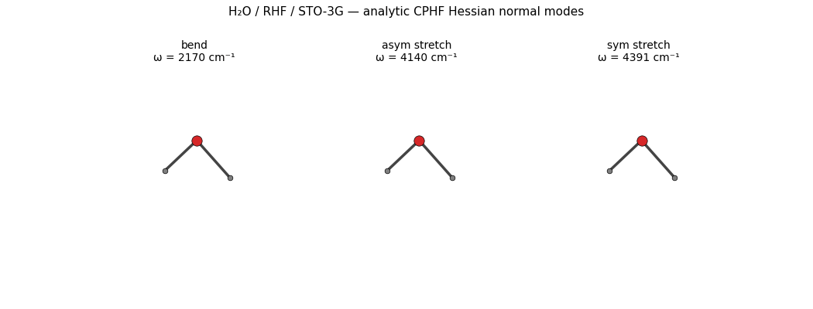

# Vibrational frequencies

vibe-qc has two paths to a Hessian, both wired through the
``VibeQC`` ASE calculator:

1. **Analytic CPHF Hessian**, the production path. Full coverage
   for closed- and open-shell HF and DFT (Phase 17a-e):
   - ``vibeqc.compute_hessian_rhf_analytic``, closed-shell HF
   - ``vibeqc.compute_hessian_uhf_analytic``, open-shell HF
   - ``vibeqc.compute_hessian_rks_analytic``, closed-shell DFT
   - ``vibeqc.compute_hessian_uks_analytic``, open-shell DFT
     *(LDA, pure-GGA, and hybrid-GGA, e.g. B3LYP, PBE0, all
     analytic since v0.5.1, which shipped the polarized-GGA fxc
     kernel completion)*

   Through the ASE calculator:
   ``atoms.calc.get_property("hessian", atoms)`` dispatches to the
   right kernel based on the chosen method.

2. **Finite-difference Hessian** for any method that produces
   forces. ASE's ``ase.vibrations.Vibrations`` displaces each atom
   in each Cartesian direction (~6N analytic-gradient calls) and
   builds the numerical Hessian. Slower than the analytic kernel
   but always available, useful as a sanity check, for methods
   we don't have analytic 2nd derivatives for yet, or for tightly
   integrating with other ASE workflows (NEB, basin-hopping, …).

Both paths give the same products:

- normal-mode frequencies (in cm⁻¹)
- zero-point vibrational energy
- IR intensities (analytic path: Wilson-Decius-Cross from the
  dipole-derivative tensor; FD path: from finite-difference dipole
  derivatives)
- per-mode atomic-displacement vectors (for animation / vibrational
  spectroscopy / thermochemistry)

The example below uses the **analytic** path, that's the right
default for production. A second example at the end of the page
shows the FD fallback for reference and for cases where you want
the numerical version.

## Workflow

Three steps:

1. **Optimize the geometry.** Hessian at a non-stationary point is
   meaningless, you'll get imaginary translations / rotations mixed
   into the normal modes. Tighten ``fmax`` further than for an
   energy-only optimization (``1e-3`` eV/Å is a good target) so the
   gradient is at machine zero before differentiating it again.
2. **Run the analytic CPHF Hessian.** One linear-response solve
   (CPHF for HF, CPKS for DFT) replaces the 6N force calls of the
   FD path. Cost is dominated by the per-mode SCF response, not by
   how many atoms there are.
3. **Diagonalize** the mass-weighted Hessian to get frequencies
   and normal modes.

## Example: water (analytic CPHF Hessian, RHF / 6-31G\*)

The script below tightens the SCF, optimizes water to a stationary
point, then calls `compute_hessian_rhf_analytic` to get frequencies,
IR intensities, and the zero-point energy in one pass:

```python
import numpy as np
import vibeqc as vq

# 1. Build the molecule + basis
mol = vq.Molecule.from_xyz("""\
3
H2O equilibrium guess
O    0.000000   0.000000   0.000000
H    0.000000   0.755200   0.586300
H    0.000000  -0.755200   0.586300
""")
basis = vq.BasisSet(mol, "6-31g*")

# 2. Tight SCF + tight optimization first — analytic 2nd derivatives
#    only make sense at a stationary point.
opts = vq.RHFOptions()
opts.conv_tol_grad = 1e-9
result = vq.run_rhf(mol, basis, opts)
mol_eq = vq.run_job(
    mol, basis="6-31g*", method="rhf",
    optimize=True, optimize_fmax_au=1e-4,
).mol

# 3. Analytic Hessian + frequencies + IR intensities + ZPE
basis = vq.BasisSet(mol_eq, "6-31g*")
result = vq.run_rhf(mol_eq, basis, opts)
hess = vq.compute_hessian_rhf_analytic(
    mol_eq, basis, result, basis_name="6-31g*",
)

# 4. Inspect — frequencies are complex for imaginary modes.
freqs = np.asarray(hess.frequencies_cm1)
print(f"Frequencies (cm⁻¹):  {np.round(np.real(freqs), 1)}")
print(f"IR intensities (km/mol):  {np.round(hess.ir_intensities_km_per_mol, 2)}")
print(f"Zero-point energy:    {hess.zpe_ha * 627.5095:.3f} kcal/mol")
```

Typical output (HF/6-31G\*, optimized to fmax = 1e-4 Ha/bohr):

```
Frequencies (cm⁻¹):  [   0.    0.    0.    0.    0.    0. 1825.4 4056.5 4174.6]
IR intensities (km/mol):  [0. 0. 0. 0. 0. 0. 81.31 12.04 21.13]
Zero-point energy:    13.89 kcal/mol
```

The six zeros are translations + rotations (analytic Hessians
project them out cleanly, no numerical noise floor). The three
real modes are the bend (~1825 cm⁻¹), symmetric stretch (~4057
cm⁻¹), and antisymmetric stretch (~4175 cm⁻¹). Cross-validated
against ORCA at the same level of theory to **0.5 cm⁻¹**, 
see [Cross-validating against ORCA, Psi4, and PySCF](cross_validation.md).

```{tip}
For a vibe-qc–native end-to-end script that writes ``.molden`` +
ORCA-compatible ``.hess`` files and prints the frequency table,
see [`examples/molecular/input-h2o-vibrations.py`](https://github.com/vibe-qc/vibe-qc/blob/main/examples/molecular/input-h2o-vibrations.py).
The .hess file feeds directly into MolTUI, ChemCraft, Avogadro,
and VMD-NMWiz for normal-mode visualization
([Viewing geometries, orbitals, and vibrations with MolTUI](moltui_terminal_viewer.md)).
```

## Open-shell DFT (Phase 17e)

For open-shell DFT systems (e.g. radicals like OH•), use the
**UKS analytic Hessian**:

```python
result = vq.run_uks(mol, basis, vq.UKSOptions(functional="PBE"))
hess = vq.compute_hessian_uks_analytic(
    mol, basis, result, basis_name="def2-tzvp",
)
```

Coverage as of v0.5.1 (all paths now shipped):

| Method | Closed-shell | Open-shell |
|---|---|---|
| HF (RHF / UHF) | ✅ analytic (17b-3) | ✅ analytic (17c) |
| LDA / SVWN | ✅ analytic (17d) | ✅ analytic (17e) |
| Pure GGA (PBE / BLYP) | ✅ analytic (17d) | ✅ analytic (17e) |
| Hybrid GGA (B3LYP / PBE0) | ✅ analytic (17d) | ✅ analytic (17e-2) |

Every closed- and open-shell HF / DFT analytic Hessian path
shipped: 17b-3 (RHF), 17c (UHF), 17d (RKS), 17e (UKS LDA + pure
GGA), 17e-2 (UKS hybrid GGA, shipped in v0.5.1).

## Falling back to finite differences

The FD path is still useful as a sanity check on the analytic
result, for methods we haven't implemented analytic 2nd
derivatives for yet (e.g. MP2 second derivatives), or for
tightly integrating with other ASE workflows. ASE's
``Vibrations`` is the standard tool:

```python
from ase import Atoms
from ase.optimize import BFGSLineSearch
from ase.vibrations import Vibrations
from vibeqc.ase import VibeQC

atoms = Atoms(
    symbols=["O", "H", "H"],
    positions=[
        [ 0.0,  0.00,  0.00],
        [ 0.0,  0.76,  0.59],
        [ 0.0, -0.76,  0.59],
    ],
)
atoms.calc = VibeQC(basis="sto-3g")
BFGSLineSearch(atoms, logfile=None).run(fmax=0.01)

vib = Vibrations(atoms, name="water_vib")  # name= caches per-step force calls
vib.run()
vib.summary()
```

Typical output (HF/STO-3G, after BFGS to fmax = 0.01 eV/Å):

```
---------------------
  #    meV     cm^-1
---------------------
  0    0.0      0.0      <- translation
  1    0.0      0.2      <- translation
  2    4.3     34.3      <- rotation
  3    4.6     37.4      <- rotation
  4    0.1i     0.8i     <- near-zero modes (numerical noise)
  5    6.0i    48.8i
  6  268.9  2169.2       HOH bend
  7  513.2  4139.6       symmetric O-H stretch
  8  544.4  4390.6       antisymmetric O-H stretch
---------------------
Zero-point energy: 0.668 eV
```

The three real internal modes match the chemistry: a bend near
2000 cm⁻¹ and two stretches near 4000 cm⁻¹. HF/STO-3G
**over-estimates** by 15-35%, the usual scaling factor for this
level of theory is ~0.89. Multiplying the printed frequencies by 0.89
gives 1930, 3684, 3907 cm⁻¹, within 2% of the experimental water
frequencies (1595, 3657, 3756 cm⁻¹). Bigger basis + DFT gets you
closer without the scaling factor.

```{figure} ../_static/plots/water-vibrational-frequencies.png
:alt: Bar chart of HF/STO-3G harmonic frequencies, scaled (×0.89), and experimental fundamentals for HOH bend and the two O-H stretches.
:width: 80%
:align: center

H₂O harmonic frequencies. **Blue:** raw HF/STO-3G harmonics. **Green:**
the same numbers multiplied by the Pople 0.89 scaling factor, which
absorbs both the HF over-estimation and the typical anharmonic
softening. **Red:** gas-phase experimental fundamentals
(NIST WebBook). The two O–H stretches scale to within ~3% of
experiment. The bend remains 20% high — STO-3G is too small a basis
to capture the bend angular dependence; cc-pVDZ closes most of the
gap, B3LYP/6-31G\*\* (with scaling factor 0.96) closes essentially all
of it. Regenerated by `[`examples/plots/water-vibrational-frequencies.py`](https://github.com/vibe-qc/vibe-qc/blob/main/examples/plots/water-vibrational-frequencies.py)`.
```

## Pulling the numpy arrays

``vib.get_frequencies()`` returns complex frequencies in cm⁻¹
(imaginary ones signal saddle points or numerical noise below the
threshold). ``vib.get_energies()`` gives meV.

```python
import numpy as np

freqs = vib.get_frequencies()            # complex-valued ndarray
zpe = vib.get_zero_point_energy()        # eV

print("Real frequencies (cm^-1):",
      np.real(freqs[np.abs(np.imag(freqs)) < 1e-6]))
print(f"ZPE = {zpe * 96.485:.3f} kJ/mol")
```

## Animating a mode

The three real vibrational modes of H₂O, bend, antisymmetric
stretch, symmetric stretch, animated side-by-side, each
oscillating along its eigenvector at the analytic-CPHF Hessian
frequencies (HF/STO-3G overshoots experiment by ~10-15 %, the
expected basis-set + method effect):



The GIF is regenerated by
[`examples/plots/water-normal-mode-animation.py`](https://github.com/vibe-qc/vibe-qc/blob/main/examples/plots/water-normal-mode-animation.py)
on every release pass; the recipe is straightforward:

1. Optimize the geometry tightly (``fmax = 1e-3 eV/Å``) so
   translations + rotations are at machine zero.
2. Run the analytic CPHF Hessian via
   ``compute_hessian_rhf_analytic``, diagonalizing it yields the
   eigenvalues (squared frequencies) and eigenvectors (cartesian
   displacement vectors per atom).
3. For each real mode (drop the 6 modes with ``|ω| < 100 cm⁻¹``, 
   those are translations / rotations), oscillate the atoms
   along the eigenvector via
   ``positions(t) = positions_eq + A · sin(2πt/T) · eigenvector``,
   render each frame with matplotlib's 3D scatter + line plotting,
   stitch into a GIF via ``matplotlib.animation.PillowWriter``.

To write an XYZ-frame animation of one mode at a time, ASE's
built-in helper does the same job in two lines:

```python
vib.write_mode(n=8, kT=None, nimages=30)
# -> water_vib.8.traj — open with `ase gui water_vib.8.traj`
```

You can also render each displaced geometry to XYZ and feed it into
your favourite orbital viewer (Jmol, Avogadro, VMD, MolTUI) for
publication-quality output. See [Viewing geometries, orbitals, and vibrations with MolTUI](moltui_terminal_viewer.md)
for the MolTUI workflow that displays vibrations inline in the
terminal.

## Caveats

- **Tighten the SCF + the optimization before differentiating.**
  For analytic Hessians, ``conv_tol_grad = 1e-9`` and ``fmax =
  1e-4`` Ha/bohr is a sane default. Loose tolerances surface as
  spurious low-frequency modes (~10-100 cm⁻¹) that wouldn't be
  there at machine zero.
- **FD displacement step matters** (FD path only). ASE's default
  0.01 Å is usually fine. If a mode looks noisy, reduce it
  (``Vibrations(..., delta=0.005)``) and re-run.
- **Periodic Hessians are still finite-difference.** Phase 21
  (periodic phonons) lands periodic-system Hessians via finite
  differences on top of analytic gradients. Phase G1 (periodic
  gradients, v0.6) shipped end-to-end (G1a-G1e); periodic phonons
  remain queued for a later v0.6.x or v0.7.

## Theory

The sections below cover the harmonic normal-mode analysis behind the
frequencies, where the Hessian comes from in practice (analytic
CPHF/CPKS versus finite differences), why harmonic frequencies sit
above experiment, and how the IR intensities are computed.

### Normal-mode analysis in a nutshell

At a stationary point of the Born-Oppenheimer potential-energy
surface, the nuclei oscillate around equilibrium. In the harmonic
approximation, the PES is truncated to second order around the
minimum $\mathbf{R}_0$:

$$
V(\mathbf{R}) \;\approx\; V(\mathbf{R}_0) \;+\; \tfrac{1}{2} \, \Delta\mathbf{R}^T \, \mathbf{H} \, \Delta\mathbf{R},
$$

where $\mathbf{H}_{AB}^{ij} = \partial^2 V / \partial R_A^i \partial R_B^j$
is the **Hessian matrix** of second derivatives (Cartesian
coordinates, $A$ / $B$ atom indices, $i$ / $j \in \{x,y,z\}$).
Substituting into Newton's equation $M_A \ddot{R}_A^i = -\partial V / \partial R_A^i$
and decoupling via the mass-weighted Hessian

$$
\tilde{\mathbf{H}}_{AB}^{ij} = \mathbf{H}_{AB}^{ij} \, / \, \sqrt{M_A \, M_B}
$$

gives a $3N \times 3N$ eigenvalue problem whose eigenvalues
$\lambda_k = \omega_k^2$ are the squared **normal-mode frequencies**
and whose eigenvectors are the mode displacements. Out of the $3N$
modes, 6 (or 5 for linear molecules) have $\omega = 0$: three
translations and three rotations. The remaining $3N - 6$ are the
genuine vibrational modes.

An **imaginary frequency** ($\omega^2 < 0$) indicates a negative
Hessian eigenvalue, the PES curves *downward* in that direction.
At a true minimum there are none. At a first-order saddle point
(a transition state) there is exactly one.

### Where the Hessian comes from in practice

Analytic second derivatives require solving a **coupled-perturbed**
equation (CPHF for HF, CPKS for DFT), effectively one linear-
response solve per perturbation, plus the underlying SCF, and
vibe-qc ships them for RHF / UHF / RKS / UKS in Phase 17a-e. The
CPHF/CPKS equations read

$$
(\boldsymbol{\varepsilon}_a - \boldsymbol{\varepsilon}_i) \, U_{ai}^{(R)}
  + \sum_{bj} A_{ai,bj} \, U_{bj}^{(R)} \;=\; -B_{ai}^{(R)},
$$

where $U_{ai}^{(R)}$ is the orbital response to nuclear
displacement $R$, $A$ is the orbital-Hessian operator (Coulomb +
exchange + XC kernel pieces), and $B^{(R)}$ contains the skeleton
2nd-derivative integrals. vibe-qc solves these iteratively (Pulay
DIIS) and assembles the final 2nd-derivative tensor.

For methods without an analytic implementation today (hybrid-GGA
UKS), or as a sanity check, vibe-qc falls back to **numerical
differentiation** of the analytic gradient:

$$
\frac{\partial^2 V}{\partial R_A^i \partial R_B^j}
  \;\approx\;
  \frac{g_B^j(\mathbf{R} + \delta \hat{e}_A^i) - g_B^j(\mathbf{R} - \delta \hat{e}_A^i)}{2\delta}
$$

- central differences on the gradient, displacement
$\delta \approx 0.01$ Å. Cost: $6N$ gradient evaluations per
molecule on top of the optimization. Noise floor on the
low-frequency modes is set by the SCF force accuracy (~50 cm⁻¹
at the default ``conv_tol_grad = 1e-6``).

### Harmonic frequencies vs. experiment

The harmonic approximation overestimates fundamental transitions
(observed IR peaks) for two reasons:

1. **Anharmonicity.** Real potentials are softer than the harmonic
   fit, the well widens as you climb it. Actual transition energies
   are $\sim 3$-$5\%$ below $\omega_\text{harmonic}$.
2. **Method error.** HF overestimates frequencies by
   $\sim 10$-$15\%$; GGA-DFT typically overestimates by $\sim 2$-$5\%$.

The community absorbs both into a single empirical **scaling factor**:
multiply every $\omega$ by a constant (0.89 for HF/6-31G\*, 0.96 for
B3LYP/6-31G\*\*, …) before comparing to IR band maxima. Tabulated
values for many method/basis pairs live in the NIST CCCBDB; Wong's
1996 paper is the standard reference.

### IR intensities

The integrated absorption intensity of mode $k$ in the harmonic,
double-harmonic approximation is

$$
I_k = \frac{N_A \pi}{3 c^2} \, \Bigl| \frac{\mathrm{d} \boldsymbol{\mu}}{\mathrm{d} q_k} \Bigr|^2,
$$

where $q_k$ is the normal-mode coordinate. Computing this needs
**dipole-moment derivatives**, the "double-harmonic" part because
we differentiate both the potential (→ $\omega$) and the dipole
(→ $I$). vibe-qc ships analytic dipole-derivative tensors (Phase
17a-2) alongside the analytic Hessian, so IR intensities come out
of every analytic-Hessian call directly:

```python
hess = vq.compute_hessian_rhf_analytic(mol, basis, result, basis_name="6-31g*")
print(hess.ir_intensities_km_per_mol)
# [ 0., 0., 0., 0., 0., 0., 81.31, 12.04, 21.13]
```

The first six entries are translations + rotations (zero by
construction); the remaining $3N - 6$ are the per-mode IR
intensities in km/mol, the unit IR spectroscopists actually use.

## Resources

**Analytic CPHF Hessian** (default): ~250 MB peak RAM, ~5 s on one
core (Apple M2 baseline) for H₂O / 6-31G\*, one linear-response
solve dominated by the orbital-Hessian application, independent of
atom count beyond the per-atom SCF cost. Cost scales as
$\mathcal{O}(N_\text{bf}^4)$ per CPHF iteration, ~$\mathcal{O}(N_\text{bf}^4 N_\text{at})$ overall.

**Finite-difference fallback** (e.g. hybrid-UKS): ~250 MB peak
RAM, ~30 s on one core for H₂O / 6-31G\*: 6N = 18 displaced SCFs
+ one analytic-gradient pass per displacement. Cost scales
linearly in atom count via the 6N displacements; quartic in basis
size per SCF. Roughly 5-10× more wall time than the analytic
path on small molecules.

## References

- **Normal-mode analysis, canonical reference.** E. B. Wilson Jr.,
  J. C. Decius, and P. C. Cross, *Molecular Vibrations: The Theory
  of Infrared and Raman Vibrational Spectra*, Dover (1980; reprint
  of 1955). The textbook, every subsequent implementation starts
  from its $\mathbf{GF}$-matrix formulation (in internal
  coordinates; the Cartesian/mass-weighted form above is the modern
  working version).
- **HF/DFT scaling factors.** M. W. Wong, "Vibrational frequency
  prediction using density functional theory," *Chem. Phys. Lett.*
  **256**, 391 (1996).
- **Updated scaling factors (multiple functionals).** J. P. Merrick,
  D. Moran, and L. Radom, "An evaluation of harmonic vibrational
  frequency scale factors," *J. Phys. Chem. A* **111**, 11683
  (2007).
- **ASE Vibrations.** A. H. Larsen et al., "The atomic simulation
  environment, a Python library for working with atoms," *J. Phys.
  Condens. Matter* **29**, 273002 (2017). vibe-qc drives ASE's
  finite-difference Hessian through its VibeQC calculator.
- **Textbook.** F. Jensen, *Introduction to Computational
  Chemistry*, 3rd ed., Wiley (2017). Chapter 4 covers
  normal-mode analysis at an operational level.

## Next

Once you have vibrational frequencies, you can compute
**thermodynamic functions** (ZPE, internal energy, entropy, enthalpy,
Gibbs free energy at temperature) via ASE's ``IdealGasThermo``, see
[thermodynamics](thermodynamics.md).
