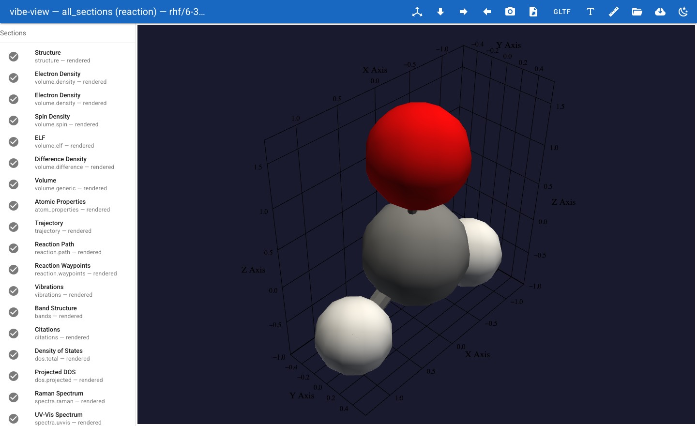
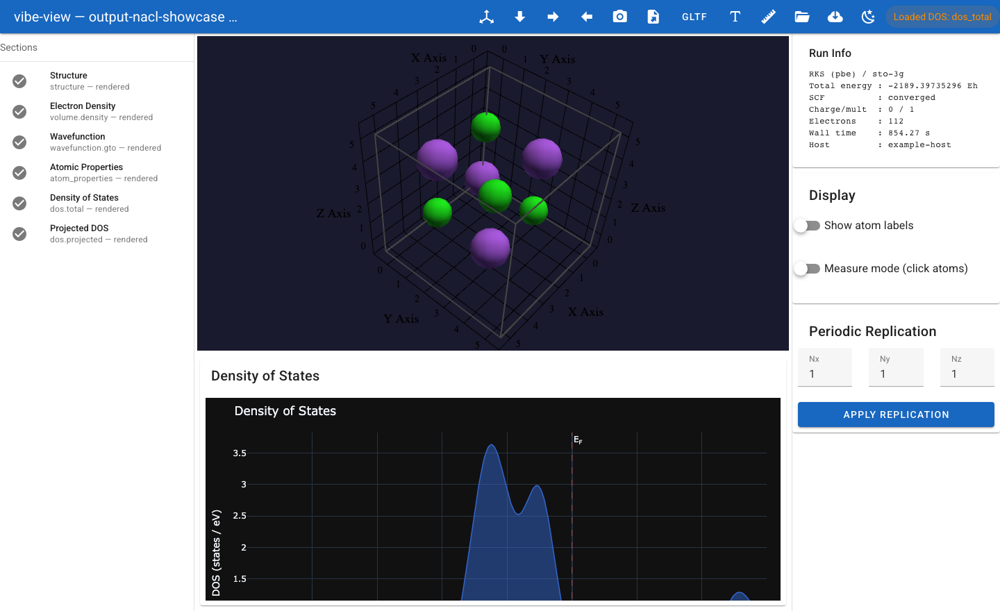

# Working with vibe-view

Viewer lifecycle commands on this page run from the **separate vibe-view
checkout**. Run calculation inputs with the core environment and give the
viewer the resulting QVF path; the two checkouts need not be adjacent.
Clone [mpei/vibe-view](https://github.com/vibe-qc/vibe-view) and follow
[viewer setup](vibe_view_getting_started.md). Its `.venv`, `scripts/`, and `electron/` belong to that repository;
vibe-qc does not contain or install the viewer.

**You will learn:** how to produce a `.qvf` archive from vibe-qc, open it in
vibe-view, inspect every section the calculation wrote, edit structures
interactively with a full atom editor, export to POV-Ray and Blender for
publication-quality renders, use the crystal builder for periodic systems,
build molecules from fragments, submit jobs to vq, and use the headless
capture API to generate figures from scripts. We cover **molecular** (H2O)
and **periodic** (Si diamond) workflows, all 39 first-class viewer section
kinds plus explicit bonds via the structure renderer, and every v2.0 feature:
build tools, measurement, edit mode, presentation mode,
material presets, POV-Ray/Blender export, and desktop packaging.

**Prerequisites:**

* `vibeqc` installed and a working SCF setup.
* `vibe-view` installed (see below).
* A modern browser.

Time to complete: about 30 minutes.

## Installation

vibe-view ("Roothaan's Roadrunner") is a standalone Python package
with its own vibe-view repository. On macOS and Linux, use the repository's
installer so the browser, source desktop, and TUI modes are verified together:

```sh
git clone https://github.com/vibe-qc/vibe-view.git
cd vibe-view
./scripts/install.sh
source .venv/bin/activate
```

The installer creates a dedicated `.venv`; it does not compile or
install vibe-qc. Run the calculation in your existing vibe-qc environment,
then activate the viewer environment to open the resulting QVF. Run every
vibe-view lifecycle script as your regular user, without `sudo`.

```{note}
A hosted package index at `https://vibe-qc.com/pypi/simple/` is planned but is
**not published yet**, so `pip install vibeview --index-url ...` will not
resolve. Use one of the methods on this page instead.
```

```{note}
The repository is currently private (public once the JCC release paper is
out); see [installation.md](../installation.md) for how to request read-only
clone access. The HTTPS clone command above works with an authorized GitLab
account now and without authentication once the repository becomes public.
```

Developers who intentionally want an editable package in their active
environment can still use pip directly:

```sh
pip install -e '.[viewer,tui]'
```

Verify the installation:

```sh
vibe-view --version
# vibe-view 2.15.2  -- Roothaan's Roadrunner   (your version will differ)
# Python    3.14.6
# PyVista   0.48.4
# VTK       (9, 6, 2)
```

```{note}
vibe-view requires PyVista + VTK (~200 MB). The first install may take a
few minutes. Set ``PYVISTA_OFF_SCREEN=True`` if you are using vibe-view
headlessly (CI, SSH, capture API) without a display server.
For capture-only automation, use
`./scripts/install.sh --extras core`; use `--extras viewer` for the
browser/desktop server or `--extras tui` for the interactive terminal.
```

## Minimum example

```python
# input-h2o.py
from vibeqc import Atom, Molecule, run_job

mol = Molecule([
    Atom(8, [0.0,  0.00,  0.00]),
    Atom(1, [0.0,  1.43, -0.98]),
    Atom(1, [0.0, -1.43, -0.98]),
])

run_job(
    mol,
    basis="6-31g*",
    method="rks",
    functional="PBE",
    output="h2o",
    output_qvf=True,
    write_cube=["density", "homo", "lumo"],
    write_molden_file=True,
    hessian=True,
    optimize=True,
)
```

```sh
vibe-view open h2o.qvf
```

Your default browser opens at `http://127.0.0.1:8080`. You see the water
molecule in the 3D viewport with a sidebar listing every section.



## What happened

`run_job` with `output_qvf=True` assembled a `.qvf` archive containing:

| Section | Kind | What it shows |
| --- | --- | --- |
| `structure` | `structure` | Atom positions, bonds, unit cell (if periodic) |
| `vol_dens_0` | `volume.density` | SCF electron density as a translucent isosurface |
| `vol_mo_0` | `volume.orbital` | Highest occupied molecular orbital (HOMO) |
| `vol_mo_1` | `volume.orbital` | Lowest unoccupied molecular orbital (LUMO) |
| `wf` | `wavefunction.gto` | Full MO set for on-demand orbital evaluation |
| `traj0` | `trajectory` | Geometry optimisation frames (from `optimize=True`) |
| `vib` | `vibrations` | Normal mode animation (from `hessian=True`) |
| `ir` | `spectra.ir` | IR spectrum (from `hessian=True`) |
| `props0` | `atom_properties` | Mulliken/Lowdin/Hirshfeld charges + spin populations |
| `citations0` | `citations` | BibTeX bundle of every method + basis + library |
| `scf_hist0` | `scf_history` | Energy + DIIS error convergence charts |

```{tip}
`write_cube=["density", "homo", "lumo"]` embeds three pre-computed
volumetric sections in the QVF. `write_molden_file=True` embeds the full MO
coefficient matrix so vibe-view can evaluate *any* orbital on demand -- far
cheaper than writing one cube per orbital. `hessian=True` adds vibrations,
IR spectrum, and thermochemistry; `optimize=True` adds the geometry
optimisation trajectory.
```

---

## 1. Opening QVF files

### CLI

```sh
vibe-view open h2o.qvf                    # auto-opens browser at :8080
vibe-view open h2o.qvf --port 9999        # custom port
vibe-view open h2o.qvf --no-browser       # don't open browser
vibe-view open h2o.qvf --host 0.0.0.0    # bind all interfaces (remote access)
vibe-view open nacl.qvf h2co.qvf          # open multiple files -- switch via dropdown
```

The terminal prints a banner showing every section and its render status:

```
╔══════════════════════════════════════════════════════════════════════════════╗
║  QVF file: h2o.qvf                                                          ║
║  Source:   vibe-qc <version> -- RKS/PBE/6-31G*                                ║
╠══════════════════════════════════════════════════════════════════════════════╣
║  Section ID           Kind                         Status                    ║
╠══════════════════════════════════════════════════════════════════════════════╣
║  structure            structure                    rendered                  ║
║  vol_dens_0           volume.density               rendered                  ║
║  vol_mo_0             volume.orbital               rendered                  ║
║  vol_mo_1             volume.orbital               rendered                  ║
║  wf                   wavefunction.gto             rendered                  ║
║  traj0                trajectory                   rendered                  ║
║  vib                  vibrations                   rendered                  ║
║  ir                   spectra.ir                   rendered                  ║
║  props0               atom_properties              rendered                  ║
║  bond_orders          bond_orders                  rendered                  ║
║  citations0           citations                    rendered                  ║
║  scf_hist0            scf_history                  rendered                  ║
╚══════════════════════════════════════════════════════════════════════════════╝

  12 section(s) will be rendered, 0 skipped, 0 error(s)
```

### In-memory (no disk round-trip)

You can pass raw bytes or a `BytesIO` to avoid writing a `.qvf` to disk:

```python
import io
from vibeview import launch_qvf

buf = io.BytesIO()
# ... use the QVF writer with buf as the output ...
buf.seek(0)
launch_qvf(buf, open_browser=False)
```

### Remote viewing over SSH

```sh
ssh -L 8080:127.0.0.1:8080 remote    # port-forward
vibe-view open run.qvf                # run on remote
# open http://127.0.0.1:8080 locally
```

### Table dump

Extract tabular data from a QVF without launching the viewer:

```sh
vibe-view table h2o.qvf                         # list what's tabulatable
vibe-view table h2o.qvf --kind wavefunction.gto  # MO energies + occupations
vibe-view table h2o.qvf --kind atom_properties   # Mulliken/Lowdin/Hirshfeld charges
vibe-view table h2o.qvf --kind vibrations        # harmonic frequencies
```

Output formats:

```sh
vibe-view table h2o.qvf --kind wavefunction.gto --format csv   # CSV for spreadsheets
vibe-view table h2o.qvf --kind atom_properties --format json   # JSON for scripts
```

This is the fastest way to grab frequencies, charges, or MO energies for a
paper or a script -- no browser, no GUI, just stdout.

### Batch rendering

Render a whole directory of QVF files into a PNG gallery in one command:

```sh
vibe-view batch runs/*.qvf                    # one structure PNG per QVF
vibe-view batch a.qvf -o gallery/             # custom output directory
vibe-view batch *.qvf --size 1200x800         # custom resolution
vibe-view batch a.qvf --volumes               # structure + every volume section
```

Each QVF's structure section is rendered offscreen with the dark-theme
background and isometric camera. The output directory gets one `.png` per
input file, named `{stem}.png`. No interactive server starts -- this is
designed for CI pipelines and scripted comparison galleries.

### File info

Quickly inspect a QVF without opening the viewer:

```sh
vibe-view info h2o.qvf
```

Prints provenance (method, functional, basis, SCF energy, convergence
status, wall time, host), a section-by-section breakdown with member counts
and sizes, and the total/archive sizes. Ideal for checking what a QVF
contains before opening it, or for logging in automated pipelines.

### Fetch from vibe-queue

If you use vibe-queue (`vq`) to run calculations on a cluster, `vibe-view
from-vq` fetches job outputs and opens their QVFs in one step:

```sh
vibe-view from-vq abc123                    # fetch and open one job
vibe-view from-vq abc123 def456             # open multiple jobs side by side
vibe-view from-vq abc123 -o ./my-results    # custom fetch directory
```

This runs `vq fetch` for each job ID, finds `.qvf` archives in the
fetched workspaces, and launches the viewer. Requires `vq` installed
and on PATH.

### One-shot capture

Render any section to PNG without writing Python:

```sh
vibe-view capture h2o.qvf                            # structure
vibe-view capture h2o.qvf -s vol_dens_0              # density
vibe-view capture h2o.qvf -s vol_mo_0 -o homo.png    # orbital, custom file
vibe-view capture h2o.qvf -s vol_dens_0 --isovalue 0.03 --colormap plasma
vibe-view capture h2o.qvf --size 1200x800            # custom resolution
```

Kind-appropriate defaults: divergent colormap for orbitals/spin, viridis for
density, plasma for ELF.

### Slicing and merging

Extract or combine sections across QVF files:

```sh
vibe-view slice big.qvf -k structure,vol_dens_0 -o small.qvf   # keep only 2 sections
vibe-view slice big.qvf -d citations0 -o no-cites.qvf          # drop citations
vibe-view merge hf.qvf pbe.qvf -o combined.qvf                 # combine 13 sections
```

Slice is useful for creating lightweight QVFs for sharing. Merge combines
sections from multiple files with automatic ID conflict resolution and
preserved SHA-256 integrity.

### Web file browser

Start a web-based directory browser for QVF files:

```sh
vibe-view serve .                          # browse current directory
vibe-view serve ~/calculations/            # browse specific directory
vibe-view serve . --port 9000              # custom port
```

Opens a web page listing all .qvf files with calculation name, energy,
convergence status, and section count. Click any file to view details.
No Python or vibe-qc required on the client -- just a browser.

### Geometry export

Extract geometry from a QVF to common formats without opening the viewer:

```sh
vibe-view export h2o.qvf -f xyz -o h2o.xyz     # Cartesian coordinates
vibe-view export h2o.qvf -f cif -o h2o.cif     # Crystallographic (periodic)
vibe-view export h2o.qvf -f obj -o h2o.obj     # Wavefront OBJ 3D mesh
vibe-view export h2o.qvf -f gltf -o h2o.gltf   # glTF 2.0 3D exchange format
vibe-view export h2o.qvf -f html -o h2o.html   # standalone HTML 3D viewer
```

XYZ and CIF are plain-text; OBJ and glTF are 3D mesh exports suitable for
Blender, ParaView, or web-based 3D viewers. The HTML format generates a
self-contained file (<6 KB) with an embedded Three.js viewer -- open it in
any browser for an interactive 3D structure view with no installation.

### Comparing files

Quickly compare two QVFs from the command line:

```sh
vibe-view diff hf.qvf pbe.qvf                  # human-readable comparison
vibe-view diff hf.qvf pbe.qvf --json           # machine-readable JSON
```

Shows energy delta (Eh, kcal/mol, eV), section-kind overlap (which kinds are
in both files, which are only in one), geometry RMSD, and SCF convergence
status. The `--json` flag is ideal for automated regression testing.

### Machine-readable info

For scripting, `vibe-view info` supports JSON output:

```sh
vibe-view info h2o.qvf --json | jq '.scf_energy_eh'   # extract energy
vibe-view info h2o.qvf --json | jq '.sections[].kind'  # list section kinds
```

---

## 2. Complete section-kind reference

vibe-view renders all 39 first-class section kinds in its QVF registry, plus
explicit `bonds` sections through the structure renderer. Here is every kind
with a brief description:

### Structure

| Kind | What it shows |
| --- | --- |
| `structure` | Atoms (CPK colours), bonds, unit cell wireframe if periodic |
| `structure.symmetry` | Spglib symmetry: space group, Wyckoff positions, operations |

### Volumetric data

| Kind | What it shows |
| --- | --- |
| `volume.density` | Electron density isosurface (single-sign, positive field) |
| `volume.orbital` | MO isosurface with signed lobes (blue/red divergent colormap) |
| `volume.spin` | Spin density -- alpha minus beta |
| `volume.elf` | Electron localisation function |
| `volume.difference` | Difference density (e.g. SCF minus promolecule) |
| `volume.potential` | Electrostatic potential mapped onto density isosurface |
| `volume.rdg` | Reduced density gradient (NCI analysis) |
| `volume.generic` | Arbitrary scalar field on a grid |
| `basis.ao` | Atomic orbital isosurface (signed, from GTO evaluation) |

### Wavefunction

| Kind | What it shows |
| --- | --- |
| `wavefunction.gto` | Full MO set: energy diagram (Grotrian), orbital picker, on-demand evaluation |

### Electronic structure (periodic)

| Kind | What it shows |
| --- | --- |
| `bands` | Band structure along k-path with Fermi level |
| `dos.total` | Total density of states |
| `dos.projected` | Projected DOS (per-atom / per-orbital channels) |
| `dos.coop` | Crystal Orbital Overlap Population |
| `dos.cohp` | Crystal Orbital Hamilton Population |
| `fermi_surface` | Fermi surface in reciprocal space |
| `phonon_bands` | Phonon dispersion |
| `phonon_dos` | Phonon density of states |
| `equation_of_state` | E-V curve with Birch-Murnaghan fit |

### Spectra

| Kind | What it shows |
| --- | --- |
| `spectra.ir` | Infrared spectrum (stem plot) |
| `spectra.raman` | Raman spectrum |
| `spectra.uvvis` | UV/Vis absorption |
| `spectra.ecd` | Electronic circular dichroism |
| `spectra.vcd` | Vibrational circular dichroism |
| `spectra.nmr` | NMR chemical shifts and coupling constants |
| `spectra.generic` | Arbitrary spectrum (intensity vs frequency) |

### Dynamics and reactions

| Kind | What it shows |
| --- | --- |
| `trajectory` | Geometry optimisation frames with energy plot |
| `vibrations` | Normal mode animation with frequency selector |
| `reaction.path` | Reaction path with per-frame energy + geometry |
| `reaction.waypoints` | Waypoint markers along a reaction path |
| `scan.surface` | 2D relaxed PES scan as a contour/surface plot |

### Analysis

| Kind | What it shows |
| --- | --- |
| `atom_properties` | Per-atom charges, spins, populations as an HTML table |
| `bond_orders` | Mayer/Wiberg bond-order matrix as a table + CSV export |
| `topology.qtaim` | QTAIM critical points (CP spheres) and bond paths |
| `citations` | BibTeX reference bundle for the calculation |
| `scf_history` | SCF convergence: energy + DIIS error per iteration |

---

## 3. Molecular example: H2O

### 3.1 Structure styles

The structure panel offers four rendering styles:

* **Ball-and-stick** (default) -- atoms as spheres, bonds as cylinders
* **Space-filling (CPK)** -- atoms scaled to van der Waals radii
* **Wireframe** -- bonds only, no spheres
* **Points** -- atom centres only

Select the style from the dropdown in the structure panel. Ball-and-stick and
CPK are best for publication figures.

```{figure} ../_static/plots/vibe_view/tutorial-h2o-structure.png
Water molecule in ball-and-stick representation with CPK-coloured atoms.
```

Atom labels can be toggled on/off. For periodic systems the unit-cell
wireframe appears automatically and the replication controls (Nx, Ny, Nz) tile
atoms, bonds, and any active isosurface together.

#### Dipole moment arrow

When the calculation's provenance includes a dipole moment vector (in Debye),
vibe-view draws an **orange arrow** from the molecular centroid pointing in
the dipole direction. The arrow length is scaled for visibility: 1 D maps to
roughly 0.3 A in the viewport. This is automatically shown for any calculation
that computes the dipole moment (all SCF methods).

### 3.2 Electron density

Click **vol_dens_0** in the sidebar. The viewport overlays a translucent
isosurface at the default isovalue of `0.05 e/bohr^3`. The sidebar controls
let you:

* **Isovalue** -- lower values enlarge lobes; higher values squeeze closer to nuclei
* **Colormap** -- viridis, plasma, inferno, or custom
* **Opacity** -- from fully transparent (0.0) to fully opaque (1.0)

For water, the lone-pair region behind the oxygen is the largest density
pocket. At `0.02 e/bohr^3` the density wraps the whole molecule; at `0.1 e/bohr^3`
only the core regions near heavy atoms remain.

```{figure} ../_static/plots/vibe_view/tutorial-h2o-density.png
Electron density isosurface at 0.05 e/bohr^3, rendered translucent over
the ball-and-stick structure.
```

### 3.3 Molecular orbitals

Click **vol_mo_0** or **vol_mo_1**. Because MOs are signed fields, vibe-view uses a
**divergent colormap**: blue for positive lobes, red for negative. The
isovalue control works the same way as for density. Typical values for
HF-style orbitals: `0.03 -- 0.05 bohr^(-3/2)`.

```{figure} ../_static/plots/vibe_view/tutorial-h2o-homo.png
HOMO isosurface with divergent colormap: blue = positive, red = negative.
```
For the full MO set, click **wavefunction**. The panel shows every MO sorted
by energy with:

* **Occupation number** (2.0 for doubly-occupied, 0.0 for virtual)
* **Energy** in Hartree and eV
* **Symmetry label** if the producer wrote them
* **HOMO/LUMO markers** -- HOMO is the highest occupied, LUMO the lowest virtual

Click any row to evaluate that orbital on a grid in real time. The grid
resolution is configurable:

```python
run_job(
    ...,
    viewer_defaults={"wavefunction": {"grid_spacing": 0.08}},
)
```

#### Grotrian diagram

The wavefunction panel also includes a **Grotrian diagram** -- an orbital
energy level diagram with:

* Horizontal bars for each MO at its energy
* Occupied levels in a filled colour, virtual in outline
* HOMO-LUMO gap clearly visible
* Spin-up / spin-down blocks for unrestricted calculations

Click **Show Energy Diagram** at the bottom of the MO panel to render it.

#### Orbital animation

Click the **play button** (triangle icon) between the prev/next step buttons
to auto-advance through all MOs. The viewer renders each orbital in sequence
at 0.5 second intervals. Click **pause** to stop at the current orbital.

This is useful for:

* Scanning the MO manifold for bonding/antibonding character
* Finding orbitals with particular spatial features (lone pairs, pi systems)
* Recording a screen capture of the orbital sequence

### 3.4 SCF history

Click **scf_history**. Two stacked charts:

* **Top**: total SCF energy (Hartree) per iteration
* **Bottom**: DIIS error (log scale) per iteration

Hover any point to see exact values. The chart auto-scales both axes; zoom
with click-drag.

### 3.5 Vibrations and IR spectrum

With `hessian=True` in `run_job`:

* **vibrations** -- select a normal mode by frequency (cm^-1). Atoms oscillate
  along the displacement vectors. The symmetric bend of water is near 1700 cm^-1;
  symmetric and antisymmetric stretches near 3900 and 4000 cm^-1.
* **spectra.ir** -- interactive stem plot of intensity vs frequency. Hover peaks
  for exact values. Lorentzian broadening is configurable via viewer defaults.

### 3.6 Geometry-optimisation trajectory

With `optimize=True`:

* **trajectory** -- frame-by-frame playback with play/pause/step controls.
  An energy chart above the viewport shows convergence.

### 3.7 Citations

Click **citations** for the auto-assembled BibTeX bundle covering every
method, functional, basis set, dispersion model, and linked library used in
the calculation. Copy-paste ready for papers.

### 3.8 Thermochemistry

When `hessian=True` is passed to `run_job`, vibe-qc computes the harmonic
vibrational frequencies and appends thermochemistry data to the QVF provenance
block. vibe-view surfaces this in the **source banner** at the top of the
window:

* **ZPVE** -- zero-point vibrational energy (Eh)
* **H** -- thermal enthalpy at the specified temperature/pressure (Eh)
* **S** -- entropy in Eh/K
* **G** -- Gibbs free energy (Eh)

The default conditions are 298.15 K and 1 atm. To change them:

```python
from vibeqc import ThermoOptions
run_job(mol, ..., hessian=True, thermo_options=ThermoOptions(temperature=500, pressure=2))
```

The thermochemistry lines appear in the banner together with charge,
multiplicity, electron count, and wall time.

### 3.9 Atom properties

Click **atom_properties** in the sidebar. The viewport switches to an
interactive HTML table showing per-atom quantities:

* **Mulliken charges** -- default view
* **Lowdin charges** -- click the "Lowdin" toggle in the panel header
* **Spin populations** -- for open-shell calculations (alpha minus beta)

The table includes a **total-charge summary row** at the bottom so you can
verify at a glance that charges sum to the expected net charge. The
charge-kind selector persists across section switches, so you can compare
Mulliken vs Lowdin across different molecules without resetting the view.

### 3.10 MO step browsing

When you have a `wavefunction.gto` section, the orbital picker includes
**step buttons** (prev/next) for rapid browsing. Click the arrows to move
through orbitals one at a time without returning to the picker list.
Combined with the Grotrian diagram, you can step from HOMO down through
occupied orbitals or up from LUMO through virtuals. Use a coarse grid for
browsing (`grid_spacing=0.15`) then switch to fine (`0.06`) for the final
publication-quality view.

### 3.11 Cube field auto-detection

When you import a `.cube` file directly, vibe-view inspects the cube's
title comment lines to guess the field type. Keywords like "density",
"orbital", "spin", "potential", or "ELF" trigger the appropriate colormap
and isovalue defaults automatically. This works for Gaussian, ORCA, and
other cube-producing codes.

### 3.12 Viewer defaults: producer-side hints

Control how vibe-view opens your QVF by passing `viewer_defaults=` to
`run_job`. Hints are embedded in the manifest:

```python
run_job(
    mol, ...,
    viewer_defaults={
        "auto_open": ["vol_dens_0"],
        "vol_dens_0": {"isovalue": 0.02, "colormap": "plasma"},
        "vol_mo_0": {"isovalue": 0.04, "colormap": "RdBu"},
        "wavefunction": {"grid_spacing": 0.08},
    },
)
```

Supported hints: `isovalue`, `colormap`, `opacity`, `grid_spacing`,
`fermi_energy_ev`, `x_min`/`x_max`, and `camera_bookmarks`.

---

## 4. Periodic example: Si diamond

Periodic calculations bring band structure, DOS, replication, and crystal-specific
analysis to the viewer.

### 4.1 Producing the QVF

```python
import numpy as np
import vibeqc as vq

# Diamond cubic: two-atom basis, a = 3.567 A
a_bohr = 3.567 / 0.529177
cell = np.eye(3) * a_bohr
frac = np.array([
    [0.00, 0.00, 0.00],
    [0.25, 0.25, 0.25],
])
si = vq.PeriodicSystem(
    3,
    cell,
    [vq.Atom(14, frac[0] @ cell),
     vq.Atom(14, frac[1] @ cell)],
)
basis = vq.BasisSet(si.unit_cell_molecule(), "sto-3g")

# Band path: Gamma-X-W-K-Gamma-L
kpath = vq.kpath_from_segments(
    si,
    segments=[
        ([0.0, 0.0, 0.0], "G", [0.5, 0.0, 0.5], "X"),
        ([0.5, 0.0, 0.5], "X", [0.5, 0.25, 0.75], "W"),
        ([0.5, 0.25, 0.75], "W", [0.375, 0.375, 0.75], "K"),
        ([0.375, 0.375, 0.75], "K", [0.0, 0.0, 0.0], "G"),
        ([0.0, 0.0, 0.0], "G", [0.5, 0.5, 0.5], "L"),
    ],
    points_per_segment=20,
)

vq.run_periodic_job(
    si,
    basis=basis,
    method="RHF",
    output="si-diamond",
    output_qvf=True,
    write_density=True,
    band_structure=vq.band_structure_hcore(si, basis, kpath),
    dos_kmesh=[8, 8, 8],
)
```

### 4.2 Structure and replication

The structure panel automatically draws the **unit-cell wireframe** for
periodic systems. The sidebar shows replication controls (Nx, Ny, Nz, default
1x1x1). Increase them to tile the cell:

* `2x2x2` gives an 8-cell supercell -- useful for seeing the full bonding
  environment
* `3x3x3` is good for publication figures of the lattice

Atoms, bonds, and any active isosurface all tile together.

```{figure} ../_static/plots/vibe_view/tutorial-si-structure.png
Si diamond 2x2x2 supercell with unit-cell wireframe.
```

#### Orbital labelling

When a `wavefunction.gto` section is present, vibe-view labels MOs as
**Molecular Orbitals**. For periodic calculations without GTO wavefunction,
the orbitals are labelled as **Crystalline Orbitals**. The orbital-kind
display distinguishes the two in the UI.

#### MO replication

When the structure is replicated (Nx, Ny, Nz > 1), *molecular orbitals do not
automatically repeat*. This is correct: MOs are defined on the unit cell's
atoms. For periodic orbitals, use the `volume.orbital` section with lattice
vectors; vibe-view replicates the isosurface together with the structure.

### 4.3 Band structure and DOS

Click **bands**. A Plotly chart shows every band's eigenvalue along the
k-path. High-symmetry labels (Gamma, X, W, K, L) mark the segment boundaries.
A horizontal dashed line at the Fermi energy (E_F = 0 eV) separates occupied
from virtual bands. Hover any band to see its energy.

If the QVF has both `bands` and `dos.total`, vibe-view draws them as **one
shared figure** on a Fermi-referenced energy axis -- the standard solid-state
plot.

```{figure} ../_static/plots/vibe_view/tutorial-si-bands.png
Si diamond band structure along Gamma-X-W-K-Gamma with Fermi level at 0 eV.
```

#### Fat bands

The `dos.projected` section enables **fat bands** -- each band line is
coloured by its projection onto atomic or orbital channels. The channel legend
identifies which colour corresponds to which atom or angular momentum
contribution.

vibe-view supports two fat-band renderers:

* **Matplotlib** (PNG via `render_to_bytes()`) -- crisp static output, good
  for papers
* **Plotly** (interactive HTML) -- hover for per-channel values, pan and zoom

#### COOP / COHP

Click **dos.coop** or **dos.cohp** for chemical bonding analysis:

* **COOP** (Crystal Orbital Overlap Population) -- positive values = bonding,
  negative = antibonding
* **COHP** (Crystal Orbital Hamilton Population) -- negative values = bonding,
  positive = antibonding (sign-flipped relative to COOP)

The chart shows both the energy-resolved projections and the integrated curve
(ICOOP / ICOHP) that gives the net bond order across the energy range.



### 4.4 Electron density in a crystal

Click **density**. The isosurface tiles with the structure replication,
showing how the electron density extends across neighbouring cells. For Si
diamond at low isovalues the covalent network is clearly visible; at higher
values only the atomic cores remain.

### 4.5 Periodic torus fixtures

The documentation also ships two small chi-CCM-B periodic QVF archives that
exercise the finite-BvK torus path: a 3D vacuum-padded H-chain and a 3D H2-pair, both with
precomputed density/orbital grids and `x_ccm.wannier_centers` overlays. They
are useful for validating lattice scale, periodic tiling, wrap-to-cell-centre
behaviour, and overlay rendering without rerunning the calculation. These
fixtures belong to the **vibe-qc checkout**. Run the following from its root
with the separately installed viewer on PATH, or supply absolute paths:

```bash
vibe-view open docs/_static/examples/chi-ccm-b-qvf/output-chi-ccm-b-hchain-ri-n4-wannier.qvf
vibe-view open docs/_static/examples/chi-ccm-b-qvf/output-chi-ccm-b-h2pair-3d-ri-n2-wannier.qvf
```

```{figure} ../_static/examples/chi-ccm-b-qvf/vibe-view-contact-sheet.png
:alt: Contact sheet of headless vibe-view captures for the chi-CCM-B periodic QVF fixtures.
:width: 100%
:align: center

Headless captures for the bundled periodic QVF fixtures. The linked fixture
folder includes the original inputs, full `.out` logs, sanitized `.system`
manifests, validated `.qvf` archives, and per-section PNG screenshots.
```

See the {ref}`QVF format tutorial fixture section <validated-periodic-chi-ccm-b-qvf-fixtures>`
for the downloadable artifact table and the grid/electron-count metadata.

---

## 5. Advanced volume features

### 5.1 Electrostatic potential mapping

`volume.potential` sections can be **mapped onto a density isosurface** --
colour the density surface by the ESP value at each vertex. This combines two
sections:

1. Select the `volume.density` section to show the isosurface
2. Check "Colour by: potential" in the sidebar controls

The result is an isosurface whose colour encodes the electrostatic potential:
red for negative (electron-rich), blue for positive (electron-poor). This is
the standard "ESP-mapped density" figure used in computational chemistry
papers.

### 5.2 Multi-isosurface layers

You can render **multiple isosurfaces at different isovalues** simultaneously.
In the volume panel, click "Add layer" to add another isosurface contour. Each
layer has independent isovalue, colormap, and opacity controls. This is useful
for:

* Showing core + valence regions of the density
* Rendering multiple orbital lobes at different contour levels

### 5.3 2D cross-section slice

The volume panel includes a **clip/slice** control. Enable it to display a 2D
planar slice through the volumetric data at a chosen plane (XY, XZ, YZ, or
custom orientation). The slice is rendered as a coloured plane with a scalar
bar. Drag the plane position with the slider.

This is useful for inspecting:

* Bonding regions in the electron density
* Nodal planes in molecular orbitals
* ELF basins across a specific plane

### 5.4 Volume LOD (level of detail)

For large volumetric grids (above ~1 million voxels), vibe-view offers a
**Reduce detail** toggle in the volume panel. When enabled, the grid is
downsampled before marching cubes, reducing rendering time and memory at the
cost of some surface fidelity. The slider controls the downsample factor
(2x, 4x, or 8x).

### 5.5 Spin density

`volume.spin` sections show the difference between alpha and beta electron
densities. Like orbitals, this is a signed field: blue for alpha-excess, red
for alpha-deficit. This is the key diagnostic for:

* Open-shell systems (radicals, transition metals)
* Magnetic materials
* Broken-symmetry solutions

### 5.6 ELF (Electron Localisation Function)

`volume.elf` sections visualise electron pair localisation. ELF values range
from 0 to 1:

* ELF ~ 1: strongly localised pairs (core, lone pairs, covalent bonds)
* ELF ~ 0.5: uniform electron gas
* ELF ~ 0: region between shells

The default isovalue of 0.8 highlights localisation basins: lone pairs on
water's oxygen, bonding basins between atoms, and core shells.

### 5.7 NCI (Non-Covalent Interactions)

`volume.rdg` sections carry the Reduced Density Gradient. Combined with a
`volume.density` section, the **sign(lambda_2) * rho** colouring reveals:

* Blue: strong attractive (H-bonds)
* Green: van der Waals interactions
* Red: steric repulsion

vibe-view's NCI renderer colours the RDG isosurface (typically at s = 0.5) by
the sign(λ2)ρ value, producing the standard NCI plot.

---

## 6. Bond analysis

### 6.1 Bond-order matrix

When the producer computes bond orders (Mayer or Wiberg), the `bond_orders`
section renders as a **triangular matrix table** in the viewport. Each cell
shows the bond order between two atoms. The table supports:

* **Colour coding** -- bond orders colour the structure's bonds: single bonds
  in grey, partial double in yellow, double in orange, triple in red.
* **Legend** -- a colour bar maps bond order to colour.
* **CSV export** -- download the full bond-order matrix as a CSV file.
* **Sorting** -- click column headers to sort by bond order.

Bond-order colouring can be toggled in the structure panel.

The tutorial artifact bundle includes a
[bond-order matrix table](../_static/plots/vibe_view/tutorial-h2o-bond-orders.html)
with colour coding for the atom-pair entries.

### 6.2 Periodic bond inference

For periodic systems without explicit bond data, vibe-view **infers bonds**
from covalent radii. Atoms within a tolerance (`_BOND_TOLERANCE`, typically
20% beyond the sum of covalent radii) are connected. The inferred bonds are
drawn in the structure viewport and tiled with replication.

```{note}
Inferred bonds are a visual aid only. For quantitative bond analysis, use
`bond_orders` (Mayer/Wiberg) or `topology.qtaim`.
```

### 6.3 QTAIM critical points and bond paths

`topology.qtaim` sections provide the full topological analysis of the
electron density:

* **Critical points (CPs)** rendered as small coloured spheres:
  * Red: bond critical points (BCPs) -- (3, -1)
  * Yellow: ring critical points (RCPs) -- (3, +1)
  * Green: cage critical points (CCPs) -- (3, +3)
  * Blue: nuclear critical points (NCPs)
* **Bond paths** drawn as gradient paths connecting nuclei through BCPs.

CPs and bond paths are overlaid on the structure. Click a CP to see its
density, Laplacian, and ellipticity at that point.

The same overlay uses the `topology.qtaim` section's critical-point and
bond-path records when they are present in the archive.

---

## 7. Compare and overlay mode

vibe-view can open **two QVF files side by side** or overlay their structures.

### Side-by-side

```sh
vibe-view compare file1.qvf file2.qvf
```

Two viewports appear side by side. Scroll/rotate in one optionally syncs to
the other. Use this to compare:

* Two levels of theory (e.g. HF vs PBE density)
* Initial vs optimised geometry
* Different functionals on the same system

### Overlay

When comparing, a toggle switches from side-by-side to **overlay mode**.
In overlay mode both structures and both isosurfaces appear in the same
viewport, with contrasting colours for the second file (compare highlighting).

### Compare highlighting

The second file's atoms and isosurface are rendered in a contrasting colour
(magenta by default, configurable). This makes it easy to spot differences:

* Geometry: how much did the atoms move?
* Density: where did the electron distribution change?
* Orbitals: how does the HOMO shift with a different functional?

### Density difference

When two loaded files both have `volume.density` sections, the **Density
Difference** card appears in the sidebar. Select File A and File B, then
click **Show A - B** to render the signed density difference (rho_A -
rho_B) as a two-colour isosurface:

* **Blue**: electron density accumulation (A > B)
* **Red**: electron density depletion (A < B)

This is the standard difference-density plot used to visualise how
electron density redistributes upon bonding, excitation, or changing
functional. The isovalue and opacity controls work as usual for the
difference field.

### Kabsch alignment

When two structures have different coordinate frames (e.g. they were optimised
starting from different input orientations), the **Kabsch least-squares fit**
automatically aligns them before comparison. This rotates and translates the
second structure to minimise the RMSD against the reference, so the residual
displacement you see is the genuine geometric difference, not a difference in
coordinate frame. The RMSD value is shown in the overlay panel header.

---

## 8. Import formats

vibe-view can open common structure files directly (no QVF needed). All are
auto-detected by extension:

| Format | Extension(s) | Notes |
| --- | --- | --- |
| QVF | `.qvf` | Native format; all sections |
| XYZ | `.xyz` | Structure only; auto-detects multi-frame |
| CIF | `.cif` | Crystallographic; extracts symmetry + cell |
| Gaussian Cube | `.cube` | Volumetric data; can include multiple datasets |
| PDB | `.pdb` | Protein Data Bank; residue-based |
| Mol2 | `.mol2` | Tripos format; atom types + bonds |
| Gaussian input | `.gjf`, `.com` | Extracts geometry + charge/multiplicity |
| GRO | `.gro` | GROMACS format; box vectors |
| SDF/Mol | `.sdf`, `.mol` | MDL format; multi-molecule SDF files |

```sh
vibe-view open molecule.xyz      # open an XYZ file
vibe-view open cell.cif          # open a CIF with symmetry
vibe-view open density.cube      # open a Gaussian cube file
```

Non-QVF files are treated as having a single `structure` section (plus
volumetric data for `.cube` files). All the structure controls (styles,
labels, replication for CIF) work as usual.

---

## 9. Export formats

The structure can be exported from vibe-view in several formats:

| Format | What it exports | Notes |
| --- | --- | --- |
| OBJ | Wavefront OBJ | Mesh export of atoms + bonds for 3D rendering |
| glTF | glTF 2.0 | Standard 3D exchange format, PBR materials |
| XYZ | XYZ coordinates | Plain-text, multi-atom |
| CIF | Crystallographic | Fractional coordinates + cell parameters |
| SVG | Vector graphics | Journals, presentations |
| PDF | High-res PNG | LaTeX papers |

Export is available from the structure panel's "Export" dropdown. For CIF
export from a molecular geometry, vibe-view wraps the molecule in a box with
sufficient vacuum padding.

---

## 10. Headless capture API

vibe-view includes a **headless capture API** (`vibeview.capture`) for
generating publication-quality figures from scripts or CI pipelines without
opening a browser.

```python
from vibeview.capture import (
    capture_structure,
    capture_volume,
    capture_bands,
    capture_dos,
    capture_scf_history,
    capture_bond_orders,
    capture_spectra,
    capture_energy_diagram,
)
from vibeview.qvf import QVFReader

reader = QVFReader("h2o.qvf")

# 3D structure -- PNG
capture_structure(reader, "fig_structure.png", representation="ball_and_stick")

# Density isosurface with structure context -- PNG
capture_volume(reader, "density", "fig_density.png", isovalue=0.05, colormap="viridis")

# Band structure -- PNG (matplotlib)
capture_bands(reader, "fig_bands.png")

# These produce interactive HTML:
capture_dos(reader, "fig_dos.html")
capture_scf_history(reader, "fig_scf.html")
capture_bond_orders(reader, "fig_bonds.html")
capture_spectra(reader, "fig_ir.html")
capture_energy_diagram(reader, "fig_grotrian.html")

reader.close()
```

### Capture function reference

| Function | Output | Notes |
| --- | --- | --- |
| `capture_structure(reader, path)` | PNG | `representation`, `show_labels`, `replication` |
| `capture_volume(reader, section_id, path)` | PNG | `isovalue`, `colormap`, `opacity`, `replication` |
| `capture_bands(reader, path)` | PNG | Auto-detects `bands` section |
| `capture_dos(reader, path)` | HTML | Auto-detects `dos.total` or `dos.projected` |
| `capture_scf_history(reader, path)` | HTML | Convergence charts |
| `capture_bond_orders(reader, path)` | HTML | Bond-order matrix table |
| `capture_spectra(reader, path)` | HTML | Auto-detects `spectra.*` sections |
| `capture_energy_diagram(reader, path)` | HTML | Grotrian diagram from `wavefunction.gto` |

2D charts (DOS, bands, spectra, SCF history, energy diagram) produce **HTML**
with Plotly or matplotlib. For PNG output of these, convert with a headless
browser or use matplotlib's `savefig`.

```{note}
The capture API uses `pyvista.Plotter(off_screen=True)` and requires no
display server. Set `PYVISTA_OFF_SCREEN=True` in CI environments. For
queue or CI healthchecks, run `xvfb-run -a vibe-view capture-selftest`;
exit code 0 means the headless renderer is ready.
```

The bundled chi-CCM-B periodic fixtures in
[section 4.5](#45-periodic-torus-fixtures) are generated with this same
headless path, so they double as a compact regression target for capture-only
deployments.

---

## 11. QA validation

vibe-view includes built-in QA checks for QVF archives. Results appear in
the status bar at the bottom of the window.

### SCF convergence warnings

If the provenance block reports `scf_converged: false`, vibe-view shows a
warning: "SCF did not converge -- energies and properties may be unreliable".
This catches unconverged calculations before you spend time analysing
meaningless numbers.

### Energy sanity checks

The viewer checks the total SCF energy for common mistakes:

* **Positive total energy** triggers a warning -- this usually means the
  charge or multiplicity is wrong.
* **Very large negative energy** (below -10 000 Eh) warns about possible
  basis-set linear dependence, which can happen with diffuse basis sets or
  tight crystal geometries.

These checks run at file-open time and do not block the view -- they are
advisory warnings in the status bar.

### Isovalue units

The volume panel shows the **units of the isovalue field** in the sidebar:
`e/bohr^3` for electron density, `bohr^(-3/2)` for orbitals, dimensionless
for ELF. This prevents confusion about what "0.05" means for different field
types.

### Manifest validation

Every `.qvf` is validated against the QVF JSON Schema on open. Schema
violations block the open with a descriptive error. The same validation
catches:

* Missing required members
* Wrong member formats (e.g. binary when JSON expected)
* Invalid SHA-256 hashes (verified before every binary read)
* Unsupported `qvf_version`

### Critical-section enforcement

Sections marked `critical: true` in the manifest will **block the open** if
vibe-view does not support their kind. This prevents partial renders that
would be misleading -- a consumer that cannot show a critical section must
refuse the entire archive.

---

## 12. Tips and gotchas

### Producer-side hints

To control how vibe-view opens a QVF, pass `viewer_defaults=`:

```python
run_job(
    ...,
    viewer_defaults={
        "auto_open": ["density"],
        "density": {"isovalue": 0.02, "colormap": "plasma", "opacity": 0.5},
        "homo": {"isovalue": 0.04, "colormap": "RdBu"},
        "bands": {"fermi_energy_ev": 0.0},
    },
)
```

### Large grids and memory

Volumetric `.dat` members are **lazy-loaded** -- the binary blob is read from
the zip only when you click that section in the UI, not at file-open time.
This keeps vibe-view responsive even for multi-gigabyte QVF archives.

For very large grids (> 10^7 voxels), use the "Reduce detail" toggle or
pre-set the isovalue to a higher value to reduce the marching-cubes output.

### Unsupported sections

If the banner reports "skipped, unsupported", the section kind is not in
`SUPPORTED_KINDS`:

* Unknown vendor sections (`x_<vendor>.*`) are listed and skipped by default
* Known vendor overlays can still render markers on a supported panel
* Reserved-but-unwritten kinds are skipped with a hint

### Server conflicts

If port 8080 is in use, `vibe-view open` will fail with "port already in use"
rather than connecting to a stale server. Use `--port 9999` or stop the old
server with `pkill -f "vibe-view open"`.

### Bookmarks and sessions

vibe-view remembers your work across sessions with interactive bookmarks and
session save/restore.

#### Creating a bookmark

1. Set up the view you want: navigate to the right section, adjust isovalue and
   colormap, rotate/zoom to the best camera angle.
2. In the **Bookmarks** card (sidebar, below the section list), type a name like
   "density-top-view" into the bookmark name field.
3. Click **Save View**.

The bookmark captures all five properties: camera position, active section,
isovalue, colormap, and opacity. You can save as many bookmarks as you like.

#### Applying a bookmark

Select a saved bookmark from the "My bookmarks" dropdown. vibe-view restores:

* The **camera** to the exact saved position
* The **active section** (switches to it if you were viewing something else)
* The **isovalue**, **colormap**, and **opacity** for that section

This is instant -- no re-marching, no re-rendering beyond the camera move.

#### Session save/load

A **session** bundles all your bookmarks plus the current view state into a
single `.vibe-session` JSON file:

```json
{
  "version": 1,
  "active_section": "vol_dens_0",
  "isovalue": 0.05,
  "colormap": "viridis",
  "opacity": 0.6,
  "camera": {
    "position": [5.0, -3.2, 4.1],
    "focal_point": [0, 0, 0],
    "up": [0, 0, 1]
  },
  "replication": [2, 2, 2],
  "user_bookmarks": [
    {
      "name": "density-top",
      "camera": {"position": [5.0, -3.2, 4.1], "focal_point": [0, 0, 0]},
      "section_id": "vol_dens_0",
      "isovalue": 0.05,
      "colormap": "plasma",
      "opacity": 0.7
    },
    {
      "name": "homo-side",
      "camera": {"position": [3.0, 4.0, 2.0], "focal_point": [0, 0, 0]},
      "section_id": "vol_mo_0",
      "isovalue": 0.04,
      "colormap": "RdBu",
      "opacity": 0.6
    }
  ]
}
```

* **Save Session** writes this file to disk (default: `session.vibe-session`,
  configurable via the path field).
* **Load Session** reads a `.vibe-session` file and restores the camera, active
  section, isovalue/colormap/opacity, and all bookmarks.

The path field accepts any writeable location. Sessions are plain JSON and can
be shared, version-controlled, or generated by scripts.

```{tip}
For a presentation or demo, prepare a `.vibe-session` file with bookmarks for
key views (structure overview, density, HOMO, LUMO). Load it at the start and
click through the bookmarks for a guided tour of your results.
```

---

## 13. Reaction paths via NEB

The Nudged Elastic Band method finds the minimum-energy path (MEP) between
a reactant and product. vibe-qc's `run_neb` writes a `reaction.path` section
that vibe-view renders as an animated path with per-image energies.

```python
import vibeqc as vq

# NH3 umbrella inversion: planar reactant, inverted product
reactant = vq.Molecule([
    vq.Atom(7, [0.0, 0.0, 0.0]),
    vq.Atom(1, [0.0, 0.94, -0.33]),
    vq.Atom(1, [0.81, -0.47, -0.33]),
    vq.Atom(1, [-0.81, -0.47, -0.33]),
])
product = vq.Molecule([
    vq.Atom(7, [0.0, 0.0, 0.0]),
    vq.Atom(1, [0.0, 0.94, 0.33]),
    vq.Atom(1, [0.81, -0.47, 0.33]),
    vq.Atom(1, [-0.81, -0.47, 0.33]),
])

result = vq.run_neb(reactant, product, basis="sto-3g", method="RHF", n_images=7)
result.write_qvf("nh3-neb")   # writes nh3-neb.qvf
```

```sh
vibe-view open nh3-neb.qvf
```

In vibe-view, click **reaction.path** to see the 7 images along the path.
Click **reaction.path** to see the 7 images along the path.
The energy profile appears above the viewport; a play/pause strip steps
through the images. The transition state (highest-energy image) is
highlighted. If the NEB includes a climbing-image phase, that image is
marked.

```{figure} ../_static/plots/vibe_view/tutorial-nh3-neb.png
NH3 umbrella-inversion NEB path: 7 images with atom labels. The planar
transition state is image 3 (index 2, highest energy).
```

Waypoints (from `reaction.waypoints`) appear as coloured markers on the
energy profile at the reactant, transition state, and product positions.

## 14. Relaxed PES scan surface

A 2D relaxed potential-energy surface scan produces a `scan.surface` section
that vibe-view renders as an interactive 3D surface or contour plot.

Scan surfaces are produced by the QVF output module when the calculation
context includes `scan_surface` data. The vibrator writes this automatically
for 2D relaxed scans routed through the output plan API.

```python
# The scan-surface section is written automatically by the output plan
# when a 2D relaxed scan is configured. See docs/tutorial/relaxed_pes_scan.md
# for the full scan workflow.

result = run_job(
    mol,
    ...,
    output_qvf=True,
    # The output plan detects scan data and writes scan.surface
)
```

The viewport shows a 3D surface (energy vs coordinate 1 vs coordinate 2)
with a contour projection on the base plane. Rotate to inspect the energy
landscape; hover any grid point to see the energy.

## 15. NCI and ELF visualization

Non-Covalent Interaction (NCI) analysis and the Electron Localisation
Function (ELF) are advanced volumetric fields. vibe-view renders them with
specialised colour scales: ELF with a hot colormap (0 to 1), and NCI/RDG
with the sign(\u03bb2)\u03c1 blue-green-red scale.

These sections are produced through the QVF builder's context dict. For
developers embedding these fields into a QVF:

```python
from vibeqc.output.formats.qvf import qvf_bytes, qvf_density_data

# After an SCF calculation, build a QVF with extra volumetric fields.
# elf_data is a dict of {label: (data_3d, grid_data)}.
# rdg_data is a dict of {label: (rdg_values, sign_lambda2_rho, grid_data)}.

qvf_data = qvf_bytes(
    result, basis_obj, mol,
    density_data=qvf_density_data(result, basis_obj, mol, spacing=0.2),
    elf_data={"elf": (elf_values, elf_grid)},
    rdg_data={"nci": (rdg_values, sl2r_values, nci_grid)},
)
Path("analysis.qvf").write_bytes(qvf_data)
```

In vibe-view, these appear as `volume.elf` and `volume.rdg` sections in
the sidebar. Select ELF to see localisation basins (values near 1.0 in
warm colours, near 0.5 in cool colours). Select RDG to see the NCI
isosurface coloured by sign(\u03bb2)\u03c1 with the density providing
context.

```{note}
The computational routines that produce `elf_values` and `rdg_values`
from SCF results are being promoted from internal helpers to public API.
For the current status, see the QVF consumer reference.
```

## 16. Scripted end-to-end workflow

Combine vibe-qc, `vibe-view table`, and the capture API for a fully
automated analysis pipeline:

```python
#!/usr/bin/env python3
"""Run a calculation, extract data, and generate figures -- no browser."""
import json, subprocess, sys
from pathlib import Path

from vibeqc import Atom, Molecule, run_job

# 1. Run the calculation
mol = Molecule([
    Atom(8, [0.0, 0.0, 0.0]),
    Atom(1, [0.0, 1.43, -0.98]),
    Atom(1, [0.0, -1.43, -0.98]),
])
run_job(mol, basis="sto-3g", method="rks", functional="PBE",
        output="h2o", output_qvf=True,
        write_cube=["density", "homo", "lumo"],
        write_molden_file=True, hessian=True, optimize=True)

# 2. Extract tabular data (no GUI)
charges = subprocess.run(
    ["vibe-view", "table", "h2o.qvf", "--kind", "atom_properties", "--format", "json"],
    capture_output=True, text=True
)
data = json.loads(charges.stdout)
print(f"Mulliken charges: {[d['mulliken'] for d in data]}")

# 3. Extract MO energies
mo_table = subprocess.run(
    ["vibe-view", "table", "h2o.qvf", "--kind", "wavefunction.gto", "--format", "csv"],
    capture_output=True, text=True
)
Path("h2o-mo-energies.csv").write_text(mo_table.stdout)

# 4. Generate figures via capture API
from vibeview.capture import capture_structure, capture_volume
from vibeview.qvf import QVFReader

reader = QVFReader("h2o.qvf")
capture_structure(reader, "figs/structure.png")
capture_volume(reader, "vol_dens_0", "figs/density.png", isovalue=0.05)
capture_volume(reader, "vol_mo_0", "figs/homo.png", isovalue=0.04, colormap="RdBu")
reader.close()

# 5. Batch PNG gallery of all QVFs in a directory
subprocess.run(["vibe-view", "batch", "runs/*.qvf", "-o", "gallery/"])

print("Pipeline complete: figures in figs/ and gallery/")
```

This script can run headlessly on a cluster or in CI. The only
requirement is `PYVISTA_OFF_SCREEN=True` for the capture step.

## 17. Compare mode from CLI

Compare two QVF files directly from the command line:

```sh
vibe-view compare h2o-hf.qvf h2o-pbe.qvf
```

Two viewports open side by side. The structures are Kabsch-aligned
automatically. Switch to overlay mode with the toggle button to see
both structures in one viewport, with the second file highlighted in
magenta.

```{figure} ../_static/plots/vibe_view/tutorial-compare-hf.png
HF/STO-3G H2O structure.
```

```{figure} ../_static/plots/vibe_view/tutorial-compare-pbe.png
PBE/STO-3G H2O structure -- same geometry, different electronic structure.
Open both with `vibe-view compare` to see them side by side or overlaid.
```

For a scripted comparison without launching the browser:

```python
from vibeview.qvf import QVFReader
from vibeview.align import kabsch_fit
import numpy as np

r1 = QVFReader("h2o-hf.qvf")
r2 = QVFReader("h2o-pbe.qvf")

s1 = r1.read_structure()
s2 = r2.read_structure()

pos1 = np.array([a.position for a in s1.atoms])
pos2 = np.array([a.position for a in s2.atoms])

aligned, rmsd = kabsch_fit(pos2, pos1)
print(f"RMSD: {rmsd:.4f} A")
print(f"Aligned positions:\n{aligned}")

r1.close()
r2.close()
```

---

## Jupyter integration

vibe-view ships a `%vibeview` line magic for Jupyter notebooks:
install the source `all` profile, or the wheel's `[jupyter]` extra, in the
environment that runs the notebook kernel.

```python
%load_ext vibeview.jupyter
%vibeview h2o.qvf                          # structure image + section list
%vibeview h2o.qvf --table atom_properties  # Mulliken/Lowdin/Hirshfeld charges table
%vibeview h2o.qvf --table wavefunction.gto # MO energies + occupations
%vibeview h2o.qvf --mo                     # same as --table wavefunction.gto
%vibeview h2o.qvf --scf                    # SCF convergence chart (interactive)
%vibeview h2o.qvf --bands                  # band structure plot
%vibeview h2o.qvf --capture density        # density isosurface image
%vibeview h2o.qvf --capture orbital        # orbital isosurface image
```

Without options, `%vibeview` shows an inline structure PNG, the section list,
and available method, functional, basis, SCF convergence, and energy
provenance. Option views reuse vibe-view's capture and table APIs.

```{tip}
For the full interactive 3D viewer from a notebook, use
`launch_qvf(reader, open_browser=False)` -- this starts the Trame server
without opening a browser. Connect manually at `http://127.0.0.1:8080`.
```

## Common workflows

### CI regression testing

```sh
# Run calculation, check integrity, compare against reference
vibe-view validate result.qvf
vibe-view diff result.qvf reference.qvf --json | jq '.delta_e_kcal_mol'
```

### Automated figure generation

```sh
# Generate structure + density + orbital figures from a calculation
vibe-view capture result.qvf -o figs/structure.png
vibe-view capture result.qvf -s vol_dens_0 -o figs/density.png
vibe-view capture result.qvf -s vol_mo_0 -o figs/homo.png --colormap RdBu
vibe-view batch results/*.qvf --volumes -o gallery/
```

### Quick inspection pipeline

```sh
# Check what's in a QVF, extract data, compare against reference
vibe-view info result.qvf
vibe-view table result.qvf --kind atom_properties --format csv > charges.csv
vibe-view export result.qvf -f xyz -o geometry.xyz
```

### Presentation preparation

1. Open the QVF: `vibe-view open result.qvf`
2. Set up each view (structure, density, HOMO, LUMO) and save as a bookmark
3. Save the session: click **Save Session** → `presentation.vibe-session`
4. During the presentation: `vibe-view open result.qvf`, then **Load Session**
5. Click through bookmarks for a guided tour of your results
```

---

## Quick reference

```{list-table} vibe-view CLI commands
:header-rows: 1

* - Command
  - What it does
* - `vibe-view quickstart`
  - Run H2O demo and open viewer
* - `vibe-view open file.qvf`
  - Launch interactive viewer
* - `vibe-view open a.qvf b.qvf`
  - Open multiple files
* - `vibe-view compare a.qvf b.qvf`
  - Side-by-side with auto compare-mode
* - `vibe-view table file.qvf --kind KIND`
  - Dump tabular data to stdout
* - `vibe-view batch *.qvf -o gallery/`
  - Offscreen PNG gallery
* - `vibe-view batch *.qvf --volumes`
  - Render all volume sections too
* - `vibe-view from-vq JOB_ID`
  - Fetch from vibe-queue and open
* - `vibe-view info file.qvf`
  - Detailed metadata + section sizes
* - `vibe-view info file.qvf --json`
  - Machine-readable JSON output
* - `vibe-view info file.qvf --short`
  - One-line summary
* - `vibe-view export file.qvf -f xyz`
  - Export geometry to XYZ/CIF/OBJ/glTF/HTML/JSON
* - `vibe-view diff a.qvf b.qvf`
  - Compare energy, sections, geometry
* - `vibe-view diff a.qvf b.qvf --json`
  - Machine-readable comparison
* - `vibe-view validate *.qvf`
  - SHA-256 integrity check
* - `vibe-view capture file.qvf -s vol_dens_0`
  - Render a section to PNG via CLI
* - `vibe-view capture-selftest`
  - Verify the headless renderer for CI or queue hosts
* - `vibe-view serve .`
  - Web-based QVF file browser
* - `vibe-view slice file.qvf -k structure,vol_dens_0`
  - Extract specific sections
* - `vibe-view merge a.qvf b.qvf -o combined.qvf`
  - Combine sections from multiple files
* - `vibe-view config --init`
  - Create default config file
* - `vibe-view recent`
  - Recently opened files
* - `vibe-view stats .`
  - Directory-wide statistics

* - **Bookmarks** -- save camera + section + isovalue as named preset
* - **Save Session** -- persist all state to `.vibe-session` JSON
* - **Load Session** -- restore complete viewer state from file
```

```{list-table} Common vibe-qc flags for QVF output
:header-rows: 1

* - Flag
  - Sections emitted
* - `output_qvf=True`
  - structure, atom_properties, citations, scf_history, bond_orders
* - `write_cube=["density"]`
  - volume.density
* - `write_cube=["density","homo","lumo"]`
  - volume.density, volume.orbital (x2)
* - `write_molden_file=True`
  - wavefunction.gto (full MO set)
* - `hessian=True`
  - vibrations, spectra.ir, thermochemistry in banner
* - `optimize=True`
  - trajectory
* - `qtaim=True`
  - topology.qtaim
* - `band_structure=...`
  - bands (periodic only)
* - `dos_kmesh=[8,8,8]`
  - dos.total, dos.projected (periodic only)
* - `coop_cohp=True`
  - dos.coop, dos.cohp (periodic only)
* - `viewer_defaults={...}`
  - Embed isovalue/colormap/camera hints
```

## Building and publishing packages

The package index at `vibe-qc.com` is planned but is not published. Bare
`pip install vibeview` and an install pointed at that index do not work today.
Use the source installer or the hosted wheel described in
[Getting started with vibe-view alone](vibe_view_getting_started.md).

### Build a local wheel

Install the managed viewer environment, then run its local build helper from
the repository root:

```sh
./scripts/install.sh
./scripts/build.sh
```

The helper auto-detects `.venv`, checks that the Python `build`
frontend is installed, cleans the local viewer build output, and writes a wheel
under `dist/`. Select a custom environment with `VIBE_VIEW_VENV` or
an exact interpreter with `VIBE_VIEW_VENV_PYTHON`.

Install the resulting wheel into a separate test environment with its local
path, for example:

```sh
python3 -m venv /tmp/vibe-view-wheel-test
/tmp/vibe-view-wheel-test/bin/pip install \
    'dist/vibeview-X.Y.Z-py3-none-any.whl[all]'
```

### Build release artifacts

Release maintainers use the validated publisher workflow:

```sh
./scripts/make_wheel.sh
```

It builds the wheel and source distribution in temporary directories, checks
reproducibility and package contents, runs Twine validation, writes checksums,
and prepares viewer release artifacts in the viewer repository. Publishing and release tags remain
release-chat-owned; ordinary contributors should use `build.sh` for local
packaging.

---

## 19. Interactive structure editor (v1.2)

vibe-view includes a full interactive atom-level editor. Click the pencil
icon (✏️) in the toolbar to enter **edit mode**.

**Selecting atoms:** Click on any atom to select it. Selected atoms appear
with an orange wireframe highlight. Click again to deselect.

**Changing elements:** Select atoms, then choose a new element from the
"Change selected to" dropdown in the **Atom Editor** panel. Supported
elements include H, B, C, N, O, F, Si, P, S, Cl, Li, Na, K, Fe, Ni, Cu,
Zn, Br, I, Pt, and Au.

**Adding atoms:** Click on empty space in the viewport to place a new
atom. The element is controlled by the "New atom element" dropdown
(default: Carbon).

**Deleting atoms:** Select atoms and click "Delete Selected" (red button).

**Undo/redo:** All edit operations are recorded in an undo stack. Use the
Undo (↩️) and Redo (↪️) buttons to step through changes.

**Auto-bonding:** Bonds are automatically recomputed after every edit
based on covalent radii.

```{tip}
Edit mode and measure mode are mutually exclusive. Toggle measure mode
off before editing.
```

## 20. Building from fragments (v1.3)

The **Fragment Library** lets you rapidly construct molecules by attaching
common groups to selected atoms. Available fragments:

| Fragment | Formula | Description |
|----------|---------|-------------|
| CH3      | -CH₃    | Methyl group |
| NH2      | -NH₂    | Amino group |
| OH       | -OH     | Hydroxyl group |
| COOH     | -COOH   | Carboxyl group |
| Ph       | -C₆H₅   | Phenyl ring |
| CHO      | -CHO    | Aldehyde group |
| NO2      | -NO₂    | Nitro group |
| CN       | -CN     | Cyano group |
| CF3      | -CF₃    | Trifluoromethyl |
| SO3H     | -SO₃H   | Sulfonic acid |

**Workflow:** Select an attachment atom in edit mode, pick a fragment from
the dropdown, and it is attached at the selected position. If no atom is
selected, the fragment is placed at the molecule center.

**Adding hydrogens:** Select atoms with open valences and click "Add
Hydrogens" to saturate them. The hydrogen positions use tetrahedral
geometry where possible.

**Supercell builder:** For periodic systems, click "Supercell Build" to
open the replication dialog. Specify Nx, Ny, Nz factors and click Build
to replicate the unit cell:

```sh
# CLI equivalent:
vibe-view supercell si.qvf --nx 2 --ny 2 --nz 2 --output si_2x2x2.qvf
```

## 21. Presentation mode (v1.3)

Transform vibe-view into a fullscreen slideshow using saved bookmarks.

1. Set up your views using the camera presets and bookmarks.
2. Click the presentation icon (📽️) in the toolbar.
3. Navigate slides with arrow keys (← →) or the on-screen controls.
4. Press the close button (✕) or press Escape to exit.

Each bookmark becomes a slide. Camera position and active section are
restored when switching slides. The slide counter shows your position
(e.g., "3 / 12").

## 22. 360 turntable export (v1.3)

Export a rotating view of your molecule as an MP4 video or GIF:

```sh
# From CLI:
vibe-view animate si.qvf --kind turntable --output rotation.mp4

# MP4 with ffmpeg, GIF as fallback:
vibe-view animate si.qvf --kind turntable --format gif --output rotation.gif
```

In the UI, the video export button (🎬) becomes available when
animatable sections (trajectory, vibration, orbital) are loaded.

## 23. Material presets and rendering (v1.6)

vibe-view 2.0 ships six configurable material presets accessible from
the **Material Style** dropdown in the right panel:

| Preset | Description | Best for |
|--------|-------------|----------|
| CPK Glossy | Default semi-gloss spheres | General use |
| Matte | Diffuse, non-reflective | Diagrams |
| Glass | Translucent with high specular | Show interiors |
| Metallic | High metallic, low roughness | Surfaces, bulk |
| Toon / NPR | Non-photorealistic with outlines | Textbook figures |
| Scientific | Clean, bright, publication-ready | Journal figures |

Changing the preset instantly updates all atoms, bonds, and isosurfaces
in the viewport. The background color also adjusts to complement the
material style.

```{note}
Ambient occlusion (SSAO) and shadow mapping are available on VTK 9.2+
builds. These are enabled automatically when the renderer supports them.
```

## 24. POV-Ray and Blender export (v1.6/v1.8)

For publication-quality stills, vibe-view exports to two external
renderers:

### POV-Ray

```sh
# Export a .pov scene file:
vibe-view export water.qvf --format pov --output water.pov

# Render with POV-Ray 3.7+:
povray +W3840 +H2160 +A +Q11 water.pov
```

The generated scene includes:
- CPK-colored atom spheres with proper finish blocks
- Bond cylinders between detected bonds
- 3-point studio lighting (key, fill, rim)
- Unit cell wireframe for periodic systems

### Blender

```sh
# Export a self-contained Blender Python script:
vibe-view export water.qvf --format blend --output water_blender.py

# Render in Blender (headless):
blender --background --python water_blender.py --render-output //water.png -f 1

# Open interactively:
blender --python water_blender.py
```

The Blender script sets up:
- Cycles render engine with 256 samples + denoising
- PBR Principled BSDF materials for all atoms
- 3-point lighting with area lights
- Auto-framing camera
- Transparent film for compositing

## 25. vq job submission (v1.4)

Submit your structure directly to the vq job queue from within vibe-view:

1. Configure calculation parameters in the **Calculation Parameters** panel
   (method, functional, basis set, charge, multiplicity).
2. Click the cloud-upload icon (☁️↑) in the toolbar.
3. Review the template and click "Submit to Cluster".

The job appears in the vq Jobs dialog (☁️↓), which shows all recent jobs
with their status. Enable "Auto-refresh" to poll every 5 seconds.

```sh
# Equivalent CLI workflow:
vibe-view export structure.qvf -f py -o input.py
vq submit input.py
vq fetch JOB_ID
vibe-view from-vq JOB_ID
```

## 26. Crystal builder (v1.5)

The crystal builder provides tools for constructing and
editing periodic structures.

### Space group browser

```python
from vibeview.crystal_builder import search_space_groups

# Find all cubic groups:
cubic = search_space_groups("cubic")
for g in cubic:
    print(f"{g['number']:3d}  {g['symbol']:<10s}  {g['crystal_system']}")

# Find a specific group:
fm3m = search_space_groups("Fm-3m")
# [(number: 225, symbol: 'Fm-3m', crystal_system: 'cubic')]
```

### Cell parameter conversion

```python
from vibeview.crystal_builder import cell_from_abc, abc_from_cell

# Build lattice from cell parameters:
cell = cell_from_abc(a=5.43, b=5.43, c=5.43, alpha=90, beta=90, gamma=90)

# Extract parameters from a lattice matrix:
a, b, c, alpha, beta, gamma = abc_from_cell(cell)
```

### Miller-plane slab cutting

```python
from vibeview.crystal_builder import cell_from_abc, miller_slab

cell = cell_from_abc(5.0, 5.0, 20.0, 90, 90, 90)
atoms = [...]  # your structure

# Cut a (001) slab with 3 layers and 15 Angstrom vacuum:
new_cell, slab_atoms = miller_slab(
    cell, atoms, hkl=(0, 0, 1), n_layers=3, vacuum=15.0
)
```

### Supercell replication

```python
from vibeview.crystal_builder import replicate_cell

# 2x2x2 supercell:
super_cell, super_atoms = replicate_cell(cell, atoms, nx=2, ny=2, nz=2)
print(f"Supercell: {len(super_atoms)} atoms")
```


## 27. Desktop packaging (v1.8)

vibe-view can be bundled as a native desktop application using Electron.
Generate the scaffolding:

```python
from vibeview.desktop import (
    generate_electron_package_json,
    generate_electron_main_js,
    generate_electron_preload_js,
)

# Generate all three files:
generate_electron_package_json("electron-build")
generate_electron_main_js("electron-build")
generate_electron_preload_js("electron-build")

# Then:
# cd electron-build && npm install && npm start
```

The Electron app:
- Launches the vibe-view Python server automatically
- Provides a system tray icon with quick-open and quit
- Supports macOS file associations (double-click .qvf to open)
- Has an auto-update check (hits vibe-qc.com for new versions)

## 28. Calculation parameter panel (v1.1)

When a structure section is active, the right sidebar shows a
**Calculation Parameters** panel. Configure and export vibe-qc input
scripts without leaving the viewer:

1. **Method:** RHF, UHF, RKS (DFT), UKS (DFT), RMP2, UMP2
2. **Functional:** (DFT only) PBE, PBE0, B3LYP, BLYP, BP86, TPSS,
   M06-2X, ωB97X-D, CAM-B3LYP, LDA, r²SCAN, HSE06
3. **Basis set:** STO-3G through aug-cc-pVTZ, def2 family
4. **Charge** and **Multiplicity**
5. **Calculation Type:** Single Point, Optimization, Frequencies,
   Full (SP+Freq+Opt), Periodic

Click **Export vibe-qc input (.py)** to download the configured script.

```{note}
The parameter panel is also used by the vq submit workflow: the
current settings become the submitted job's parameters.
```

## 29. Importing vibe-qc input scripts (v1.1)

Open a `.py` input file directly in vibe-view to extract the structure
and calculation parameters:

```sh
vibe-view open input.py
```

The AST-based parser extracts:
- `Molecule([Atom(...), ...])` or `PeriodicSystem(...)` structures
- `basis`, `method`, `functional`, `charge`, `multiplicity` from `run_job()`
- `optimize`, `tddft`, and other keyword arguments

## Next

* [vibe-view user guide](../user_guide/vibe_view.md): full reference
  (install routes, programmatic API, every sidebar control).
* [NEB reaction path](neb_reaction_path.md): produce reaction.path QVFs
  with `run_neb`.
* [Relaxed PES scan](relaxed_pes_scan.md): 2D scan surfaces.
* [QVF consumer reference](../consumer_qvf_reference.md): read `.qvf` files
  programmatically without launching the viewer.
* [moltui](moltui_terminal_viewer.md): the terminal-only sibling viewer for
  SSH contexts.
* [auto citations](auto_citations.md): how the citations section is assembled.
* [AICCM quickstart](aiccm_quickstart.md): the cyclic cluster model for
  solids.
* [Periodic HF](periodic_hf.md): first principles of periodic SCF.
